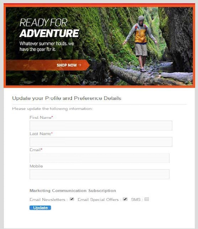

# Razones para utilizar las API de Campaign Standard {#why-using-campaign-standard-apis}

Adobe Campaign Standard proporciona API que permiten que los sistemas existentes se integren con la plataforma de Campaign para solucionar problemas en tiempo real.

Los sitios web públicos como la página de registro o de exclusión deben conectarse a sistemas back-end para almacenar información de perfil. Los sistemas back-end como Adobe Campaign tienen la flexibilidad y la potencia necesarias para introducir datos de perfil en y realizar operaciones personalizadas en ellos.

Estos son algunos ejemplos:

* Inscripción en línea de clientes potenciales.
* Administración de preferencias de comunicación de marketing y perfil de cliente existente.
  <!--* Event based transactional communication triggering – order confirmation, booking Itinerary, password reset, etc.-->
* Comunicación por correo electrónico incluso de abandono del carro de compras.

Las páginas de aterrizaje de registro permiten a los clientes o clientes potenciales registrar su nombre y dirección de correo electrónico. Una vez que Campaign Standard captura la información y las preferencias del perfil, puede enviar mensajes personalizados según los intereses de la persona.

Se crean con los elementos siguientes:

1. Un formulario de registro con oyentes de API de campaña.

   

1. Acciones personalizadas que se deben realizar en función de las casillas de verificación. Un cliente que selecciona &quot;Ofertas especiales de correo electrónico&quot; recibirá un correo personalizado diferente con un cupón de regalo en comparación con el proceso de registro normal.

   

1. Un perfil puede cambiar sus detalles después de hacer clic en el vínculo &quot;Actualizar detalles&quot; del correo electrónico. Esto lleva el perfil a la página &quot;Actualizar el perfil y los detalles de preferencia&quot;. Para realizar la operación, los detalles del perfil (Pkey) se pasan al servidor de Campaign y el perfil se recupera y representa. Una vez que el perfil hace clic en el botón &quot;Actualizar&quot;, la información se actualiza en el sistema (mediante un comando de PATCH).

   

Hay una colección de solicitudes disponibles para ayudarle a familiarizarse con las solicitudes de la API de Campaign Standard. Esta colección en formato JSON proporciona solicitudes de API prediseñadas que representan casos de uso comunes.

En los pasos siguientes se describe un caso de uso paso a paso para importar y utilizar la colección para crear un perfil en la base de datos de Campaign Standard.

>[!NOTE]
>
>Nuestro ejemplo utiliza Postman. Sin embargo, siéntase libre de usar su cliente REST favorito.

1. Descargue la colección JSON haciendo clic [aquí](https://helpx.adobe.com/content/dam/help/en/campaign/kb/working-with-acs-api/_jcr_content/main-pars/download_section/download-1/KB_postman_collection.json.zip).

1. Abra Postman y, a continuación, seleccione el menú **Archivo** / **Importar**.

1. Arrastre y suelte el archivo descargado en la ventana. Se muestran las solicitudes de API prediseñadas, listas para usar.

   

1. Seleccione la solicitud **Creando un perfil**, luego actualice la solicitud POST y la pestaña **Encabezados** con su propia información (&lt;ORGANIZACIÓN>, &lt;API_KEY>, &lt;TOKEN_DE_ACCESO>). Para obtener más información, consulte [esta sección](setting-up-api-access.md).

   

1. Rellene la ficha **Cuerpo** con la información que desee agregar al nuevo perfil y, a continuación, haga clic en el botón **Enviar** para ejecutar la solicitud.

   

1. Una vez creado un objeto, se le asocia una clave principal (PKey). Se puede ver en la respuesta de solicitud, así como en otros atributos.

   

1. Abra la instancia de Campaign Standard y, a continuación, compruebe que el perfil se ha creado con toda la información de la carga útil.

   
