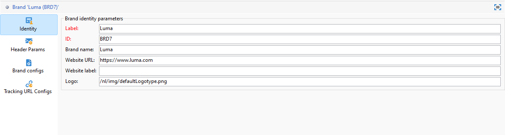
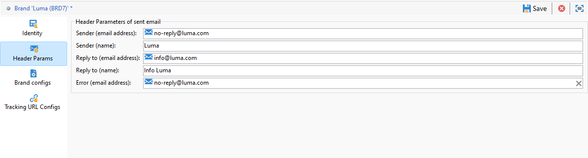
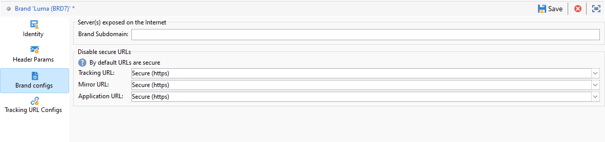

# Configurar marcas {#branding-configure}

>[!IMPORTANT]
>
>Los usuarios finales no pueden crear ni modificar marcas: estas operaciones deben ser realizadas por el administrador técnico de Adobe Campaign. Para cualquier pregunta, póngase en contacto con el servicio de atención al cliente de Adobe.

En Adobe Campaign V8, las marcas se encuentran en el menú **[!UICONTROL Administración > Plataforma > Marca]**.

Una **[!UICONTROL marca]** se define con las siguientes características:

* Una **[!UICONTROL identidad]**, que define y personaliza su marca. Esta sección contiene los campos siguientes:

   * **[!UICONTROL Etiqueta]** visible en la interfaz.
   * **[!UICONTROL ID]**
   * **[!UICONTROL Nombre de la marca]**.
   * **[!UICONTROL Dirección URL]** y **[!UICONTROL etiqueta del sitio web]** de la marca.
   * **[!UICONTROL Logotipo de marca]**.

  

* **[!UICONTROL Parámetros de encabezado de correos electrónicos enviados]** que personalizan lo que verán los destinatarios de sus campañas. Esta sección contiene los campos siguientes:

   * **[!UICONTROL Remitente (dirección de correo electrónico)]** con la dirección de correo electrónico de la marca.
   * **[!UICONTROL Remitente (nombre)]** con el nombre de la marca.
   * **[!UICONTROL Responder a (dirección de correo electrónico)]** con la dirección de correo electrónico a la que el cliente puede responder.
   * **[!UICONTROL Responder a (nombre)]** con el nombre de la marca.
   * **[!UICONTROL Error (dirección de correo electrónico)]** con la dirección de correo electrónico que se utiliza en caso de error.

  >[!IMPORTANT]
  >
  >Después de haber actualizado los parámetros de encabezado de los correos electrónicos, si el nombre y la dirección de correo electrónico del remitente no han cambiado en el correo electrónico creado a partir de la plantilla, compruebe la configuración avanzada de esta.

  

* **[!UICONTROL Configuraciones de marca]** define los servidores que se usan para realizar el seguimiento también para el acceso a la página de aterrizaje. Esta sección contiene los campos siguientes:

   * **[!UICONTROL Subdominio de marca]** hace referencia a la dirección URL de subdominio designada específica de esta marca, solicitada para delegación desde Adobe.

  Tenga en cuenta que la configuración de los servidores de seguimiento, réplica y aplicaciones se almacena en cuentas externas independientes asociadas con el enrutamiento. Esta configuración se aplica durante el aprovisionamiento y no debe modificarse. Para mostrar las direcciones URL, acceda a la pestaña **[!UICONTROL Prefijos de marca]** desde su cuenta externa.

  

* El menú **[!UICONTROL Configuraciones de URL de seguimiento]** le permite mejorar el seguimiento de URL mediante la definición de parámetros adicionales para la integración con herramientas de Web Analytics como Adobe Analytics y Google Analytics.

  Utilice el menú **[!UICONTROL Parámetros de URL adicionales]** para crear parámetros adicionales como pares clave-valor junto con sus condiciones de aplicabilidad. Cada nombre de parámetro debe ser único y no vacío, y cada valor de parámetro no debe estar vacío. La condición de aplicabilidad puede estar vacía, pero ninguno de estos valores puede incluir etiquetas JST.

  Estos parámetros se aplicarán a las direcciones URL rastreadas que coincidan con cualquier nombre de dominio especificado en la **[!UICONTROL Lista de nombres de dominio]**, que puede incluir expresiones regulares.
