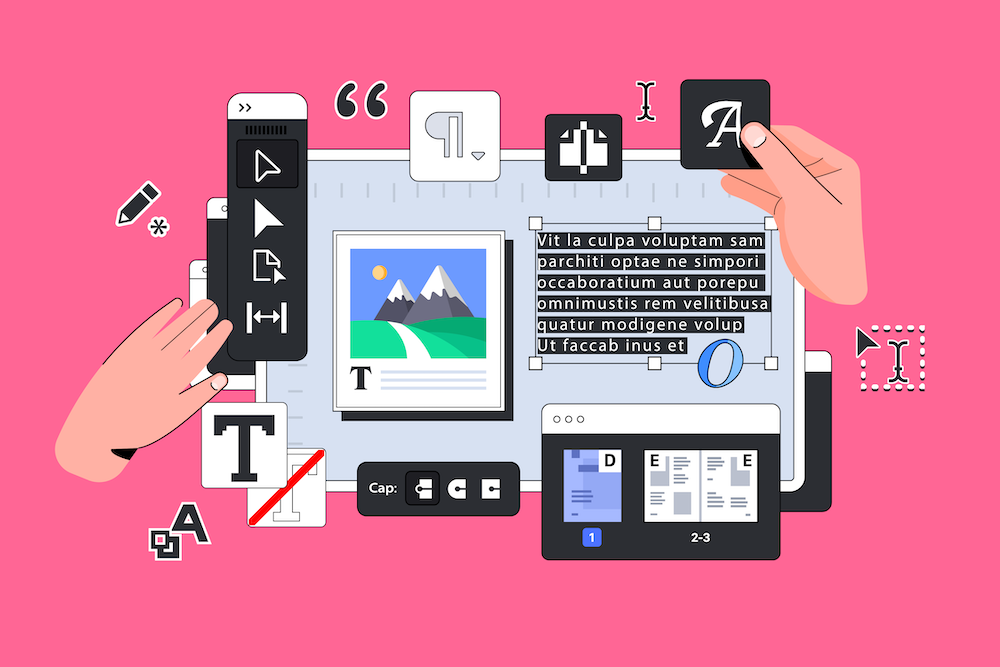

# Transición de Campaign Standard a Campaign v8 {#triggers-home}

Como usuario Campaign Standard que está realizando la transición a Campaign v8, ahora puede beneficiarse de la nueva versión de la interfaz de usuario web de Adobe Campaign y de la potente consola v8. La transición es sencilla y le permitirá utilizar todas las funciones intuitivas diseñadas para simplificar la creación de campañas personalizadas entre canales. La interfaz de usuario web de Campaign también ofrece un lienzo conectado con Adobe Experience Platform para una experiencia unificada.

Además, esta transición traerá muchos beneficios:

* Infraestructura de TI sólida
* Compatibilidad mejorada
* Integración con Adobe Experience Platform
* Interfaz de usuario y experiencia coherentes

Para obtener más información sobre las capacidades clave y las diferencias de concepto, consulte [esta página](https://experienceleague.adobe.com/en/docs/campaign-web/v8/start/acs-migration).

## Novedades

Eche un vistazo a todas las funciones y capacidades que ofrecen la [Interfaz de usuario web de Campaign](https://experienceleague.adobe.com/es/docs/campaign-web/v8/campaign-web-home) y la [versión 8 de Campaign](https://experienceleague.adobe.com/es/docs/campaign/campaign-v8/campaign-home).

Para que pueda realizar la transición sin problemas, hemos añadido funciones clave de Campaign Standard a la versión 8:

>[!BEGINTABS]

>[!TAB Informes dinámicos]

Puede acceder a la Creación de informes dinámicos, que proporciona informes totalmente personalizables y en tiempo real para medir el impacto de sus actividades de marketing.

>[!TAB Personalización de marca centralizada]

Los administradores técnicos ahora pueden definir una o varias marcas para centralizar los parámetros que afectan a la identidad de una marca.

>[!TAB API de REST]

Puede utilizar las API de REST para crear integraciones para Adobe Campaign y construir su propio ecosistema al interconectar Adobe Campaign con el panel de tecnologías que utiliza.

>[!ENDTABS]

## Empiece con lo básico

<table style="table-layout:fixed">
  <tr style="border: 0;">
    <td>
    
    
<strong>Descubra la nueva interfaz de usuario</strong> 

    </td>
    <td>
    
    
<strong>Lienzo de flujo de trabajo reimaginado</strong> 
 
    </td>
    <td>
    
    
<strong>Conozca el Diseñador de correo electrónico</strong> 
    
</td>
    <td>
    
    
<strong>Haga que el contenido sea dinámico</strong> 

    </td>
  </tr>
  <tr style="border: 0;">
    <td align="center"></td>
    <td align="center"></td>
    <td align="center"></td>
    <td align="center"></td>
    </tr>
</table>
