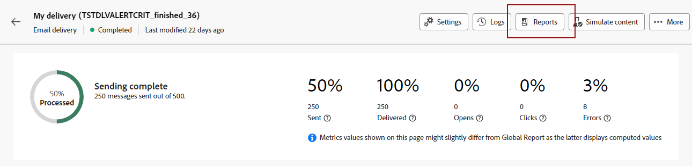
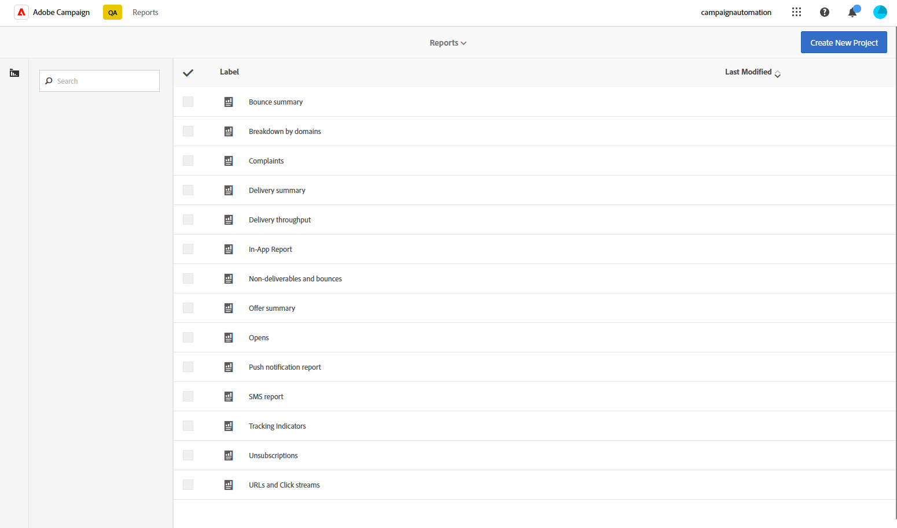

# Introducción a los informes dinámicos {#about-dynamic-reports}

El sistema de informes dinámico proporciona informes totalmente personalizables y en tiempo real. Este añade acceso a los datos de perfil, lo que permite el análisis demográfico por dimensiones de perfil como sexo, ciudad y edad, además de datos funcionales de campaña de correo electrónico como aperturas y clics. Con la interfaz de arrastrar y soltar, puede explorar datos, determinar el rendimiento de sus campañas de correo electrónico en relación con los segmentos de clientes más importantes y medir su impacto en los destinatarios.

## Acceso a informes dinámicos {#accessing-dynamic-reports}

Se puede acceder a los informes en cada campaña y entrega haciendo clic en **Informes**. Aparecerá una ventana emergente que le informará que se le redirigirá a la página **Informe dinámico** en una nueva pestaña del explorador.

Algunos informes no pueden estar disponibles inmediatamente después de una entrega, según el tiempo que tarde en recopilar y procesar la información.

Los informes dinámicos se dividen en dos categorías:

* **Plantillas**, que se pueden modificar copiándolas con la opción **Guardar como** (**Proyecto > Guardar como..**) en la plantilla.
* **Informes personalizados** (identificados en azul), que se pueden crear directamente haciendo clic en el botón **Crear nuevo proyecto** de la página de inicio de **Informes**.

