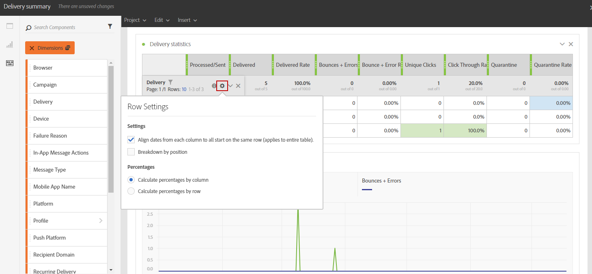

# Adición de componentes{#adding-components}

Los componentes ayudan a personalizar los informes con diferentes dimensiones, métricas y períodos de tiempo.

1. Haga clic en **[!UICONTROL Componentes]** para acceder a la lista de componentes.

   

1. Cada categoría presentada en la **[!UICONTROL Componentes]** La pestaña muestra los cinco elementos más utilizados. Haga clic en el nombre de una categoría para acceder a su lista completa de componentes.

   La tabla de componentes se divide en cuatro categorías:

   * **Dimension**: obtenga detalles del registro de envíos, como el explorador o el dominio del destinatario, o el éxito de una entrega.
   * **Métricas**: obtenga detalles sobre el estado de un mensaje. Por ejemplo, si se entregó un mensaje y el usuario lo abrió.
   * **[!UICONTROL Segmentos]**: filtre los datos en función del intervalo de edad del destinatario. **[!UICONTROL Segmentos]** se pueden arrastrar y soltar directamente en una tabla de forma libre o en la barra superior del panel.

     Esta categoría solo está disponible una vez que el administrador ha aprobado los términos y condiciones del contrato de uso de creación de informes dinámicos que se mostrarán en la pantalla. Si el administrador rechaza el acuerdo, los segmentos no aparecen en la **[!UICONTROL Componentes]** y los datos no se recopilarán.

   * **Hora**: establezca un período de tiempo para la tabla.

1. Arrastre y suelte los componentes en un panel para filtrar los datos.

   

1. Después de arrastrar y soltar el componente, puede configurar aún más la tabla con el **[!UICONTROL Configuración de fila]** opción.

   

1. También puede filtrar aún más la tabla haciendo clic en el icono **Buscar** icono. Con esta búsqueda, puede buscar resultados específicos como una entrega o un explorador específicos, por ejemplo.

   

Puede arrastrar y soltar tantos componentes como sea necesario y compararlos entre sí.

**Temas relacionados:**

* [Lista de componentes](list-of-components.md)
* [Lista de informes](defining-the-report-period.md)
