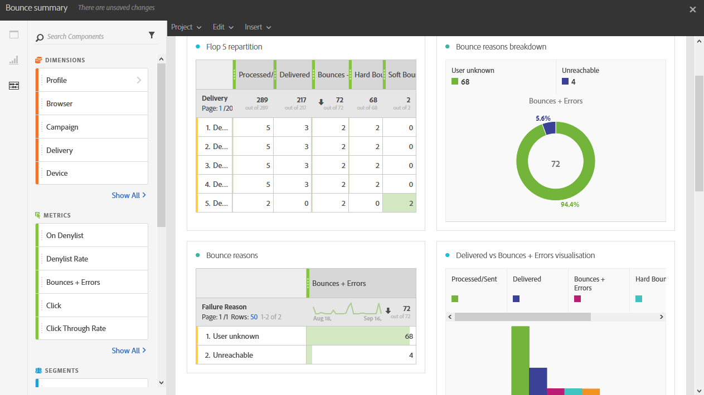

# Resumen de devoluciones{#bounce-summary}

Este informe detalla los errores generales, tanto los errores graves como los leves que se han encontrado durante las entregas, así como el procesamiento automático de las devoluciones.

Cada tabla está representada por números de resumen y gráficos. Puede cambiar cómo se muestran los detalles en sus respectivos ajustes de visualización.

**Flop 5 repartition** enumera las cinco entregas con el mayor número de cuarentenas:

La tabla **Razones de rechazo** contiene los datos disponibles para los tipos de errores que causaron devoluciones en cada envío:

* **[!UICONTROL Usuario desconocido]**: Tipo de error generado cuando se envía un envío a una dirección de correo electrónico no válida.
* **[!UICONTROL Dominio no válido]**: Tipo de error generado cuando se envía una entrega a una dirección de correo electrónico cuyo dominio es incorrecto o ya no existe.
* **[!UICONTROL Inaccesible]**: tipo de error encontrado en la cadena de entrega de mensajes, como un dominio temporalmente inaccesible.
* **[!UICONTROL Cuenta deshabilitada]**: Tipo de error generado cuando se envía una entrega a una dirección de correo electrónico que ya no existe.
* **[!UICONTROL Buzón lleno]**: Tipo de error generado cuando la bandeja de entrada del destinatario está llena. Hay cinco intentos de enviar el mensaje antes de que se genere este error.
* **[!UICONTROL No conectado]**: Tipo de error generado cuando el teléfono móvil del destinatario está apagado o no está conectado a una red en el momento de enviar el mensaje.

  >[!NOTE]
  >
  >Este tipo de error solo afecta a las entregas de canales móviles.

* **[!UICONTROL Rechazado]**: Tipo de error generado cuando el proveedor de servicios Internet (ISP) rechaza una dirección. Por ejemplo, cuando un software antispam ha aplicado una regla de seguridad.

La tabla **Domain repartition** muestra los problemas generales encontrados durante las entregas según el dominio del destinatario.
