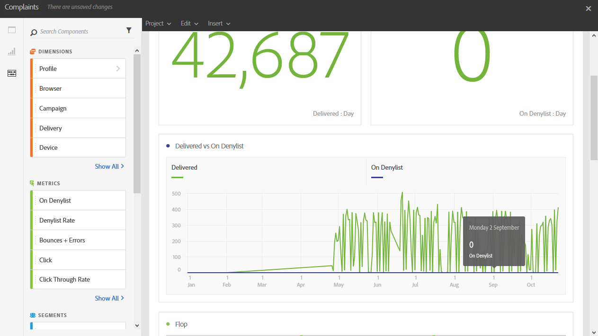

# Quejas{#complaints}

El informe **[!UICONTROL Complaints]** identifica los envíos que reciben la mayoría de las declaraciones como correo no deseado.

La tabla **Flop**, ordenada por dominio de destinatario, muestra el número de destinatarios que han declarado un correo electrónico o correo no deseado. Los resultados de la tabla también están disponibles en un gráfico y números de resumen.

La tabla **Entregado frente a en la Lista de bloqueados de la entrega** enumera el número de destinatarios que han declarado un correo electrónico como correo no deseado o no deseado. La tabla se ordena por envío.
