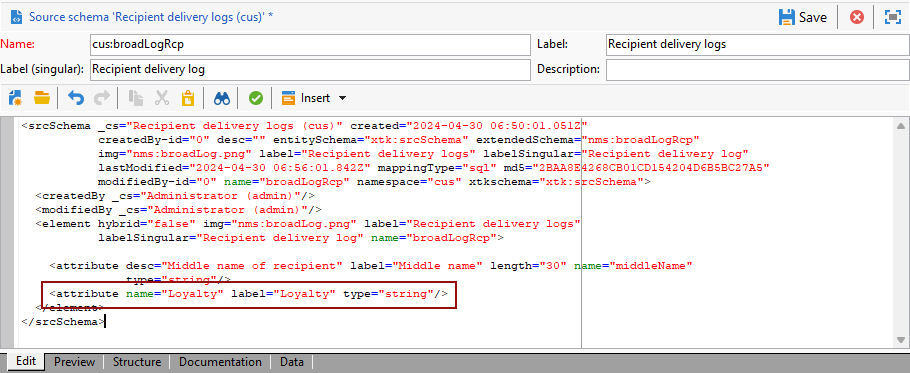
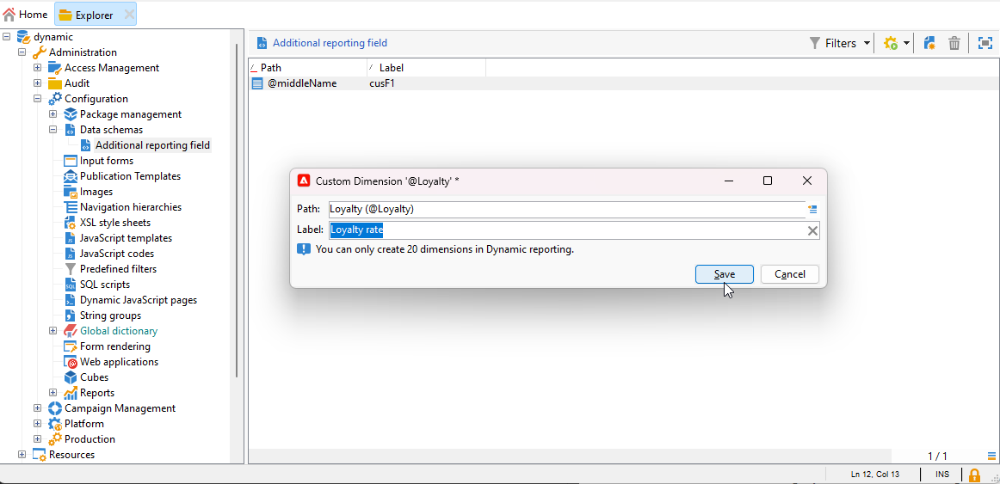

# Creación de una dimensión de perfil personalizada{#creating-a-custom-profile-dimension}

Los informes también se pueden crear y administrar en función de los datos de perfil personalizados creados durante la extensión del esquema de destinatario.

* [Paso 1: Ampliación del esquema de destinatario](##extend-schema)
* [Paso 2: Vincular el nuevo campo personalizado](#link-custom)
* [Paso 3: Creación de un informe dinámico para filtrar los destinatarios con la dimensión de perfil personalizada](#create-report)

## Paso 1: Ampliación del esquema de destinatario {#extend-schema}

Para añadir un nuevo campo de perfil, debe ampliar el esquema, siga los pasos a continuación:

1. Vaya a **[!UICONTROL Administration]** > **[!UICONTROL Configuración]** > **[!UICONTROL Esquemas de datos]** en el Explorador.

   

1. Identifique el esquema de destinatario personalizado y selecciónelo. Si todavía no ha ampliado el esquema integrado nms:recipient, consulte [este procedimiento](https://experienceleague.adobe.com/en/docs/campaign/campaign-v8/developer/shemas-forms/extend-schema).

1. Añada el campo personalizado al editor de esquemas.

   Por ejemplo, para agregar un campo personalizado de Fidelidad en el esquema de destinatarios:

   ```
   <attribute label="Loyalty" name="loyalty" type="string"/>
   ```

   

1. Haga clic en **[!UICONTROL Guardar]**.

1. A continuación, identifique el esquema broadLogRcp personalizado y selecciónelo. Si todavía no ha ampliado el esquema de registro de envío integrado, consulte [este procedimiento](https://experienceleague.adobe.com/en/docs/campaign/campaign-v8/developer/shemas-forms/extend-schema).

1. Añada el mismo campo personalizado que el esquema Recipient al editor de esquemas.

   

1. Haga clic en **[!UICONTROL Guardar]**.

1. Para aplicar las modificaciones realizadas a los esquemas, inicie el asistente de actualización de la base de datos mediante **[!UICONTROL Herramientas]** > **[!UICONTROL Avanzadas]** > **[!UICONTROL Actualizar estructura de base de datos]** y ejecute la opción Update the database structure. [Más información](https://experienceleague.adobe.com/en/docs/campaign/campaign-v8/developer/shemas-forms/update-database-structure)

   

El nuevo campo de perfil ya está listo para que lo utilicen y seleccionen los destinatarios.

## Paso 2: Vincular el nuevo campo personalizado {#link-custom}

>[!NOTE]
>
> Solo puede agregar hasta 20 campos personalizados al informe dinámico.

Ahora que se ha creado el campo de perfil, es necesario vincularlo a la dimensión de creación de informes dinámica correspondiente.

1. Vaya a **[!UICONTROL Administration]** > **[!UICONTROL Configuración]** > **[!UICONTROL Esquemas de datos]** > **[!UICONTROL Campo de informe adicional]** en el Explorador.

   

1. Clic **[!UICONTROL Nuevo]** para crear la dimensión de informes dinámicos correspondiente.

1. Seleccionar **[!UICONTROL Editar expresión]** y examine el esquema Destinatario para encontrar el campo de perfil personalizado creado anteriormente.

   

1. Haga clic en **[!UICONTROL Finalizar]**.

1. Escriba su dimensión **[!UICONTROL Etiqueta]**, visible en Informes dinámicos y haga clic en **[!UICONTROL Guardar]**.

   

El campo de perfil personalizado ya está disponible como dimensión de perfil personalizada en los informes. Para eliminar la dimensión de perfil personalizada, puede seleccionarla y hacer clic en **[!UICONTROL Eliminar]** icono.

Ahora que el esquema de destinatario se ha ampliado con este campo de perfil y se ha creado la dimensión personalizada, puede empezar a segmentar destinatarios en las entregas.

## Paso 3: Creación de un informe dinámico para filtrar los destinatarios con la dimensión de perfil personalizada {#create-report}

Después de realizar la entrega, puede desglosar los informes utilizando la dimensión de perfil personalizada.

1. Desde el **[!UICONTROL Informes]** , seleccione un informe predeterminado o haga clic en el botón **[!UICONTROL Crear]** para comenzar uno desde cero.

   

1. En el **[!UICONTROL Dimension]** categoría, haga clic en **[!UICONTROL Perfil]** a continuación, arrastre y suelte la dimensión de perfil personalizada en la tabla de forma libre.

   

1. Arrastre y suelte cualquier métrica para empezar a filtrar los datos.

1. Arrastre y suelte una visualización en el espacio de trabajo si es necesario.
