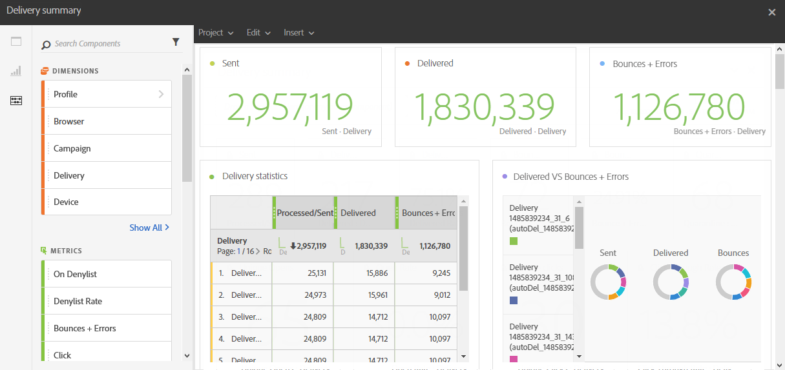

# Resumen de envíos{#delivery-summary}

El informe **[!UICONTROL Resumen de envío]** detalla la información principal relativa a un correo electrónico o a varios.

Cada tabla está representada por números de resumen y gráficos. Puede cambiar cómo se muestran los detalles en sus respectivos ajustes de visualización.

La tabla **Estadísticas de envío** contiene los datos disponibles para los correos electrónicos enviados, como:

* **[!UICONTROL Procesado/enviado]**: Número total de envíos para la entrega.
* **[!UICONTROL Entregado]**: El número de mensajes enviados correctamente, en relación con el número total de mensajes enviados. Los errores producidos (devoluciones) se tienen en cuenta. Sin embargo, no se tienen en cuenta las quejas (declaraciones de correo no deseado) ni los mensajes enviados fuera de la oficina.
* **[!UICONTROL Devoluciones + Errores]**: El número total de errores acumulados durante el envío y el procesamiento automático de devoluciones en relación con el número total de mensajes enviados.

La tabla **Abrir y clics** contiene los datos disponibles para la actividad de destinatario de cada envío, como:

* **Clic**: El número de veces que se hizo clic en un contenido en una entrega.
* **Abrir**: El número de veces que se abrió un mensaje en una entrega.
* **Aperturas únicas**: El número de destinatarios que abrieron la entrega.
* **Clics únicos**: El número de destinatarios que hicieron clic en un contenido de una entrega.

La tabla **Domain repartition** muestra el estado de las entregas según el dominio del destinatario.
