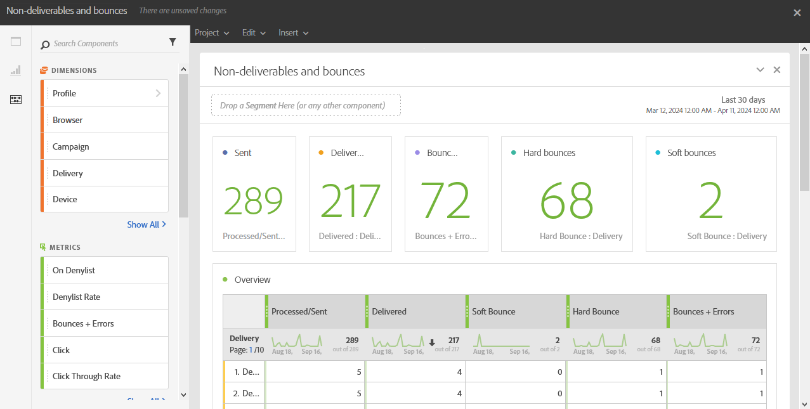

# Rechazos y correos que no se pueden entregar{#non-deliverables-and-bounces}

El informe **[!UICONTROL No entregables y devoluciones]** proporciona detalles sobre todos los errores encontrados durante una entrega.

La tabla **[!UICONTROL Información general]** contiene los datos disponibles sobre los posibles errores que se pueden encontrar en cada entrega, como:

* **Procesado/enviado**: El número de correos electrónicos enviados.
* **Entregado**: El número de correos electrónicos entregados.
* **Devolución suave**: El número total de errores temporales, como una bandeja de entrada completa.
* **Rechazo grave**: El número total de errores permanentes, como una dirección de correo electrónico incorrecta.
* **Devoluciones + Errores**: El número de mensajes que no se pudieron entregar.

La tabla **Desglose por dominio** enumera las devoluciones por dominios de destinatarios.
