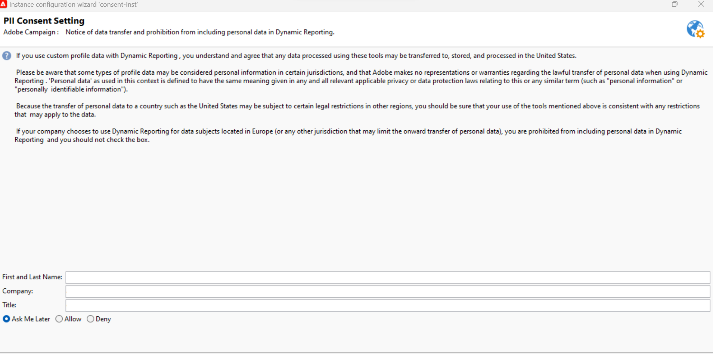

# Acuerdo de uso de creación de informes dinámicos {#pii-agreement}

El propósito del acuerdo de uso de creación de informes dinámicos es funcionar como un consentimiento emergente para el procesamiento de datos. De forma predeterminada, el acuerdo solo es visible y solo lo pueden aceptar o rechazar los usuarios con derechos de administración.

Para obtener acceso al acuerdo de uso de creación de informes dinámica, seleccione **[!UICONTROL Herramientas]** > **[!UICONTROL Avanzadas]** > **[!UICONTROL Asistente de implementación]**.

Hay tres opciones disponibles:

* **[!UICONTROL Preguntarme más tarde]**: Hasta que acepte o rechace el acuerdo, las dimensiones de perfil no aparecerán en los informes y la información de identificación personal de sus clientes no se recopilará ni enviará.
* **[!UICONTROL Aceptar]**: Al aceptar este contrato, autoriza a Adobe Campaign a recopilar la información de identificación personal de sus clientes y a transferirla al centro de informes o de datos.
* **[!UICONTROL Rechazar]**: Al rechazar el acuerdo, las dimensiones del perfil no aparecerán en los informes y la información de identificación personal de los clientes no se recopilará ni enviará. Tenga en cuenta que, en este caso, externalID se seguirá recopilando y utilizando para identificar a los usuarios finales.

La tabla siguiente muestra lo que sucede después de aceptar este acuerdo según su región.

|  | Creación de informes dinámicos | Conector de Microsoft Dynamics 365 |
|---|---|---|
| América y APAC (Asia-Pacífico) | **Característica disponible**.  Toda la información predeterminada (es decir, ciudad, país/región, estado, sexo y segmentos según la edad) y los perfiles personalizados se envía al centro de informes de EE. UU. | **Característica disponible**.  Todos los campos de perfiles personalizados y listos para usar y los campos de eventos de Adobe Campaign se procesan en el centro de datos de EE. UU. |
| EMEA (Europa, Oriente Medio y África) | **Característica disponible**.  Toda la información predeterminada (es decir, ciudad, país/región, estado, sexo y segmentos según la edad) y los perfiles personalizados se envía al centro de informes de EMEA. | **Característica disponible.**  Todos los campos de perfiles personalizados y listos para usar y los campos de eventos de Adobe Campaign procesados en el centro de datos de EMEA.  **[!UICONTROL Datos de control &#x200B;]**&#x200B;que contienen datos de registro de Adobe I/O e ID de eventos de usuarios finales de clientes enviados y almacenados en el centro de datos de EE. UU. |

La tabla siguiente muestra lo que sucede después de rechazar este acuerdo según su región. Tenga en cuenta que aunque rechace este acuerdo, los informes sobre entregas y la integración con Microsoft Dynamics 365 seguirán estando disponibles.

| Región | Creación de informes dinámicos | Conector de Microsoft Dynamics 365 |
|---|---|---|
| América y APAC (Asia-Pacífico) | **Característica disponible**.   No se ha insertado información de perfiles personalizados y preestablecida en el centro de informes de EE. UU. con la excepción de ExternalID. | **Característica disponible**.  No se han enviado campos de perfil personalizados o predeterminados al centro de datos de EE. UU. con la excepción del ID externo y el ID de destinatario.  Todos los campos de evento de Adobe Campaign procesados en el centro de datos de EE. UU. excepto el ID de página espejo. |
| EMEA (Europa, Oriente Medio y África) | **Característica disponible**.  No se ha insertado información de perfiles personalizados y preestablecida en el centro de informes de EMEA, con la excepción de ExternalID. | **Característica disponible.**  No se han enviado campos de perfil predeterminados o personalizados al centro de datos de EMEA, con la excepción del ID externo y el ID de destinatario.  Todos los campos de evento de Adobe Campaign procesados en el centro de datos de EMEA, excepto el ID de página espejo. |

Esta opción no es final, siempre puede cambiarla seleccionando la opción **[!UICONTROL realtimeReporting_collectPII]** en **[!UICONTROL Administración]** > **[!UICONTROL Plataforma]** > **[!UICONTROL Opciones]**.

El valor se puede cambiar en cualquier momento. El valor 1 corresponde a **[!UICONTROL Preguntarme más tarde]**, 2 **[!UICONTROL Rechazar]** y 3 **[!UICONTROL Aceptar]**.
