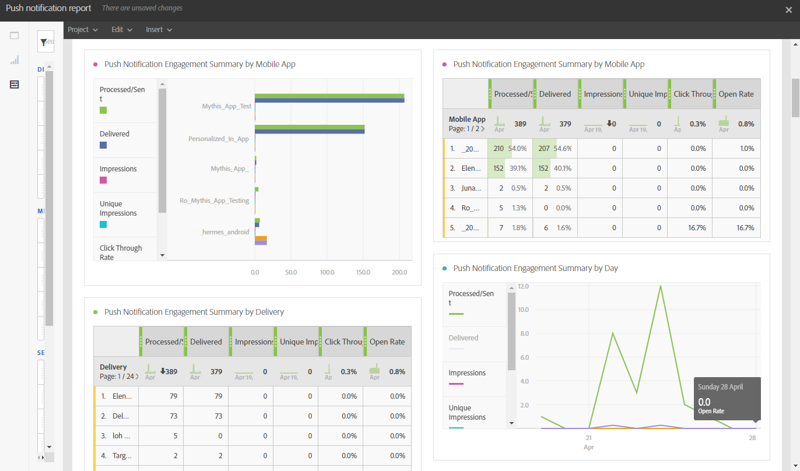

# Informe de notificaciones push{#push-notification-report}

>[!CAUTION]
>
>Tenga en cuenta que debe arrastrar y soltar las métricas de **[!UICONTROL Tipo de mensaje]** en las tablas para dividir los datos según los tipos de entrega, en este caso entregas de notificaciones push.

El informe **Notificación push** proporciona detalles sobre el rendimiento de marketing de las notificaciones push en Adobe Campaign. Este informe predeterminado le ayuda a comprender cómo interactúan los usuarios con las notificaciones push, las aplicaciones móviles y las entregas.

Cada tabla está representada por números de resumen y gráficos. Puede cambiar cómo se muestran los detalles en sus respectivos ajustes de visualización.

La primera tabla **Resumen de participación de notificaciones push** se divide en tres categorías: por día, por aplicación móvil y por entrega. Contiene los datos disponibles para la reacción del destinatario a la entrega:

* **[!UICONTROL Procesado/enviado]**: Número total de notificaciones push enviadas.
* **[!UICONTROL Entregado]**: Número de notificaciones push enviadas correctamente, en relación con el número total de notificaciones push enviadas.
* **[!UICONTROL Impresiones]**: Número de veces que se ha enviado una notificación push al dispositivo y se ha dejado intacta en el centro de notificaciones. En la mayoría de los casos, el número de impresiones debe ser similar al número enviado. Esto garantiza que el dispositivo reciba el mensaje y retransmita esa información al servidor.
* **[!UICONTROL Impresiones únicas]**: Número de impresiones por destinatario.
* **[!UICONTROL Tasa de clics]**: Porcentaje de usuarios que interactuaron con la notificación push.
* **[!UICONTROL Tasa de apertura]**: Porcentaje de notificaciones push abiertas.

La segunda tabla **Clics y aperturas de notificaciones push** se divide en tres categorías: por día, por aplicación móvil y por entrega. Contiene los datos disponibles del comportamiento del destinatario por envío:

* **[!UICONTROL Impresiones]**: Total de notificaciones push vistas por los destinatarios.
* **[!UICONTROL Impresiones únicas]**: Número de impresiones por destinatario.
* **[!UICONTROL Clic]**: Número de veces que el usuario ha enviado una notificación push al dispositivo y ha hecho clic en ella. El usuario deseaba ver la notificación, que luego se moverá al seguimiento de Apertura push, o descartarla.
* **[!UICONTROL Clics únicos]**: Número de veces que un usuario único interactúa con la notificación push, por ejemplo, hace clic en la notificación o el botón.
* **[!UICONTROL Abrir]**: Número total de notificaciones push enviadas al dispositivo y en las que los usuarios hicieron clic al abrir la aplicación. Esto es similar al clic push, excepto que una apertura push no se activa si se descarta la notificación.
* **[!UICONTROL Aperturas únicas]**: Número de destinatarios que abrieron la entrega.
