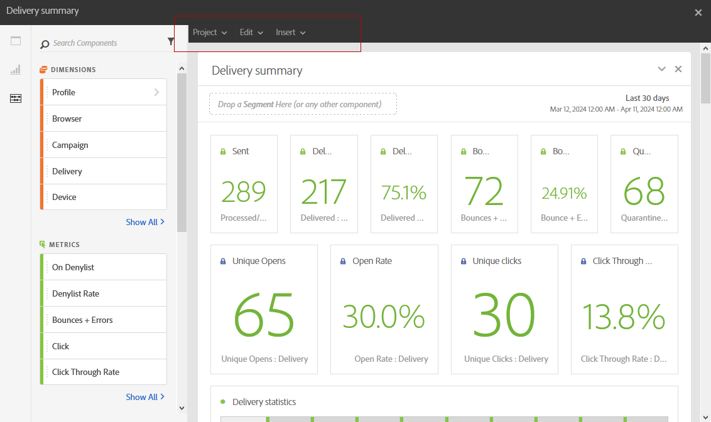
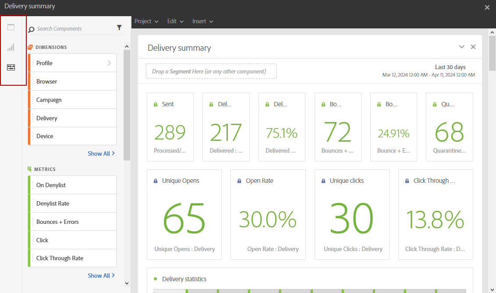
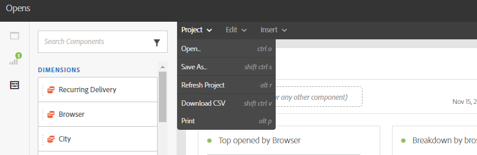
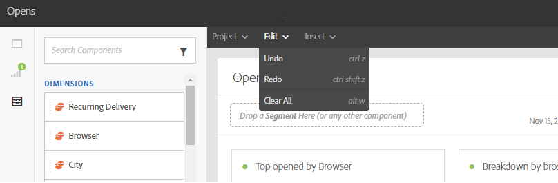
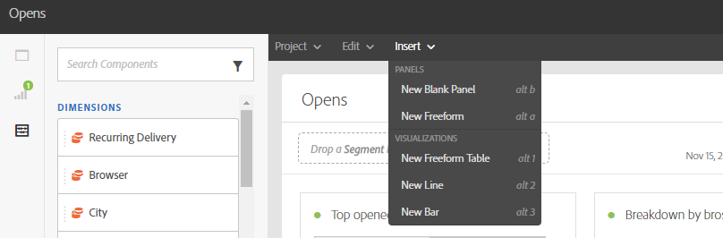

# Interfaz de informes{#reporting-interface}

La barra de herramientas superior permite, por ejemplo, modificar, guardar o imprimir el informe.

Utilice la ficha **Proyecto** para:

* **Abrir...**: abre un informe o una plantilla creados anteriormente.
* **Guardar como...**: duplica las plantillas para poder modificarlas.
* **Actualizar proyecto**: actualiza el informe en función de los nuevos datos y los cambios en los filtros.
* **Descargar CSV**: Exporta los informes a un archivo CSV.

La ficha **Editar** le permite:

* **Deshacer**: Cancela la última acción en el panel.
* **Borrar todo**: Elimina todos los paneles del tablero.

La tabla **Insert** le permite personalizar los informes al agregar gráficos y tablas al tablero:

* **Nuevo panel en blanco**: Agrega un nuevo panel en blanco al panel.
* **Nueva forma libre**: Agrega una nueva tabla de forma libre a tu panel.
* **Nueva línea**: Agrega un gráfico de líneas nuevo al panel.
* **Nueva barra**: Agrega un nuevo gráfico de barras al tablero.

**Temas relacionados:**

* [Adición de paneles](adding-panels.md)
* [Adición de visualizaciones](adding-visualizations.md)
* [Adición de componentes](adding-components.md)

## Fichas {#tabs}

Las pestañas de la izquierda le permiten crear el informe y filtrar los datos según sea necesario.

Estas pestañas le proporcionan acceso a los siguientes elementos:

* **[!UICONTROL Paneles]**: agrega un panel en blanco o una forma libre al informe para filtrar los datos. Para obtener más información, consulte la sección Añadir paneles
* **[!UICONTROL Visualizaciones]**: arrastre y suelte una selección de elementos de visualización para darle una dimensión gráfica al informe. Para obtener más información, consulte la sección Adición de visualizaciones.
* **[!UICONTROL Componentes]**: personalice los informes con distintas dimensiones, métricas, segmentos y períodos de tiempo.

## Barra de herramientas {#toolbar}

La barra de herramientas se encuentra encima del espacio de trabajo. Se compone de diferentes pestañas y permite, por ejemplo, modificar, guardar, compartir o imprimir el informe.

**Temas relacionados:**

* [Adición de paneles](adding-panels.md)
* [Adición de visualizaciones](adding-visualizations.md)
* [Adición de componentes](adding-components.md)

### Pestaña Proyecto {#project-tab}

Utilice la ficha **Proyecto** para:

* **Abrir...**: abre un informe o una plantilla creados anteriormente.
* **Guardar como...**: duplica las plantillas para poder modificarlas.
* **Actualizar proyecto**: actualiza el informe en función de los nuevos datos y los cambios en los filtros.
* **Descargar CSV**: Exporta los informes a un archivo CSV.
* **[!UICONTROL Imprimir]**: Imprima el informe.

### Pestaña Editar {#edit-tab}

La ficha **Editar** le permite:

* **Deshacer**: Cancela la última acción en el panel.
* **Borrar todo**: Elimina todos los paneles del tablero.

### Pestaña Insertar {#insert-tab}

La ficha **Insertar** le permite personalizar los informes al agregar gráficos y tablas al tablero:

* **Nuevo panel en blanco**: Agrega un nuevo panel en blanco al panel.
* **Nueva forma libre**: Agrega una nueva tabla de forma libre a tu panel.
* **Nueva línea**: Agrega un gráfico de líneas nuevo al panel.
* **Nueva barra**: Agrega un nuevo gráfico de barras al tablero.
