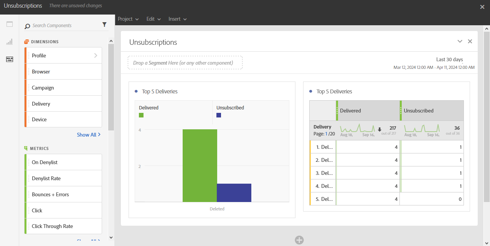

# Bajas{#unsubscriptions}

El informe **[!UICONTROL Unsubscriptions]** identifica los envíos con la mayor cantidad de bajas.

La tabla y el gráfico **[!UICONTROL TOP 5 deliveries]** muestran los cinco envíos principales con la mayor cantidad de mensajes enviados y la cantidad de destinatarios que se han dado de baja. Los datos enumerados aquí se basan en el número de clics en el vínculo de baja del mensaje.
