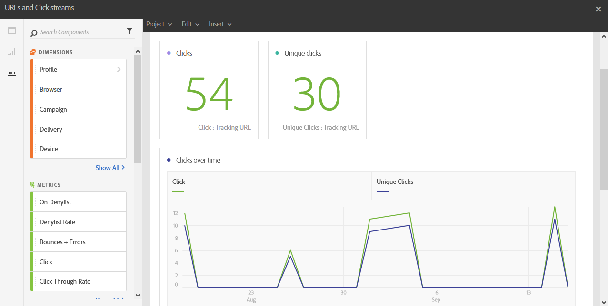

# URL y flujos de clics{#urls-and-click-streams}

Las **URL y flujos de clics** muestran las URL en las que se hizo clic con mayor frecuencia durante una entrega o varias entregas si están vinculadas a una campaña o programa.

Cada tabla está representada por números de resumen y gráficos. Puede cambiar cómo se muestran los detalles en sus respectivos ajustes de visualización.

La tabla **Vínculos más visitados** contiene los datos disponibles sobre el comportamiento de los destinatarios por envío, como:

* **Clic**: El número de veces que se hizo clic en el contenido en una entrega.
* **Clics únicos**: El número de destinatarios que hicieron clic en el contenido de una entrega.
