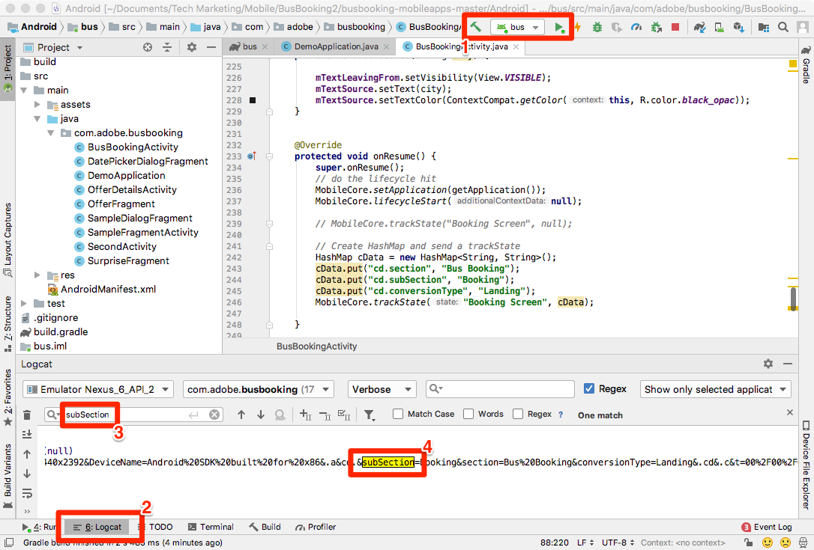
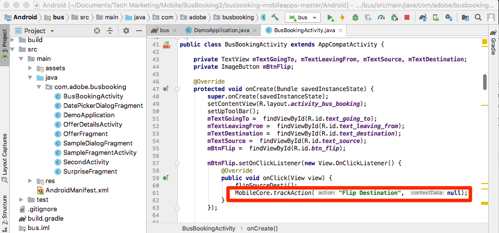

# Añadir Adobe Analytics

En esta lección, habilitará el seguimiento de Adobe Analytics en su aplicación.

[Adobe Analytics](https://docs.adobe.com/content/help/en/analytics/landing/home.html) es una solución líder del sector que le permite comprender a sus clientes como personas y dirigir su negocio con inteligencia de clientes.

En las lecciones de [Agregar extensiones](launch-add-extensions.md) e [instalar el SDK](launch-install-the-mobile-sdk.md) móvil, ha agregado la extensión Adobe Analytics a la propiedad Launch y la ha importado en la aplicación de ejemplo.  Ahora, todo lo que tiene que hacer es agregar código para rastrear los estados y las acciones en la aplicación.

## Objetivos de aprendizaje

Al final de esta lección podrá:

* Verifique que las métricas del ciclo vital se envíen a Adobe Analytics
* Agregue código para rastrear estados en la aplicación con datos adicionales
* Agregue código para rastrear acciones en la aplicación con datos adicionales

Hay muchas cosas que se podrían implementar para Analytics en Launch. Esta lección no es exhaustiva, pero debería ofrecerle una visión general sólida de las principales técnicas que necesitará para implementar en su propia aplicación.

## Requisitos previos

You should have already completed the lessons in the [Configure Launch](launch-create-a-property.md) section. En esa sección, agregó la extensión de Analytics y configuró el servidor de seguimiento y los ID del grupo de informes.

## Métricas del ciclo vital y Adobe Analytics

Las métricas del ciclo vital son métricas y dimensiones basadas en el entorno que se pueden activar fácilmente en una aplicación mediante el SDK de Experience Platform Mobile.

Ya habilitó las métricas del ciclo vital cuando agregó la extensión Core a su propiedad y siguió las Instrucciones de instalación móvil proporcionadas en la interfaz. Estas métricas y dimensiones, incluidas las métricas específicas del entorno y la aplicación, como la versión de la aplicación, el número de usuarios comprometidos, la versión del sistema operativo, la partición de tiempo, los días transcurridos desde el último uso, etc. puede resultar muy útil en el análisis de la aplicación, sobre todo cuando crea segmentos de Analytics a partir de ellos para aplicarlos a todos los informes. La lista completa de métricas está disponible en la [documentación](https://docs.adobe.com/content/help/en/mobile-services/android/metrics.htmlh).

## Importación de la biblioteca ACPCore

En la lección anterior, denominada ["Instalar el SDK de Mobile"](launch-install-the-mobile-sdk.md), se ha añadido una instrucción import para que la biblioteca de AdobeCore esté disponible en el archivo BusBookingActivity. Esta misma biblioteca se utilizará para llamadas de API adicionales en las actividades de esta lección. En los próximos ejercicios, usará las API para rastrear estados ("trackState") y acciones ("trackAction") en su aplicación, que se definen en la biblioteca AdobeCore.  En el nuevo SDK de Experience Cloud Platform Mobile, las API trackState y trackAction se han trasladado de la biblioteca de Analytics a la biblioteca principal, lo que permite aprovechar estas API para otros fines que no solo el seguimiento de Adobe Analytics.

## Seguimiento de estados

En la aplicación, es posible que tenga muchas pantallas de contenido diferentes que proporcione a los usuarios. Son equivalentes a las páginas de un sitio web. Adobe Analytics proporciona un método para enviar estas "visitas de vista de página" y verlas en los mismos informes a los que está acostumbrado para sus propiedades web. Este método se denomina "trackState".

En este tutorial, solo colocará el código de una llamada a trackState en una pantalla (página) de la aplicación. En la vida real, lo replicará en todas las demás pantallas o estados de la aplicación.

A continuación encontrará una sintaxis y un ejemplo de código de la documentación que puede copiar y pegar en este tutorial o en su propia aplicación.

**Sintaxis:**

```java
public static void trackState(final String state, final Map<String, String> contextData)
```

**Ejemplo:**

```java
HashMap cData = new HashMap<String, String>();
contextData.put("key", "value");
MobileCore.trackState("state name",contextData);
```

### Seguimiento de un estado sin datos

1. Con la aplicación de ejemplo abierta en Android Studio, vaya a BusBookingActivity y desplácese hacia abajo, cerca de la parte inferior, hasta la función onResume
1. Agregar una llamada de método trackState
1. Configure el `state name` en "Pantalla de reservación"
1. En lugar de agregar datos adicionales, agregue `null` como marcador de posición en la llamada de API
1. O bien, copie y pegue lo siguiente:

   ```java
   MobileCore.trackState("Booking Screen", null);
   ```


**Para validar trackState**

1. Guardar, crear y ejecutar el proyecto
1. Cuando se ejecute el simulador y se abra la pantalla de inicio de la aplicación, consulte la consola de depuración de registro de Android Studio
1. Buscar en la consola `pageName=Booking%20Screen`
1. Tenga en cuenta que la variable pageName está configurada en `Booking Screen` (con %20 como espacio codificado) y no hay otros pares de datos personalizados. Aunque técnicamente está configurando un "nombre de estado" y no un "nombre de página", el nombre de parámetro utilizado es `pageName` para proporcionar coherencia con las implementaciones de sitios web.

   

### Seguimiento de un estado con datos

1. Vuelva a BusBookingActivity y agregue una importación a la parte superior del archivo `import java.util.HashMap;` debajo de las importaciones existentes
1. En la `onResume()` función, comente (o elimine) la llamada trackState básica desde el último ejercicio
1. Agregue una nueva llamada de método trackState, esta vez con datos, creando y nombrando un HashMap, utilizando el comando "put" para incluir algunos pares de clave/valor y luego llamando a ese HashMap en la llamada a trackState
1. Deje la `state name` opción "Pantalla de reservación"
1. O bien, copie y pegue en:

   ```java
   HashMap cData = new HashMap<String, String>();
   cData.put("cd.section", "Bus Booking");
   cData.put("cd.subSection", "Booking");
   cData.put("cd.conversionType", "Landing");
   MobileCore.trackState("Booking Screen", cData);
   ```

   

**Validación de trackState con datos**

1. Guarde, cree y ejecute de nuevo el proyecto
1. Cuando se ejecute el simulador y se abra la pantalla de inicio de la aplicación, consulte la consola de depuración de registro de Android Studio
1. Buscar `subSection` (o cualquiera de las claves o valores introducidos en el código)
1. Ahora observe que además de pageName que se está configurando, también tiene los pares clave/valor que se enviaron en la visita

   

>[!NOTE] Si está familiarizado con las "props y eVars" en Analytics, verá que estos nombres de variables no están en el SDK. Todos los datos de clave y valor procedentes del SDK se enviarán como variables [](https://docs.adobe.com/content/help/en/analytics/implementation/javascript-implementation/variables-analytics-reporting/context-data-variables.html)contextData y, como tales, deberán asignarse a props o eVars (u otras variables) mediante reglas [de](https://docs.adobe.com/content/help/en/analytics/admin/admin-tools/processing-rules/processing-rules.html) procesamiento en la interfaz de usuario de Analytics.

## Seguimiento de acciones

De forma similar a rastrear las acciones que no son de carga de página en un sitio web, con frecuencia desea rastrear una acción que un usuario realiza en la aplicación, por ejemplo, hacer clic en cosas que no cargan otra pantalla. Esto se gestiona de forma muy similar a trackState que ha utilizado anteriormente, excepto que se llama a este método `trackAction`.

A continuación se muestra una sintaxis y un ejemplo de código de la documentación.

**Sintaxis:**

```java
public static void trackAction(final String action, final Map<String, String> contextData) data;
```

**Ejemplo:**

```java
HashMap<String, String> contextData = new HashMap<String, String>();
contextData.put("key", "value");
MobileCore.trackAction("action taken", contextData);
```

### Seguimiento de la interacción con el conmutador de destino

En esta aplicación de reservación de bus de ejemplo, puede cambiar la ciudad de origen por la ciudad de destino haciendo clic en la flecha entre estos dos valores. Ha decidido que desea rastrear la interacción con esta función en Adobe Analytics.


Este mezclador se controla en el archivo BusBookingActivity del proyecto de ejemplo. En este ejercicio, enviará una visita de trackAction cada vez que las personas hagan clic en ella.

#### Para agregar el código trackAction

1. Con el proyecto de ejemplo abierto en Android Studio, vaya a BusBookingActivity
1. Busque la función "BtnFlip.setOnClickListener" en la línea 57 o alrededor de ella
1. Expanda la función si es necesario, para que pueda ver todo el código
1. En la función onClick, en la llamada a `flipSourceDesti()`, agregue una `trackAction()` llamada
1. Establezca el nombre de la acción en "Flip Destination" y añada "null" para el parámetro contextData (ya que esta vez no necesitamos enviar información adicional)
1. Puede copiar y pegar el siguiente código

   ```java
   MobileCore.trackAction("Flip Destination", null);
   ```

Ahora la función tiene este aspecto:



#### Validación del código trackAction

1. Después de agregar el código, guarde el proyecto, ejecútelo y genere
1. Haga clic en el icono de elementos no utilizados para borrar la consola de Logcat
1. Haga clic en la flecha del conmutador de destino en el simulador y observe que aparece una nueva solicitud (o más) en la consola.
1. Buscar `Flip%20Destination` en Logcat
1. Observe que tanto los parámetros action como pev2 Flip%20Destination (con espacio codificado)
1. Observe la `pe=lnk_o` clave/valor en la misma línea, mostrando que se trata de una visita de "vínculo personalizado", desencadenada por trackAction

   <!---->

¡Buen trabajo! Ha completado la lección de Analytics. Por supuesto, hay muchas otras cosas que puede hacer para mejorar nuestra implementación de Analytics, pero es de esperar que esto le haya dado algunas de las habilidades básicas que necesitará para abordar el resto de sus necesidades.

## Beneficios adicionales de trackState y trackAction

En estos últimos ejercicios, pudo enviar datos de la aplicación a Adobe Analytics mediante las API trackState y trackAction. Dado que el SDK de Experience Platform Mobile se basa en Launch, hay muchas más cosas que puede hacer en la interfaz de Launch aprovechando el código que acaba de añadir.

En Launch, puede crear reglas activadas por las API trackState y trackAction y hacer que ejecuten acciones adicionales, como realizar solicitudes a otras soluciones de Adobe o socios externos.

[Siguiente "Agregar Adobe Audience Manager" &gt;](audience-manager.md)
