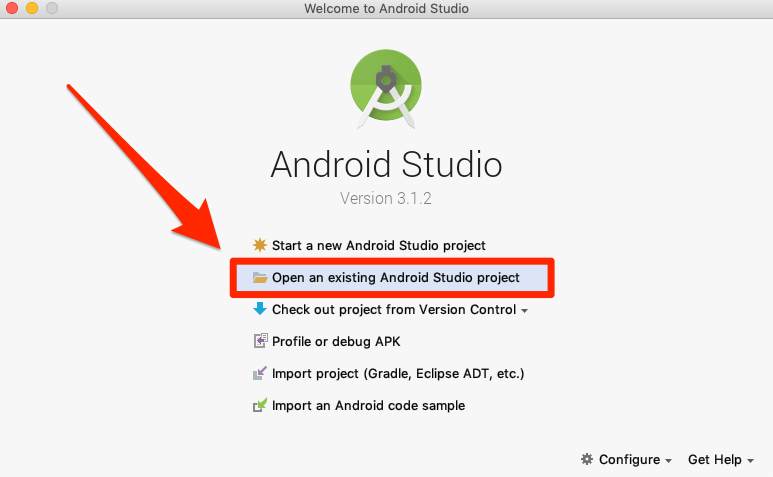
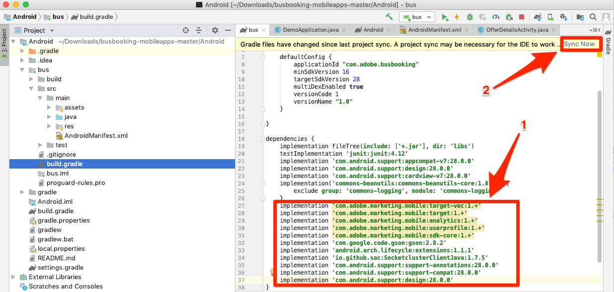
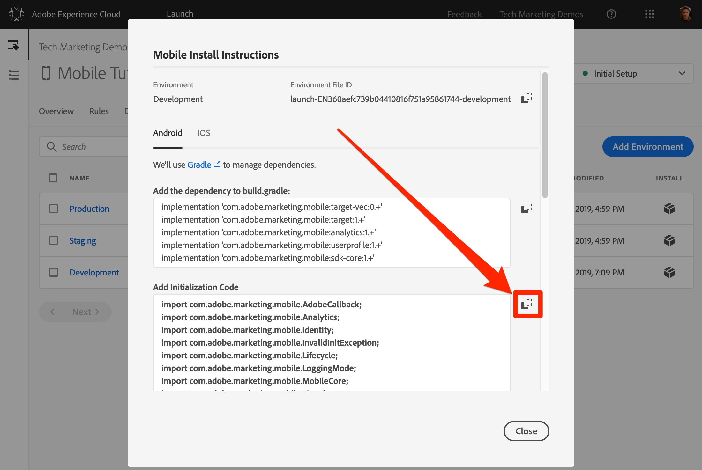
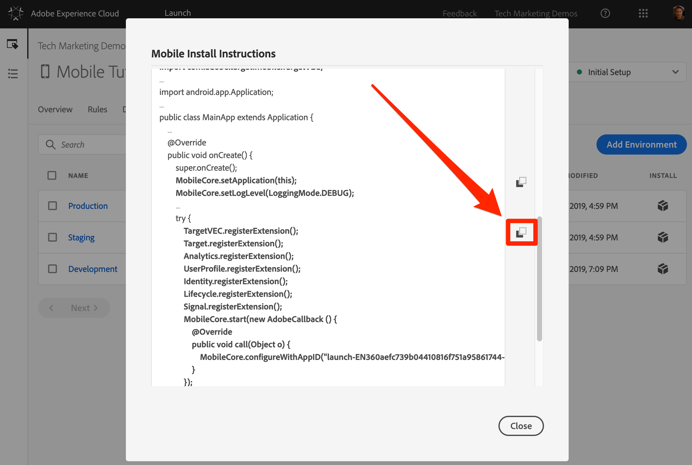

# Instalar el SDK de Mobile

En esta lección, implementará el SDK de Mobile con las extensiones y la configuración correspondientes al entorno de desarrollo de su propiedad Launch.

## Requisitos previos

En esta lección empezaremos a agregar código a la aplicación de reservación de autobuses, por lo que si aún no lo ha hecho:

1. Descargar e instalar [Android Studio](https://developer.android.com/studio)
1. Descargar la aplicación [Bus Booking](https://github.com/Adobe-Marketing-Cloud/busbooking-mobileapps)

## Objetivos de aprendizaje

Al final de esta lección podrá:

* Obtenga las instrucciones de instalación de la propiedad de inicio móvil
* Comprender la diferencia entre los entornos Development, Staging y Production
* Actualice el `build.gradle` archivo para agregar el SDK de Mobile
* Importación del SDK de Mobile en la aplicación
* Verifique que el SDK se haya implementado correctamente
* Habilitar métricas del ciclo vital en la aplicación

## Obtenga las instrucciones de instalación

Las Instrucciones de instalación para las propiedades de inicio móvil son una colección de fragmentos de código que se agregan a ubicaciones específicas de la aplicación móvil.

Haga clic en la `Environments` ficha en la navegación superior para ir a la página de entornos. Tenga en cuenta que los entornos de desarrollo, ensayo y producción se han creado previamente para usted. Corresponden a los entornos típicos del proceso de desarrollo y lanzamiento del código. El código lo escribe primero un desarrollador en un entorno de desarrollo. Cuando han completado su trabajo, lo envían a un entorno de ensayo (Staging) para que el control de calidad y otros equipos lo revisen. Una vez satisfechos el control de calidad y otros equipos, el código se publica en el entorno de producción, que es el entorno público que experimentan los visitantes al descargar la aplicación.

Launch permite entornos de desarrollo adicionales, lo que resulta útil en organizaciones grandes en las que varios desarrolladores trabajan en diferentes proyectos al mismo tiempo.

Desarrollo, Ensayo y Producción son los únicos entornos que necesitamos para completar el tutorial.


En la fila **[!UICONTROL Desarrollo]** , haga clic en el icono Instalar  Instalar para abrir el modo de código incrustado.


Veamos las instrucciones paso a paso.

## Actualizar el archivo build.gradle

Si ya ha utilizado Launch en sitios web, una de las primeras cosas que notará es que hay muchas más instrucciones de instalación para las aplicaciones móviles que para los sitios web.

El SDK de Adobe Mobile para Android utiliza Gradle para administrar las dependencias entre sus distintos componentes. Una de las primeras cosas que haremos es añadir las dependencias del SDK de Adobe Mobile al archivo build.gradle de la aplicación Bus Booking.

**Para actualizar el archivo build.gradle**

1. Abrir Android Studio
1. Seleccione "Abrir un proyecto existente de Android Studio"

   

1. Abra el archivo build.gradle en la raíz de la carpeta Bus Booking Android:

   

1. Abra la lista desplegable y cambie a la vista Proyecto

   

1. Abra el archivo **Android &gt; bus &gt; build.gradle** .

   

1. En la interfaz de Launch, asegúrese de que el sistema operativo está configurado en `Android`

1. Copie las dependencias en el portapapeles haciendo clic en el icono 

   

1. En Android Studio, pegue las dependencias del portapapeles justo después de las dependencias existentes (pero antes del cierre `}`)
1. Además, si va a instalar la extensión VEC de Adobe Target, también debe agregar las dependencias siguientes:

   ```java
   implementation 'com.google.code.gson:gson:2.8.2'
   implementation 'android.arch.lifecycle:extensions:1.1.1'
   implementation 'io.github.sac:SocketclusterClientJava:1.7.5'
   implementation 'com.android.support:support-annotations:28.0.0'
   implementation 'com.android.support:support-compat:28.0.0'
   implementation 'com.android.support:design:28.0.0'
   ```

1. Haga clic en el vínculo "Sincronizar ahora" para sincronizar el proyecto

   

## Actualizar la aplicación

Ahora es el momento de actualizar la aplicación para importar el SDK

**Para importar el SDK**

1. Abra el archivo de la aplicación principal en la aplicación Bus Booking, que se encuentra en **Android &gt; bus &gt; src &gt; main &gt; java &gt; com.adobe.busbooking &gt; DemoApplication**

   

1. En la interfaz de Launch, desplácese hasta la sección **[!UICONTROL Agregar código]** de inicialización.
1. Copie las instrucciones de importación haciendo clic en el primer icono  de la sección **[!UICONTROL Agregar código]** de inicialización:

   

1. En Android Studio, pegue estas sentencias de importación *antes* de las importaciones existentes en el `DemoApplication` archivo. Tenga en cuenta que la extensión Core incluye bibliotecas para admitir rellamadas, el servicio de identidad, las métricas del ciclo vital y el registro de consola, entre otras funciones.

   

1. En la interfaz de Launch, copie las dos líneas relacionadas con la extensión Core haciendo clic en el segundo icono  de la sección **[!UICONTROL Agregar código]** de inicialización. La segunda línea activa las sentencias de registro de la consola (las opciones disponibles son "DEBUG", "VERBOSE", "ADVERTENCIA" y "ERROR").

   

1. En Android Studio, pegue estas sentencias principales en el `DemoApplication` archivo justo después `super.onCreate()`
1. Eliminar los `//` comentarios antes de las líneas `try` y `catch`

   

1. En la interfaz de Launch, copie las sentencias de extensión haciendo clic en el tercer icono  de la sección [!UICONTROL Agregar código] de inicialización.

   

1. En Android Studio, pegue estas sentencias de extensión en la `try` sección . Tenga en cuenta que `MobileCore.configureWithAppID` contiene el identificador del entorno de desarrollo Launch de la propiedad. Esto es importante, ya que tendrá que actualizar este valor cuando estemos listos para implementar la aplicación en el entorno de producción.

   

>[!NOTE] Las instrucciones de instalación móvil que se proporcionan en la interfaz Launch incluyen las instrucciones de importación y registro para las extensiones Identidad, Ciclo de vida y Señal, así como la inicialización de las métricas de ciclo de vida. Estas extensiones se consideran parte de la extensión Mobile Core. Si no desea utilizar estas extensiones en la aplicación, no es necesario importar, registrar ni implementar otro código asociado con estas extensiones.
>
> Además, hay opciones de implementación adicionales que deben tenerse en cuenta al usar estas extensiones (por ejemplo, puede poner en pausa o reiniciar la colección Lifecycle cuando el usuario esté en segundo plano o en primer plano de la aplicación). Puede obtener más información sobre esto en [la documentación de la extensión Mobile Core](https://aep-sdks.gitbook.io/docs/using-mobile-extensions/mobile-core)

## Verificar la implementación

1. Guardar el proyecto de Android Studio
1. Ejecute la aplicación e iníciela en el emulador. Si no tiene ningún dispositivo emulador configurado, configure uno ahora, asegurándose de configurar un dispositivo que ejecute Android 4.1 (API 16) o posterior.

   

1. Espere a que se inicie el emulador y abra completamente la aplicación en la pantalla de reservación (esto puede tardar unos minutos)

   

1. Confirme que se están realizando llamadas a los servidores de Adobe en el Logcat de Android Studio

   

A continuación se muestran algunos ejemplos de llamadas específicas que puede buscar:

1. **Llamadas para recuperar la configuración** de Launch (filtrar Logcat a `adobedtm.com`). Tenga en cuenta las configuraciones de extensión introducidas en la lección anterior. Aunque la adición de la extensión requiere una actualización de la aplicación, esta configuración se puede administrar externamente en Launch y cambiar en cualquier momento:

   ```java
   03-14 16:30:29.484 24869-24930/com.adobe.busbooking D/ADBMobile: ConfigurationExtension - Cached configuration loaded.
    {"target.propertyToken":"","target.timeout":5,"global.privacy":"optedin","analytics.backdatePreviousSessionInfo":true,"analytics.offlineEnabled":true,"build.environment":"dev","rules.url":"https://assets.adobedtm.com/launch-EN360aefc739b04410816f751a95861744-development-rules.zip","experienceCloud.org":"7ABB3E6A5A7491460A495D61@AdobeOrg","target.clientCode":"techmarketingdemos","target.autoFetch":true,"target.fetchBackground":false,"lifecycle.sessionTimeout":300,"target.environmentId":"busbookingapp","analytics.server":"tmd.sc.omtrdc.net","analytics.rsids":"tmd-mobile-dev1","analytics.batchLimit":0,"property.id":"PRb4881271498b4f2cbaf67d38a8f3891a","global.ssl":true,"analytics.aamForwardingEnabled":true}
   ```

1. **Solicitud al servicio** de identidad (filtrar Logcat a `IdentityExtension`) En este ejemplo, el ID (`d_mid`)ya se ha establecido y se vuelve a registrar)

   ```java
   03-14 17:01:18.526 7743-7803/com.adobe.busbooking D/ADBMobile: IdentityExtension - Sending request (https://dpm.demdex.net/id?d_mid=59651426340521082405908216148091920022&d_ver=2&d_orgid=7ABB3E6A5A7491460A495D61%40AdobeOrg)
   ```

1. **Solicitud** de Analytics (filtrar Logcat a `AnalyticsExtension`)

   ```java
   03-14 17:01:18.509 7743-7777/com.adobe.busbooking D/ADBMobile: AnalyticsExtension - Sending Analytics ID call (https://tmd.sc.omtrdc.net/id?mcorgid=7ABB3E6A5A7491460A495D61%40AdobeOrg&mid=59651426340521082405908216148091920022)
   ```

¡Felicitaciones, ha agregado el SDK a una aplicación móvil!

## Habilitar métricas del ciclo vital en la aplicación

Las métricas del ciclo vital son métricas y dimensiones basadas en el entorno que se pueden activar fácilmente en una aplicación mediante el SDK de Experience Platform Mobile. Dado que pueden utilizarse en varias soluciones de Experience Cloud, las habilitaremos aquí antes de profundizar en las soluciones individuales. Esto es tan sencillo como agregar un par de líneas de código a nuestra aplicación en el lugar correcto.

### Importar la biblioteca principal al archivo BusBookingActivity

Para realizar llamadas de API mediante el SDK de Adobe Experience Platform Mobile, debe importar las bibliotecas en los archivos correspondientes. En este caso, para utilizar la llamada a la API de ciclo vital, debemos importar la biblioteca principal.

1. Con la aplicación abierta en Android Studio, abra el archivo BusBookingActivity, que se encuentra en el mismo directorio que el archivo DemoApplication en el que ha estado trabajando.
1. En la parte superior del archivo, agregue la siguiente instrucción de importación de MobileCore para que pueda utilizar las llamadas de API asociadas
   `import com.adobe.marketing.mobile.MobileCore;`


### Agregar el código de ciclo vital

Ahora agregará el código de ciclo de vida a la función onResume() principal de la aplicación para activar las funciones de ciclo de vida.

1. Abrir el archivo BusBookingActivity
1. Desplácese hacia abajo cerca de la parte inferior del archivo y busque la función onResume()
1. Agregue las dos líneas de código siguientes debajo de la `super.onResume()` línea:

   ```java
    MobileCore.setApplication(getApplication());
    MobileCore.lifecycleStart(null);
   ```


### Validar la visita individual al ciclo vital

Al ejecutar la aplicación, ahora debe obtener uno o más mensajes del ciclo vital en la sección de depuración de Android Studio.

1. Ejecute una compilación y elija un simulador para ejecutar la aplicación
1. Una vez que el simulador esté en funcionamiento, haga clic en la sección "Ejecutar" del depurador en Android Studio
1. Realice una búsqueda para `internalaction=Lifecycle`
1. Observe que hay líneas que incluyen este par clave/valor, así como otras métricas del ciclo vital.

Tenga en cuenta que las líneas que verá serán en realidad llamadas de Analytics con métricas del ciclo vital.


[Siguiente "Add the Adobe Experience Platform Identity Service" &gt;](id-service.md)