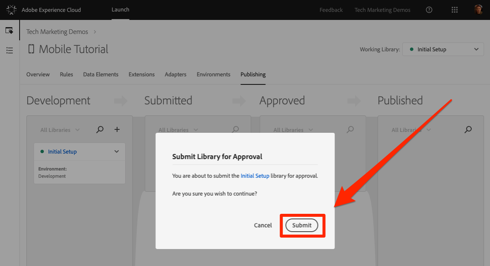
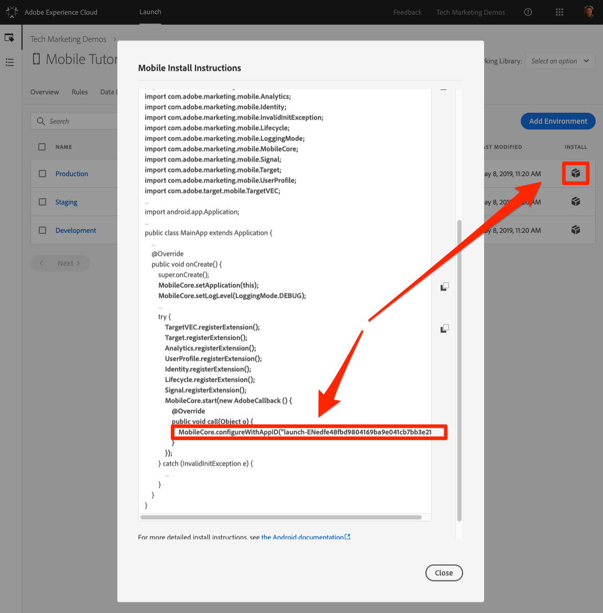

# Publicar la propiedad Launch

Ahora que ha implementado algunas soluciones clave de Adobe Experience Cloud en su entorno de desarrollo, es hora de aprender el flujo de trabajo de publicación.

## Requisitos previos

La cuenta de usuario de Launch necesita permiso para "Aprobar" y "Publicar" para completar esta lección. Si no puede completar ninguno de estos pasos porque las opciones de la interfaz de usuario no están disponibles para usted, póngase en contacto con el administrador de Experience Cloud para obtener acceso. For more information on Launch permissions, see [the documentation](https://docs.adobe.com/content/help/en/launch/using/reference/admin/user-permissions.html).

## Objetivos de aprendizaje

Al final de esta lección podrá:

1. Publicar una biblioteca de desarrollo en el entorno de ensayo
1. Actualice la aplicación para cargar diferentes entornos de lanzamiento
1. Publicar una biblioteca de ensayo en el entorno de producción

## Publicar en el entorno de ensayo

Ahora que ha creado y validado la biblioteca en el entorno de desarrollo, es hora de publicarla en Ensayo.

1. Go to the **[!UICONTROL Publishing]** page

1. Abra el menú desplegable situado junto a la biblioteca y seleccione **[!UICONTROL Enviar para aprobación]**

   

1. Haga clic en el botón **[!UICONTROL Enviar]** del cuadro de diálogo:

   

1. La biblioteca ahora aparecerá en la columna [!UICONTROL Enviado] en un estado sin compilar:

1. Abra el menú desplegable y seleccione **[!UICONTROL Generar para ensayo]**:

   
1. Una vez que aparece el icono del punto verde, la biblioteca se puede previsualizar en el entorno de ensayo.

En un escenario en tiempo real, el siguiente paso del proceso sería que el equipo de control de calidad validara los cambios en la biblioteca de ensayo.

**Validación de los cambios en la biblioteca de ensayo**

1. En la propiedad Launch, abra la página [!UICONTROL Entornos]

1. En la fila [!UICONTROL Ensayo] , haga clic en el icono Instalar

    de instalación para abrir el modal

En este punto, la única diferencia entre las instrucciones de instalación en los entornos de desarrollo y ensayo es la referencia de inicio en el código de inicialización, como se destaca en la captura de pantalla anterior.   Todo lo que necesita hacer es actualizar la línea correspondiente en el archivo DemoApplication y volver a compilar la aplicación. Si utiliza un proyecto diferente para la aplicación de ensayo, deberá asegurarse de que este proyecto tenga todas las demás actualizaciones de la aplicación que haya realizado a lo largo de este tutorial.

En la vida real, una vez que el equipo de control de calidad haya firmado revisando los cambios en el entorno de ensayo, es hora de publicar en producción.

## Publicación en producción

1. Go to the [!UICONTROL Publishing] page

1. En el menú desplegable, haga clic en **[!UICONTROL Aprobar para publicación]**:

   

1. Haga clic en el botón **[!UICONTROL Aprobar]** del cuadro de diálogo:

   

1. La biblioteca aparecerá ahora en la columna [!UICONTROL Aprobado] en el estado sin compilar (punto amarillo):

1. Abra el menú desplegable y seleccione **[!UICONTROL Generar y publicar en producción]**:

   

1. Haga clic en **[!UICONTROL Publicar]** en el cuadro de diálogo:

   

1. La biblioteca ahora aparecerá en la columna [!UICONTROL Publicado] :

   

Nuevamente, observe que el entorno Producción utiliza una referencia Launch en la Configuración principal, como se resalta en la captura de pantalla siguiente.  Si utiliza un proyecto diferente para la aplicación de producción, deberá asegurarse de que este proyecto tenga todas las actualizaciones de la aplicación que ha realizado a lo largo de este tutorial.

>[!IMPORTANT] La próxima vez que realice cambios en la configuración de Launch, deberá crear una nueva biblioteca en el entorno de desarrollo. Recuerde que la adición y eliminación de extensiones requerirán actualizaciones en la propia aplicación. Tenga cuidado de mantener los entornos de Launch y el código de la aplicación sincronizados entre sí para evitar problemas.

¡Eso es todo! Ha completado el tutorial y publicado su primera propiedad móvil en Launch.