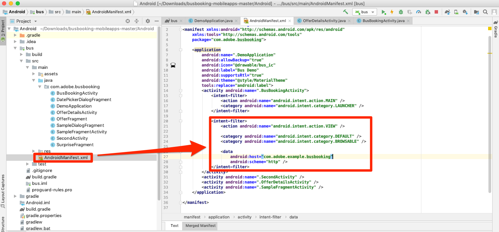
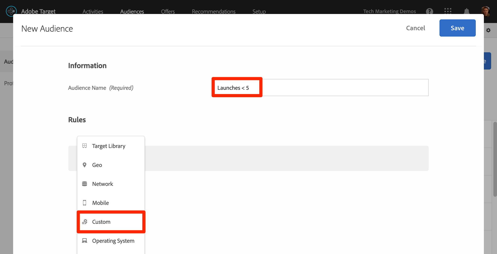

# Agregar el Compositor de experiencias visuales (VEC) de Adobe Target

En esta lección, habilitará el Compositor de experiencias visuales de Target (VEC) para aplicaciones móviles.

[Adobe Target](https://docs.adobe.com/content/help/en/target/using/target-home.html) es la solución de Adobe Experience Cloud que le proporciona todo lo necesario para adaptar y personalizar la experiencia de sus clientes, de modo que pueda maximizar los ingresos de sus sitios web y móviles, aplicaciones, medios sociales y otros canales digitales.

El Compositor de experiencias visuales (VEC) para aplicaciones móviles nativas le permite crear actividades y personalizar contenido en aplicaciones móviles nativas por su cuenta, sin las continuas dependencias y los ciclos de lanzamiento de aplicaciones de un desarrollo.

En la lección [Agregar extensiones](launch-add-extensions.md), ha agregado la extensión VEC de Target a la propiedad Launch. En la lección [Instale el SDK](launch-install-the-mobile-sdk.md) móvil que ha importado la extensión en la aplicación de ejemplo. Solo se requieren unas pocas actualizaciones menores para iniciar la configuración de actividades en el compositor de experiencias visuales móviles de Target.

>[!IMPORTANT]  Las extensiones de inicio de VEC de Target y Target son necesarias para usar el VEC de Target en la aplicación móvil.

## Objetivos de aprendizaje

Al final de esta lección podrá:

* Habilitar la aplicación de ejemplo para el VEC de Target
* Agregar parámetros a la solicitud de VEC de Target
* Par el dispositivo con el VEC
* Crear una actividad mediante el VEC

## Requisitos previos

Para completar las lecciones de esta sección, debe:

* Complete las lecciones de la sección [Configurar lanzamiento](launch-create-a-property.md) .
* Tener acceso a nivel de aprobador a la interfaz de Adobe Target

## La solicitud de carga de aplicación

Target activará una solicitud de "carga de aplicación" cuando la aplicación se cargue por primera vez debido a la configuración que seleccionamos cuando configuramos la extensión VEC de Target. Esta solicitud captura previamente todas las actividades de Target VEC que haya creado para su aplicación.

En el estudio de Android, filtre Logcat en "Target r" para mostrar las solicitudes y respuestas de Target. Observe los parámetros del nombre de la aplicación y la versión. Todas las actividades de Target VEC que cree se segmentarán automáticamente en estas propiedades.


## Agregar parámetros

Como acaba de ver en el último ejercicio, las métricas del ciclo vital de la aplicación se incluyen automáticamente como parámetros en la solicitud del VEC de Target. También puede agregar parámetros personalizados a las solicitudes, de forma global o para vistas específicas en la aplicación.

**Para agregar parámetros personalizados de forma global**

1. En Android Studio, abra `DemoApplication` el archivo.
1. Importar la extensión VEC de Target agregando `import ACPTargetVEC` debajo de la importación existente
1. Agregue el siguiente código de muestra en la `onCreate()` función antes de registrar las extensiones. Este código de ejemplo muestra cómo se pueden agregar parámetros regulares, parámetros de perfil, parámetros de producto (o entidad) y parámetros de pedido a la solicitud de TargetVEC. Este ejemplo utiliza valores estáticos, mientras que en la aplicación real es probable que desee utilizar variables dinámicas para rellenar los valores. Y, por supuesto, solo desea rellenar los parámetros que son relevantes para todas las vistas:

   ```java
   Map<String, String>targetParams = new HashMap<>(); //params
   targetParams.put( "param1", "value1");
   Map<String, String>taregtProfileParams = new HashMap<>(); //profile params
   taregtProfileParams.put("profilekey1","profilevalue1");
   
   TargetVEC.setGlobalRequestParameters(new TargetParameters.Builder()
            .parameters(targetParams)
            .profileParameters(taregtProfileParams)
            .product(new TargetProduct("1234", "furniture"))
            .order(new TargetOrder("12343", 123.45, Arrays.asList("100", "200")))
            .build());
   ```

1. Es posible que observe errores en Android Studio, ya que el código de parámetro anterior requiere las siguientes importaciones, que debe agregar al archivo:

   ```java
   import com.adobe.marketing.mobile.TargetOrder;
   import com.adobe.marketing.mobile.TargetProduct;
   import com.adobe.marketing.mobile.TargetParameters;
   import java.util.Arrays;
   import java.util.Map;
   import java.util.HashMap;
   ```

   

Ahora que ha agregado parámetros a la aplicación, es hora de confirmar que se están pasando en la solicitud.

**Para verificar los parámetros**

1. Guardar el proyecto de Android Studio
1. Vuelva a compilar la aplicación y espere a que se vuelva a abrir en el emulador
1. Abra el panel Logcat de Android Studio
1. Filtrar para mostrar todas las sentencias con "Target r"
1. Los parámetros personalizados que acaba de agregar deben ser visibles en la solicitud

   

Para obtener más información y detalles sobre cómo pasar parámetros con vistas específicas, consulte [la documentación](https://docs.adobe.com/content/help/en/target/using/implement-target/mobile-apps/composer/mobile-visual-experience-composer-android.html#parameters).

## Asociación de la aplicación móvil con la interfaz de Target

Para crear actividades de VEC en la interfaz de Target, primero debe emparejar Target con la aplicación. Este emparejamiento se logra mediante el uso de vínculos profundos.

### Creación del vínculo profundo

Android admite el uso de vínculos [profundos y vínculos](https://developer.android.com/training/app-links/deep-linking) de aplicaciones de Android para crear direcciones URL que vayan directamente a ubicaciones específicas de la aplicación. Probablemente ya los use en su aplicación. Si es así, puede utilizar la estructura de URL existente para establecer un par con Target. En este tutorial, revisará el vínculo profundo predefinido en la aplicación de reservación de bus, confirmará que funciona y, a continuación, lo utilizará para emparejar la aplicación con el VEC de Target para aplicaciones móviles.

**Para revisar la configuración de vínculos profundos**

1. En Android Studio, abra el archivo AndroidManifest.xml
1. Tenga en cuenta que ya hay un filtro de calidad configurado para el esquema de vínculos profundos de la aplicación de reservación de bus
1. Tenga en cuenta que `Host` y `Scheme` ya se han configurado en `com.adobe.example.busbooking` y `http`, respectivamente. Esto significa que una URL como `http://com.adobe.example.busbooking` cuando se abre en el emulador debe abrir automáticamente la aplicación de ejemplo

   

El siguiente paso es confirmar que el esquema de vínculos profundos está funcionando

### Verificar el vínculo profundo

Ahora asegúrese de que el vínculo profundo abrirá la aplicación en el emulador. Es posible que tenga la forma preferida de ejecutar comandos adb que puede utilizar.

**Para verificar el vínculo profundo mediante adb (Mac®)**

1. Asegúrese de que el emulador de Android se está ejecutando
1. Cierre la aplicación de reservación de bus si ya está abierta
1. Abrir una ventana Terminal
1. Vaya al directorio de herramientas de la plataforma Android: `cd Library/Android/sdk/platform-tools/`
1. Confirme que el emulador está adjunto: `./adb devices`
1. Abra el shell de adb: `./adb shell`
1. En la prueba del shell adb, el vínculo profundo: `am start -W -a android.intent.action.VIEW -d "http://com.adobe.example.busbooking" "com.adobe.busbooking"`
1. Confirme que la aplicación de reservación de bus se ha iniciado en el emulador

   

Ahora que la estructura de vínculos profundos está configurada, puede usar el VEC de Target para configurar actividades.

## Crear una actividad en el VEC móvil

Ahora vamos a crear una actividad en la interfaz de Target.

**Creación de una actividad con el VEC de Target**

1. Inicie sesión en [Adobe Experience Cloud](https://experiencecloud.adobe.com)
1. Utilice el conmutador de soluciones para ir a Target

   

1. Iniciar Target

   

1. Haga clic en el botón **[!UICONTROL Crear actividad]** y seleccione Prueba **[!UICONTROL A/B]**
1. Seleccionar aplicación **[!UICONTROL móvil]**
1. Asegúrese de que **[!UICONTROL Visual]** está seleccionado en **[!UICONTROL Elegir Compositor de experiencias]**
1. Haga clic en el botón **[!UICONTROL Siguiente]**

   

1. En la pantalla **[!UICONTROL Seleccionar una aplicación para utilizarla]** , haga clic en **[!UICONTROL Agregar nueva aplicación]**

   

1. Introduzca el esquema de URL que acaba de definir en el campo **[!UICONTROL Introducir esquema]** de URL, por ejemplo: `http://com.adobe.example.busbooking/`
1. Haga clic en **[!UICONTROL Crear vínculo profundo]**

   

   >[!NOTE] Tiene algunas opciones para enviar el vínculo profundo a la aplicación. Puede:
   >
   >   1. Envíe por correo electrónico el vínculo profundo a una dirección de correo electrónico válida y, a continuación, abra el vínculo con una aplicación de correo electrónico en el dispositivo
   >   1. Tome una foto del código QR desde su dispositivo Android (en nuestro tutorial, el dispositivo tendría que estar vinculado a Android Studio)
   >   1. Copie el vínculo profundo de la interfaz de Target y envíelo al dispositivo como desee


1. Haga clic en la ficha **[!UICONTROL Copiar y enviar vínculo]** .
1. Haga clic en la dirección URL generada (tenga en cuenta que al hacer clic en la dirección URL se copiará automáticamente en el portapapeles)

   

1. Abra una ventana de Terminal (o vuelva a la ventana si todavía la tiene abierta)
1. Vaya al directorio de herramientas de la plataforma de Android (puede que ya esté aquí): `cd Library/Android/sdk/platform-tools/`
1. Confirme que el emulador está adjunto: `./adb devices`
1. Abra el shell de adb: `./adb shell`
1. En el shell adb, reemplace [YOUR_TARGET_URL_WITH_TOKEN] en el siguiente comando por la URL que acaba de copiar en el portapapeles: `am start -W -a android.intent.action.VIEW -d "[YOUR_TARGET_URL_WITH_TOKEN]" "com.adobe.busbooking"`
1. Una vez cargada la aplicación, vuelva a la ficha del explorador donde haya abierto Target. Debería ver la aplicación cargada en el VEC.
1. Haga clic en los recursos de texto e imagen de la aplicación y verá las opciones para editarlos y reemplazarlos.

   

   > [!TIP] Si no ve que el VEC móvil se abre automáticamente en la interfaz de Target después de abrir el vínculo profundo en el dispositivo móvil, puede probar lo siguiente:
   >
   >   1. Asegúrese de que está utilizando la misma dirección URL en la interfaz de Target y de que no se recortó accidentalmente ningún carácter. Al ejecutar el comando en el shell adb, asegúrese de que la dirección URL esté entre comillas
      >
      >
      >   

   1. Confirme que ha agregado las dependencias adicionales al archivo build.gradle que requiere el VEC de Target. Estas dependencias deberían haberse agregado durante la lección [Instalar el SDK de Mobile](https://docs.adobe.com/content/help/en/experience-cloud/implementing-in-mobile-android-apps-with-launch/configure-launch/launch-install-the-mobile-sdk.html#update-the-buildgradle-file)
      >
      >
      >   

   1. Intente borrar los datos almacenados en la aplicación que se detallan en la siguiente imagen
      >
      >       
      


1. Realice algunos cambios en la primera pantalla de la aplicación
1. Ahora coloque el emulador junto al navegador con el VEC abierto
1. Vaya a otra pantalla de la aplicación y observe cómo se actualiza el VEC con el emulador.
1. Puede realizar actualizaciones en varias vistas de la aplicación, en una sola actividad.

   

1. También puede agregar visualmente métricas de rastreo de clics.
1. Guarde y apruebe su actividad y compruebe que puede verla en la aplicación de ejemplo

El emparejamiento del dispositivo con el VEC es una acción única. Cuando cree más actividades en el futuro en el mismo dispositivo, solo podrá seleccionar el dispositivo en una lista, como se muestra a continuación:


>[!TIP] Si tiene un dispositivo abierto, pero no está disponible en el menú de selección, intente cerrar y volver a abrir la aplicación en el emulador o dispositivo.

## Creación de audiencias en función de las métricas de ciclo vital

Métricas del ciclo vital métricas integradas sobre el uso de la aplicación por parte del visitante que se incluyen automáticamente en las llamadas realizadas por el SDK de Adobe Mobile. Puede crear audiencias fácilmente en Target basándose en estas métricas.

**Para crear una audiencia**

1. En la interfaz de Target, haga clic en **Audiencias** en la barra de navegación superior
1. Click the **Create Audience** button

   

1. Name the Audience `Launches < 5`
1. Click **Add Rule &gt; Custom**

   

1. En la primera lista desplegable, seleccione el parámetro **a.Launches** . Todos los parámetros de la métrica Ciclo de vida comienzan por "a".prefijo. El contenido de Target se segmentará en función del número de inicios de aplicación que tenga el usuario, lo que constituye una excelente manera de dirigirse a los usuarios que utilicen la aplicación por primera vez con instrucciones y experiencia del usuario por primera vez (FTUE).
1. En el siguiente menú desplegable, seleccione **es menor que**
1. En la tercera lista desplegable, escriba **5**
1. Haga clic en **Guardar**

   

Tenga en cuenta que en Target hay una gran variedad de opciones de creación de audiencias integradas. Además, puede enviar datos personalizados en la solicitud de Target para la creación de audiencias, usar audiencias compartidas desde otras soluciones de Experience Cloud, como Audience Manager y Analytics, y datos CRM compartidos con Target mediante la función Atributos del cliente del servicio principal Personas.

[Siguiente "Agregar Adobe Target" &gt;](target.md)