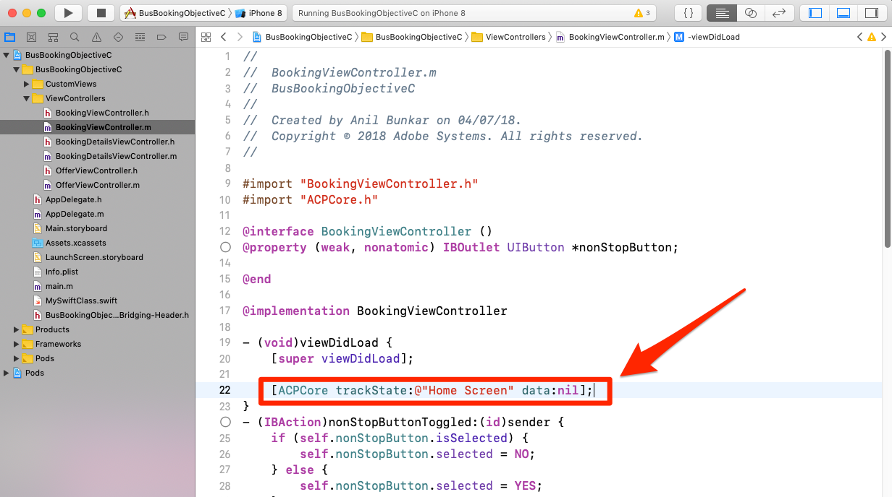

# Añadir Adobe Analytics

En esta lección, habilitará el seguimiento de Adobe Analytics en su aplicación.

[Adobe Analytics](https://docs.adobe.com/content/help/en/analytics/landing/home.html) es una solución líder del sector que le permite comprender a sus clientes como personas y dirigir su negocio con inteligencia de clientes.

En las lecciones de [Agregar extensiones](launch-add-extensions.md) e [instalar el SDK](launch-install-the-mobile-sdk.md) móvil, ha agregado la extensión Adobe Analytics a la propiedad Launch y la ha importado en la aplicación de ejemplo.  Ahora, todo lo que tiene que hacer es agregar código para rastrear los estados y las acciones en la aplicación.

## Objetivos de aprendizaje

Al final de esta lección podrá:

* Verifique que las métricas del ciclo vital se envíen a Adobe Analytics
* Agregue código para rastrear estados en la aplicación con datos adicionales
* Agregue código para rastrear acciones en la aplicación con datos adicionales

Hay muchas cosas que se podrían implementar para Analytics en Launch. Esta lección no es exhaustiva, pero debería ofrecerle una visión general sólida de las principales técnicas que necesitará para implementar en su propia aplicación.

## Requisitos previos

You should have already completed the lessons in the [Configure Launch](launch-create-a-property.md) section. En esa sección, agregó la extensión de Analytics y configuró el servidor de seguimiento y los ID del grupo de informes.

## Métricas del ciclo vital y Adobe Analytics

Las métricas del ciclo vital son métricas y dimensiones basadas en el entorno que se pueden activar fácilmente en una aplicación mediante el SDK de Experience Platform Mobile. ¡De hecho, ya los has agregado!

Ya habilitó las métricas del ciclo vital cuando agregó la extensión Core a su propiedad y siguió las Instrucciones de instalación móvil proporcionadas en la interfaz. Estas métricas y dimensiones, incluidas las métricas específicas del entorno y la aplicación, como la versión de la aplicación, el número de usuarios comprometidos, la versión del sistema operativo, la partición de tiempo, los días transcurridos desde el último uso, etc. puede resultar muy útil en el análisis de la aplicación, sobre todo cuando crea segmentos de Analytics a partir de ellos para aplicarlos a todos los informes. La lista completa de métricas está disponible en la [documentación](https://docs.adobe.com/content/help/en/mobile-services/ios/metrics.html).

### Visualización de la visita al ciclo vital de Analytics

Aunque puede ver las visitas del ciclo vital en cualquier programa de depuración o husmeador de paquetes, simplemente las mostraremos en la consola de depuración de Xcode.

1. Cree y ejecute el proyecto en Xcode para que se inicie el simulador
1. En la consola de depuración de Xcode, escriba `lifecycle` en el filtro de la parte inferior para limitar lo que aparece y, a continuación, desplácese hasta la parte inferior de las entradas
1. Observe la `Analytics request was sent with body` sección
1. Las métricas del ciclo vital incluyen elementos como AppID, CarrierName, DayOfWeek, DaysSinceFirstUse y otras métricas y dimensiones que se enumeran en la [documentación](https://docs.adobe.com/content/help/en/mobile-services/ios/metrics.html)

   

## Importación de la biblioteca ACPCore

En los próximos ejercicios, usará las API para rastrear estados ("trackState") y acciones ("trackAction") en su aplicación. Para utilizar estas API, debe importar la biblioteca que las contiene.  En el nuevo SDK de Experience Cloud Platform Mobile, las API trackState y trackAction se han trasladado de la biblioteca de Analytics a la biblioteca principal, lo que permite aprovechar estas API para otros fines que no solo el seguimiento de Adobe Analytics.

En este tutorial, solo realizará un seguimiento de un estado, pero en la aplicación real, querrá rastrear varios estados.

**Para importar la biblioteca ACPCore**

1. Abra el archivo BookingViewController.m en Xcode
1. En la parte superior del archivo (normalmente junto con otras instrucciones de importación), agregue `#import "ACPCore.h"`
1. Guardar
1. Ya está listo para usar las API trackState o trackAction en este archivo

   <!---->

## Seguimiento de estados

En la aplicación, es posible que tenga muchas pantallas de contenido diferentes que proporcione a los usuarios. Son equivalentes a las páginas de un sitio web. Adobe Analytics proporciona un método para enviar estas "visitas de vista de página" y verlas en los mismos informes a los que está acostumbrado para sus propiedades web. Este método se denomina "trackState".

En este tutorial, solo colocará el código de una llamada a trackState en una pantalla (página) de la aplicación. En la vida real, lo replicará en todas las demás pantallas o estados de la aplicación. También explorará distintas formas de enviar datos (pares clave/valor) con la visita.

A continuación encontrará una sintaxis y un ejemplo de código de la documentación que puede copiar y pegar en este tutorial o en su propia aplicación.

**Sintaxis:**

```objective-c
+ (void) trackState: (nullable NSString*) state data: (nullable NSDictionary*) data;
```

**Ejemplo:**

```objective-c
[ACPCore trackState:@"state name" data:@{@"key":@"value"}];
```

### Seguimiento de un estado sin datos

1. Con la aplicación de ejemplo abierta en Xcode, vaya a BookingViewController.m y, en la `viewDidLoad()` función, agregue una llamada de método trackState
1. Definir el `state name` en "Pantalla principal"
1. En lugar de agregar datos adicionales, agregue `null` como marcador de posición en la llamada al método
1. O bien, copie y pegue lo siguiente:

   ```objective-c
   [ACPCore trackState:@"Home Screen" data:nil];
   ```

   

>[!NOTE] Si ha completado las lecciones para implementar el VEC de Target, tendrá algún código adicional en la función viewDidLoad() que no se muestra en las capturas de pantalla de este ejercicio. Esto se espera y tiene por objeto centrar la atención en la tarea que se está realizando.

**Para validar trackState**

1. Guardar, crear y ejecutar el proyecto
1. Cuando se ejecute el simulador y se abra la pantalla de inicio de la aplicación, vea la consola Xcode
1. Filtre la consola a las entradas con "inicio" y observe la entrada inferior que muestra que la variable `Analytics request was sent with body`
1. Tenga en cuenta que la variable pageName está configurada en `Home Screen`, y no hay otros pares de datos personalizados. Aunque técnicamente está configurando un "nombre de estado" y no un "nombre de página", el nombre de parámetro utilizado es `pageName` para proporcionar coherencia con las implementaciones de sitios web.

   

### Seguimiento de un estado con datos

1. Vuelva a BookingViewController.m y, en la `viewDidLoad()` función, comente (o elimine) la llamada trackState básica (sin datos agregados) desde el último ejercicio
1. Agregue una nueva llamada de método trackState, esta vez con datos, usando `key1` como clave y `value1` como valor
1. Deje el `state name` mensaje como "Pantalla principal"
1. O bien, copie y pegue en:

   ```objective-c
   [ACPCore trackState:@"Home Screen" data:@{@"key1":@"value1"}];
   ```

   

**Validación de trackState con datos**

1. Guarde, cree y ejecute de nuevo el proyecto
1. Cuando se ejecute el simulador y se abra la pantalla de inicio de la aplicación, vea la consola Xcode
1. Deje el filtro como "inicio" y observe la entrada inferior que muestra que la variable `Analytics request was sent with body`
1. Ahora observe que además de pageName que se está configurando, también tiene el par clave/valor que se envió en la visita

   

>[!NOTE] Si está familiarizado con las "props y eVars" en Analytics, verá que estos nombres de variables no están en el SDK. Todos los datos de clave y valor procedentes del SDK se enviarán como variables [](https://docs.adobe.com/content/help/en/analytics/implementation/javascript-implementation/variables-analytics-reporting/context-data-variables.html)contextData y, como tales, deberán asignarse a props o eVars (u otras variables) mediante reglas [de](https://docs.adobe.com/content/help/en/analytics/admin/admin-tools/processing-rules/processing-rules.html) procesamiento en la interfaz de usuario de Analytics.

### Opciones adicionales de envío de datos

En los dos ejercicios anteriores has hecho dos solicitudes, una con datos adicionales y otra sin datos. Sin embargo, ¿qué sucede si desea enviar varios puntos de datos a Analytics con una pantalla o una carga de estado? Debajo hay dos opciones.

#### Opción 1: Varios pares clave/valor

En la llamada trackState, tiene la opción de enviar varios pares de clave/valor, simplemente separándolos por coma en el conjunto de datos. Por ejemplo:

```objective-c
[ACPCore trackState:@"Home Screen" data:@{@"key1":@"value1",@"key2":@"value2",@"key3":@"value3"}];
```

#### Opción 2: Objeto Dictionary

También puede definir un diccionario en el código y enviarlo también con trackState. Por supuesto, si ya ha definido algunos objetos de diccionario en el código y desea enviarlos a Analytics, esta puede ser la opción perfecta para usted. Por ejemplo:

```objective-c
NSDictionary *theStuff = @{@"key1": @"value1",@"key2": @"value2"};
[ACPCore trackState:@"Home Screen" data:theStuff];
```

**Crédito** adicional Pruebe estas dos opciones en su código, viendo los resultados en la consola de depuración de Xcode. Puede utilizar el mismo filtro que antes y comprobar los resultados para asegurarse de que las variables y los valores se están transmitiendo

## Seguimiento de acciones

De forma similar a rastrear las acciones que no son de carga de página en un sitio web, con frecuencia desea rastrear una acción que un usuario realiza en la aplicación, por ejemplo, hacer clic en cosas que no cargan otra pantalla. Esto se gestiona de forma muy similar a trackState que ha utilizado anteriormente, excepto que se llama a este método `trackAction`.

A continuación se muestra una sintaxis y un ejemplo de código de la documentación que puede copiar y pegar en este tutorial o en su propia aplicación.

**Sintaxis:**

```objective-c
+ (void) trackAction: (nullable NSString*) action data: (nullable NSDictionary*) data;
```

**Ejemplo:**

```objective-c
[ACPCore trackAction:@"action name" data:@{@"key":@"value"}];
```

### Rastrear interacción con la casilla de verificación 'Sin interrupciones'

En esta aplicación de reservación de bus de muestra, hay una casilla de verificación que permite a los usuarios decidir si desean limitar los resultados de búsqueda a las opciones. Ha decidido que desea rastrear la interacción con esa casilla de verificación en Adobe Analytics.


Esta casilla de verificación está controlada en el archivo BookingViewController.m del proyecto de muestra. En este ejercicio, enviará una visita de trackAction cada vez que las personas marquen o desmarquen la casilla.

#### Configuración del código trackAction

1. Con el proyecto de ejemplo abierto en Xcode, vaya a BookingViewController.m y busque la función "nonStopButtonToggled"
1. En la `if` instrucción, la primera sección anula la selección del cuadro si ya está seleccionado. En este escenario, desea enviar una visita con el valor "off", utilizando el siguiente código:

   ```objective-c
   [ACPCore trackAction:@"NonStop Button Interaction" data:@{@"NonStop":@"off"}];
   ```

1. En la siguiente sección (la sección "else"), marca la casilla si no está marcada. En este escenario, desea enviar una visita con el valor "on", utilizando el siguiente código:

   ```objective-c
   [ACPCore trackAction:@"NonStop Button Interaction" data:@{@"NonStop":@"on"}];
   ```

Observe las demás personalizaciones del código:

* Está configurando el `action name` en "Interacción de botón de no detención". Este valor rellenará el parámetro "action" de la solicitud y el informe o la dimensión del vínculo personalizado en Adobe Analytics
* El nombre del `key` usuario es "NonStop". Este es el nombre clave que puede buscar en Reglas de procesamiento en la Consola de administración de Analytics, para poder asignar estos valores a una propiedad o eVar.

Ahora la función tiene este aspecto:


#### Validación del código trackAction

1. Después de agregar el código, guarde el proyecto, ejecútelo y genere
1. Haga clic en el icono de elementos no utilizados para borrar la consola
1. Marque la casilla en el simulador y observe que aparecen dos solicitudes en la consola. El último es el envío de datos a Adobe Analytics desde el código que acaba de agregar.
1. Observe que tanto los parámetros action como pev2 están configurados en "Interacción de botón NonStop" (con espacios codificados)
1. Observe que el par clave/valor "NonStop=on" está presente y se puede asignar a una prop/eVar en las reglas de procesamiento
1. Observe la clave o el valor "pe=lnk_o", que muestra que se trata de una visita de "vínculo personalizado", desencadenada por trackAction

   

¡Buen trabajo! Ha completado la lección de Analytics. Por supuesto, hay muchas otras cosas que puede hacer para mejorar nuestra implementación de Analytics, pero es de esperar que esto le haya dado algunas de las habilidades básicas que necesitará para abordar el resto de sus necesidades.

## Beneficios adicionales de trackState y trackAction

En estos últimos ejercicios, pudo enviar datos de la aplicación a Adobe Analytics mediante las API trackState y trackAction. Dado que el SDK de Experience Platform Mobile se basa en Launch, hay muchas más cosas que puede hacer en la interfaz de Launch aprovechando el código que acaba de añadir.

En Launch, puede crear reglas activadas por las API trackState y trackAction y hacer que ejecuten acciones adicionales, como realizar solicitudes a otras soluciones de Adobe o socios externos.

[Siguiente "Agregar Adobe Audience Manager" &gt;](audience-manager.md)
