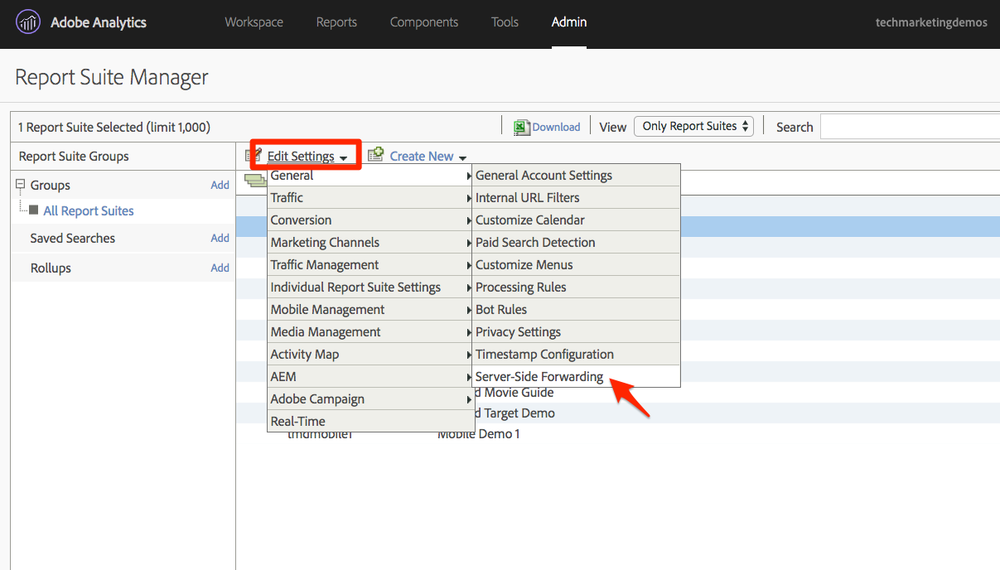

# Agregar Adobe Audience Manager

Esta lección le guiará a través de los pasos para implementar Adobe Audience Manager en el SDK de Experience Platform Mobile mediante el reenvío del lado del servidor.

[Adobe Audience Manager](https://docs.adobe.com/content/help/en/audience-manager/user-guide/aam-home.html) (AAM) proporciona servicios líderes en el sector para la administración de datos de audiencia en línea, lo que proporciona a los anunciantes y editores digitales las herramientas que necesitan para controlar y aprovechar sus recursos de datos a fin de contribuir al éxito de las ventas.

## Objetivos de aprendizaje

Al final de esta lección podrá:

1. Describa las dos formas principales de implementar Audience Manager en una aplicación móvil
1. Adición de Audience Manager mediante el reenvío de servidor de la señalización de Analytics
1. Validar la implementación de Audience Manager

## Requisitos previos

Para completar esta lección, necesitará:

1. Para completar las lecciones en la sección Configuración de lanzamiento, a saber, [Crear una propiedad](launch-create-a-property.md)de inicio, [Agregar extensiones](launch-add-extensions.md), [Crear una biblioteca](launch-create-a-library.md)e [instalar el SDK](launch-install-the-mobile-sdk.md)móvil.

1. Acceso del administrador a Adobe Analytics para que pueda habilitar el reenvío del lado del servidor para el grupo de informes que está utilizando para este tutorial. También puede pedir a un administrador existente de su organización que lo haga siguiendo las instrucciones que se indican a continuación.

Si aún no ha implementado Audience Manager, siga estas instrucciones para [obtener el subdominio](https://docs.adobe.com/content/help/en/audience-manager-learn/tutorials/web-implementation/how-to-identify-your-partner-id-or-subdomain.html)de Audience Manager.

## Opciones de implementación

Existen dos formas de implementar Audience Manager en una aplicación:

* Reenvío del lado del servidor (SSF): para los clientes con Adobe Analytics, esta es la forma más fácil y recomendada de implementar. Adobe Analytics reenvía datos a AAM en el servidor de Adobe para que no tenga que realizar solicitudes desde la aplicación directamente a Audience Manager. Esto también permite funciones de integración clave y se ajusta a las optimizaciones para la implementación y la implementación del código de Audience Manager.

* DIL del lado del cliente: este método es para clientes que no tienen Adobe Analytics. Los métodos de Audience Manager de la aplicación envían datos directamente a Audience Manager. En este caso, utilizaría la extensión de Audience Manager en Launch al configurar la propiedad de inicio móvil.

Cuando anteriormente configuró la extensión de Analytics en la sección [Agregar extensiones](launch-add-extensions.md) de este tutorial, marcó la casilla para iniciar el reenvío de datos de Analytics a Audience Manager por parte del servidor. Esto insertará dinámicamente el código necesario para gestionar la respuesta de los segmentos de Audience Manager de nuevo en la aplicación. No se agregará la extensión de Audience Manager en este tutorial, porque, de nuevo, solo se aplica al caso de uso de cuando NO tenga Adobe Analytics.

## Activación del reenvío del lado del servidor

Existen dos pasos principales para realizar una implementación de SSF:

1. Activar un "conmutador" en la Consola de administración de Analytics para reenviar datos de Analytics a Audience Manager *por grupo* de informes.
1. Coloque el código SDK en su lugar, **lo que ha hecho** mediante Launch simplemente marcando la casilla en la extensión de Analytics para reenviar datos a AAM.

### Habilitar el reenvío del lado del servidor en la Admin Console de Analytics

Se requiere una configuración en la Consola de administración de Adobe Analytics para empezar a reenviar datos de Adobe Analytics a Adobe Audience Manager. Tenga en cuenta que el sistema puede tardar hasta cuatro horas en empezar a reenviar los datos, por lo que tenga en cuenta que está solucionando el problema con el reenvío.

#### Para activar SSF en la Consola de administración de Analytics

1. Inicie sesión en Analytics mediante la interfaz de usuario de Experience Cloud. Si no tiene acceso de administrador a Analytics, deberá hablar con el administrador de Experience Cloud o Analytics para asignarle acceso o completar estos pasos.

   

1. En el panel de navegación superior de Analytics, elija **[!UICONTROL Administración &gt; Grupos]** de informes y, en la lista, seleccione (o seleccione varias) los grupos de informes que desee reenviar a Audience Manager.

   

1. En la pantalla Grupos de informes y con los grupos de informes seleccionados, elija **[!UICONTROL Editar configuración &gt; General &gt; Reenvío]** del lado del servidor.

   

   >[!WARNING] Como se ha indicado anteriormente, debe tener privilegios de administrador para ver este elemento de menú.

1. Una vez en la página Reenvío del lado del servidor, lea la información y marque la casilla de verificación **[!UICONTROL Habilitar reenvío]** del lado del servidor para los grupos de informes.

1. Haga clic en **[!UICONTROL Guardar]**

   

>[!NOTE] Dado que el SSF debe habilitarse por grupo de informes, no olvide repetir este paso para los grupos de informes reales cuando implemente el SSF en el grupo de informes de la aplicación real.
>
>Además, si la opción SSF está atenuada, deberá "asignar los grupos de informes a su organización de Experience Cloud para habilitar la opción. Esto se explica en [la documentación](https://docs.adobe.com/content/help/en/core-services/interface/about-core-services/report-suite-mapping.html).

Este conmutador iniciará el reenvío real de datos a AAM, siempre que tenga implementado el servicio de identidad de la plataforma de experiencia de Adobe. El resto de la implementación de SSF se lleva a cabo en el código, que se gestionó en Launch cuando activó la casilla en la extensión de Analytics para reenviar a AAM.

El código de reenvío del lado del servidor ya está implementado para su aplicación.

### Validación del reenvío del lado del servidor

La forma principal de validar que el reenvío del lado del servidor esté activo y en ejecución es mirando la respuesta a cualquiera de las visitas de Adobe Analytics procedentes de la aplicación.

Si no realiza el reenvío de datos del lado del servidor (SSF) de Analytics a Audience Manager, no hay ninguna respuesta a la señalización de Analytics (además de un píxel de 2x2). Sin embargo, una vez activado el SSF, hay elementos que puede comprobar en la solicitud y la respuesta de Analytics que le harán saber que funciona correctamente.

Dado que la consola Xcode no muestra la respuesta a las señalizaciones, debe utilizar otro depurador/husmeador de paquetes que no muestre la respuesta, como Charles Proxy, por ejemplo (que es lo que mostraré en la captura de pantalla siguiente).

1. Abra el depurador y el filtro para `b/ss`, lo que limitará lo que ve a las solicitudes de Adobe Analytics
1. Cree y ejecute la aplicación de ejemplo desde ejercicios anteriores
1. Para cualquiera de sus solicitudes de Analytics, consulte la respuesta. Debe contener un `dcs_region` parámetro, un `uuid` parámetro y también un objeto "material". Este objeto es el lugar donde se enviarán los ID de segmento de AAM al explorador (para cualquier segmento al que pertenezca el usuario, que se asignen en AAM a un destino de cookie). Si tienes el objeto "material", ¡SSF está funcionando!

   

>[!WARNING] Cuidado con el falso "éxito" - Si hay una respuesta, y todo parece estar funcionando, asegúrate de **que** tienes ese objeto "material". Si no lo hace, puede que vea un mensaje en la respuesta que diga "estado":"ÉXITO". Por más loco que parezca, esto es prueba de que **NO** está funcionando correctamente. Si lo ve, significa que ha completado el paso en Iniciar para reenviar a AAM, pero que el reenvío en la Consola de administración de Analytics aún no se ha completado. En este caso, debe comprobar que ha activado SSF en la Consola de administración de Analytics. Si lo has hecho, y no han pasado 4 horas todavía, ten paciencia.

[Siguiente "Publicar su propiedad" &gt;](publish.md)