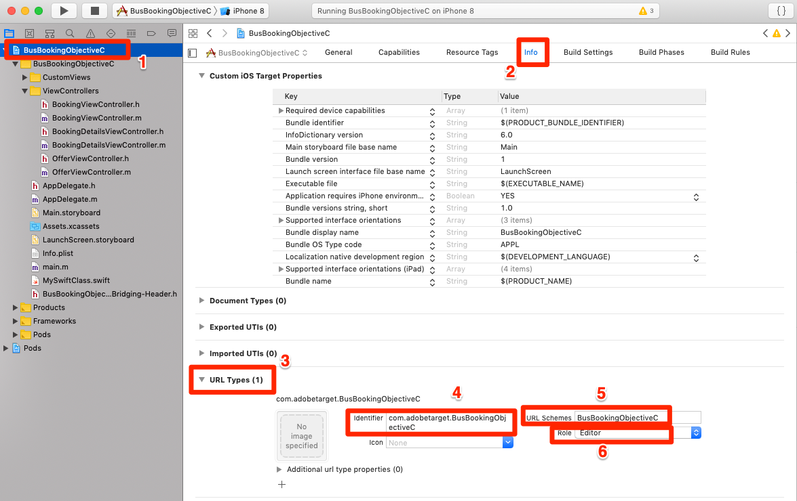

# Agregar el Compositor de experiencias visuales (VEC) de Adobe Target

En esta lección, habilitará el Compositor de experiencias visuales de Target (VEC) para aplicaciones móviles.

[Adobe Target](https://docs.adobe.com/content/help/en/target/using/target-home.html) es la solución de Adobe Experience Cloud que le proporciona todo lo necesario para adaptar y personalizar la experiencia de sus clientes, de modo que pueda maximizar los ingresos de sus sitios web y móviles, aplicaciones, medios sociales y otros canales digitales.

El Compositor de experiencias visuales (VEC) para aplicaciones móviles nativas le permite crear actividades y personalizar contenido en aplicaciones móviles nativas por su cuenta, sin las continuas dependencias y los ciclos de lanzamiento de aplicaciones de un desarrollo.

En la lección [Agregar extensiones](launch-add-extensions.md), ha agregado la extensión VEC de Target a la propiedad Launch. En la lección [Instale el SDK](launch-install-the-mobile-sdk.md) móvil que ha importado la extensión en la aplicación de ejemplo. Solo se requieren unas pocas actualizaciones menores para iniciar la configuración de actividades en el compositor de experiencias visuales móviles de Target.

>[!WARNING]  Las extensiones de inicio de VEC de Target y Target son necesarias para usar el VEC de Target en la aplicación móvil.

## Objetivos de aprendizaje

Al final de esta lección podrá:

* Habilitar la aplicación de ejemplo para el VEC de Target
* Agregar parámetros a la solicitud de VEC de Target
* Par el dispositivo con el VEC
* Crear una actividad mediante el VEC

## Requisitos previos

Para completar las lecciones de esta sección, debe:

* Complete las lecciones de la sección [Configurar lanzamiento](launch-create-a-property.md) .
* Tener acceso a nivel de aprobador a la interfaz de Adobe Target

## Agregar parámetros

Las métricas del ciclo vital se incluyen automáticamente como parámetros en la solicitud del VEC de Target. También puede agregar parámetros personalizados a las solicitudes.

**Para agregar parámetros personalizados**

1. En Xcode, abra el `BookingViewController.m` archivo. Este archivo lo utiliza la pantalla de inicio.
1. Importar las extensiones de VEC de Target y Target debajo de las importaciones existentes

   ```swift
   #import "ACPTarget.h"
   #import "ACPTargetVEC.h"
   ```

1. En la `viewDidLoad` función, después de la línea con `super.viewDidLoad` agregue el siguiente código. Este código de ejemplo muestra cómo se pueden agregar parámetros, parámetros de perfil, parámetros de producto (o entidad) y parámetros de pedido a la solicitud de TargetVEC. Este ejemplo utiliza valores estáticos, mientras que en la aplicación real desea utilizar variables dinámicas para rellenar los valores. Y, por supuesto, solo desea rellenar los parámetros relacionados con la vista:

   ```objective-c
   NSDictionary *params = @{@"param1":@"value1"};
   NSDictionary *profileParams = @{@"profilekey1":@"profilevalue1"};
   ACPTargetProduct *product = [ACPTargetProduct targetProductWithId:@"1234" categoryId:@"furniture"];
   ACPTargetOrder *order = [ACPTargetOrder targetOrderWithId:@"12343" total:@(123.45) purchasedProductIds:@[@"100",@"200"]];
   ACPTargetParameters *targetParams = [ACPTargetParameters targetParametersWithParameters:params
                                                                         profileParameters:profileParams
                                                                                   product:product
                                                                                     order:order];
   [ACPTargetVEC setGlobalRequestParameters:targetParams];
   ```

   

Ahora que ha agregado parámetros a la aplicación, es hora de confirmar que se están pasando en la solicitud.

**Para verificar los parámetros**

1. Guardar el proyecto Xcode
1. Vuelva a compilar la aplicación y espere a que se vuelva a abrir en el simulador
1. Haga clic en el panel Consola de Xcode
1. Utilice la función F para abrir el cuadro Buscar
1. Buscar `targetvec` en el cuadro Buscar
1. Visita `Enter` para ir al cuerpo de la solicitud y la publicación de Target. Busque los parámetros personalizados que acaba de agregar a la solicitud:

   

## Asociación de la aplicación móvil con la interfaz de Target

Para crear actividades de VEC en la interfaz de Target, primero debe emparejar Target con la aplicación. Este emparejamiento se logra mediante el uso de vínculos profundos.

### Creación del esquema de vínculos profundos

iOS admite el uso de vínculos [](https://developer.apple.com/documentation/uikit/core_app/allowing_apps_and_websites_to_link_to_your_content) universales y esquemas [de URL](https://developer.apple.com/documentation/uikit/core_app/allowing_apps_and_websites_to_link_to_your_content/defining_a_custom_url_scheme_for_your_app) personalizados para crear vínculos profundos a la aplicación. Probablemente ya utilice esquemas de URL personalizados en la aplicación. Si es así, puede utilizar estos vínculos existentes para establecer un par con Target. Para este tutorial, debe crear un esquema de URL personalizado.

**Para registrar el esquema de URL**

1. En Xcode, haga doble clic en la aplicación para abrir la pantalla Configuración
1. En la pantalla Configuración, haga clic en la `Info` ficha
1. Expandir la `URL Types` sección
1. Tenga en cuenta que el **[!UICONTROL identificador]** está establecido en `com.adobetarget.BusBookingObjectiveC`. Puede usar este identificador o cambiarlo si lo desea.
1. Tenga en cuenta que el esquema **[!UICONTROL de]** URL es `BusBookingObjectiveC`. Puede usar este esquema o cambiarlo si lo desea.
1. Asegúrese de que **[!UICONTROL el Editor]** esté seleccionado como la **[!UICONTROL función]**

   

1. Si ha actualizado el identificador o el esquema, haga clic en la `General` ficha para guardar el esquema.  Haga clic en la `Info` ficha, expanda la `URL type` sección y verifique que su identificador o esquema y lo guarde.

El siguiente paso es agregar un controlador al vínculo profundo.

**Gestión de los vínculos profundos**

1. Abrir el `AppDelegate.m` archivo
1. Agregue la línea `[ACPCore collectLaunchInfo:@ {@"adb_deeplink": url.absoluteString}];` a la `AppDelegate:application:openURL` sección como se muestra a continuación
   

### Verificar el vínculo profundo

Ahora, cuando un usuario con la aplicación instalada abre una URL como `BusBookingObjectiveC://com.adobetarget.BusBookingObjectiveC` (o el esquema que haya definido) en el simulador, se abrirá la aplicación.

**Para verificar el esquema de vínculos profundos**

1. Guardar el proyecto Xcode
1. Volver a compilar la aplicación
1. En el simulador, abra Safari
1. Introduzca la dirección URL `BusBookingObjectiveC://com.adobetarget.BusBookingObjectiveC` (o el esquema que haya definido) en la barra de direcciones. Si tiene alguna dificultad, consulte la sección Sugerencia a continuación.
1. Debe recibir un modal para "Abrir esta página en "BusBookingObjectiveC". Si tiene alguna dificultad, consulte la sección Sugerencia a continuación.
1. Haga clic en `Open`
1. Esto debería abrir la aplicación de reservación de bus

   > [!TIP] Si no consigue copiar y pegar la URL desde el escritorio al simulador, suele deberse a uno de estos dos motivos:
   >
   >   1. **La dirección URL copiada de la interfaz de Target no se pega en el simulador** . Esto sucede cuando no se sincronizan los portapapeles de escritorio y del simulador.  Si esto sucede, pruebe a desactivar y activar la `Automatically Sync Pasteboard` configuración en el simulador y vuelva a copiar/pegar:
      >
      >      
      
      >
      >   
   1. **Al pegar la dirección URL, ésta se coloca en la página** de resultados de búsqueda de Google. Intente volver a pegar la dirección URL del vínculo profundo en la barra de direcciones y pulse `Enter`. Es posible que deba repetir esto varias veces.


   

Ahora que la estructura de vínculos profundos está configurada, puede usar el VEC de Target para configurar actividades.

## Crear una actividad en el VEC móvil

Ahora vamos a crear una actividad en la interfaz de usuario de Target.

**Creación de una actividad con el VEC de Target**

1. Inicie sesión en [Adobe Experience Cloud](https://experiencecloud.adobe.com)
1. Utilice el conmutador de soluciones para ir a Target

   

1. Iniciar Target

   

1. Haga clic en el botón **[!UICONTROL Crear actividad]** y seleccione Prueba **[!UICONTROL A/B]**
1. Seleccionar aplicación **[!UICONTROL móvil]**
1. Asegúrese de que **[!UICONTROL Visual]** está seleccionado en **[!UICONTROL Elegir Compositor de experiencias]**
1. Haga clic en el botón **[!UICONTROL Siguiente]**

   

1. En la pantalla **[!UICONTROL Seleccionar una aplicación para utilizarla]** , haga clic en **[!UICONTROL Agregar nueva aplicación]**

   

1. Introduzca el esquema de URL que acaba de definir en el campo **[!UICONTROL Introducir esquema]** de URL, por ejemplo: `BusBookingObjectiveC://com.adobetarget.BusBookingObjectiveC`
1. Haga clic en **[!UICONTROL Crear vínculo profundo]**

   

   >[!NOTE] Tiene algunas opciones para enviar el vínculo profundo a la aplicación. Puede:
   >
   >   1. Tome una foto del código QR desde su dispositivo iOS (en nuestro tutorial, el dispositivo tendría que estar vinculado a Xcode)
   >   1. Copie el vínculo profundo de la interfaz de Target y envíelo al dispositivo como desee
   >   1. Envíe por correo electrónico el vínculo profundo a una dirección de correo electrónico válida y, a continuación, abra el vínculo con una aplicación de correo electrónico en el dispositivo


1. Haga clic en la ficha **[!UICONTROL Copiar y enviar vínculo]** .
1. Haga clic en cualquier lugar del vínculo para copiar automáticamente el vínculo en el portapapeles

   

1. Volver al simulador
1. Abrir Safari en el simulador
1. Pegue la dirección URL del vínculo profundo en la barra de direcciones
1. Haga clic en el `Open` botón para abrir la aplicación

   > [!TIP] Si no consigue copiar y pegar la URL desde el escritorio al simulador, suele deberse a uno de estos dos motivos:
   >
   >   1. **La dirección URL copiada de la interfaz de Target no se pega en el simulador** . Esto sucede cuando no se sincronizan los portapapeles de escritorio y del simulador.  Si esto sucede, pruebe a desactivar y activar la `Automatically Sync Pasteboard` configuración en el simulador y vuelva a copiar/pegar:
      >
      >      
      
      >
      >   
   1. **Al pegar la dirección URL, ésta se coloca en la página** de resultados de búsqueda de Google. Intente volver a pegar la dirección URL del vínculo profundo en la barra de direcciones y pulse `Enter`. Es posible que deba repetir esto varias veces.


   

1. Una vez cargada la aplicación, vuelva a la ficha del explorador donde haya abierto Target. Debería ver la aplicación cargada en el VEC.
1. Haga clic en los recursos de texto e imagen de la aplicación y verá las opciones para editarlos y reemplazarlos.

   

1. Realice algunos cambios en la primera pantalla de la aplicación
1. Ahora coloque el simulador junto al explorador con el VEC abierto
1. Vaya a otra pantalla de la aplicación y observe cómo se actualiza el VEC con el simulador.
1. Puede realizar actualizaciones en varias vistas de la aplicación, en una sola actividad.
   
1. También puede añadir visualmente métricas de seguimiento de clics y utilizar la integración de A4T con Analytics.
1. Guarde y apruebe su actividad y compruebe que puede verla en la aplicación de ejemplo

El emparejamiento del dispositivo con el VEC es una acción única. Cuando cree más actividades en el futuro en el mismo dispositivo, solo podrá seleccionar el dispositivo en una lista, como se muestra a continuación:


>[!TIP] Si tiene un dispositivo abierto, pero no está disponible en el menú de selección, vuelva a la pantalla de inicio y, a continuación, mueva la aplicación de nuevo al primer plano para que vuelva a estar "disponible".

## Creación de audiencias en función de las métricas de ciclo vital

Métricas del ciclo vital métricas integradas sobre el uso de la aplicación por parte del visitante que se incluyen automáticamente en las llamadas realizadas por el SDK de Adobe Mobile. Puede crear audiencias fácilmente en Target basándose en estas métricas.

**Para crear una audiencia**

1. En la interfaz de Target, haga clic en **Audiencias** en la barra de navegación superior
1. Click the **Create Audience** button

   

1. Name the Audience `Launches < 5`
1. Click **Add Rule &gt; Custom**

   

1. En la primera lista desplegable, seleccione el parámetro **a.Launches** . Todos los parámetros de la métrica Ciclo de vida comienzan por "a".prefijo. El contenido de Target se segmentará en función del número de inicios de aplicación que tenga el usuario, lo que constituye una excelente manera de dirigirse a los usuarios que utilicen la aplicación por primera vez con instrucciones y experiencia del usuario por primera vez (FTUE).
1. En el siguiente menú desplegable, seleccione **es menor que**
1. En la tercera lista desplegable, escriba **5**
1. Haga clic en **Guardar**

   

Tenga en cuenta que en Target hay una gran variedad de opciones de creación de audiencias integradas. Además, puede enviar datos personalizados en la solicitud de Target para la creación de audiencias, usar audiencias compartidas desde otras soluciones de Experience Cloud, como Audience Manager y Analytics, y datos CRM compartidos con Target mediante la función Atributos del cliente del servicio principal Personas.

[Siguiente "Agregar Adobe Target" &gt;](target.md)