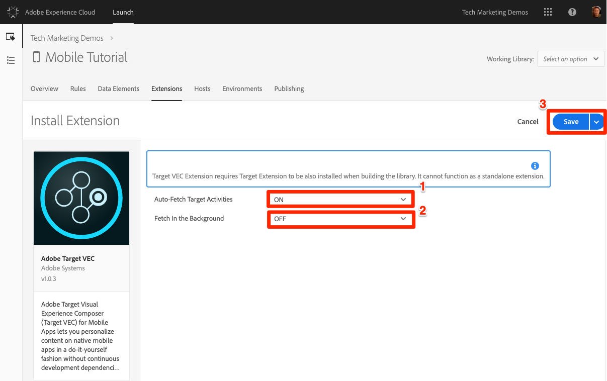

# Agregar extensiones

En esta lección, agregará extensiones a la propiedad Launch.

Launch es una plataforma que permite a Adobe y a terceros proveedores crear extensiones para facilitar la implementación de sus soluciones mediante Launch. Una extensión es un paquete de código que amplía la interfaz de Launch y la funcionalidad del cliente. Las extensiones le permiten elegir solo las partes del SDK de Adobe Experience Platform Mobile que necesita para su aplicación específica.  Podríamos equiparar a Launch con un sistema operativo y a las extensiones con las aplicaciones que usa para realizar sus tareas.

Como va a implementar las soluciones de Adobe (por ejemplo, Target, Analytics y Audience Manager), agregará las extensiones necesarias para admitirlas.

>[!WARNING] La adición y eliminación de extensiones en propiedades de inicio móvil requiere que actualice la aplicación. Esto es diferente de las propiedades de inicio web, en las que puede agregar o quitar extensiones en cualquier momento, sin tener que actualizar el sitio web.

## Requisitos previos

La cuenta de usuario de Launch necesita permiso para "Administrar extensiones" a fin de completar esta lección. Si no puede completar ninguno de estos pasos porque las opciones de la interfaz de usuario no están disponibles para usted, póngase en contacto con el administrador de Experience Cloud para obtener acceso. For more information on Launch permissions, see [the documentation](https://docs.adobe.com/content/help/en/launch/using/reference/admin/user-permissions.html).

Necesitará los siguientes detalles de la solución:

* Un ID de grupo de informes de Analytics. Si no tiene un grupo de informes de prueba/desarrollo que pueda utilizar para este tutorial, cree uno. Si no está seguro de cómo hacerlo, consulte [la documentación](https://docs.adobe.com/content/help/en/analytics/admin/manage-report-suites/new-report-suite/new-report-suite.html).

* Su servidor de seguimiento de Analytics. Puede recuperar el servidor de seguimiento de su implementación actual, del consultor de Adobe o del representante del servicio de atención al cliente.

## Objetivos de aprendizaje

Al final de esta lección podrá:

* Agregar extensiones a una propiedad de inicio móvil
* Configurar la extensión de Analytics
* Configurar las extensiones de VEC de Target y Target

>[!NOTE] Adobe Audience Manager se puede implementar mediante una configuración en la extensión de Analytics y, por tanto, no es necesario agregar la extensión de Audience Manager en este tutorial

## Revisar las extensiones preinstaladas

1. Haga clic en la ficha **[!UICONTROL Extensiones]** para ir a la página de extensiones
1. Tenga en cuenta que Mobile Core y `Profile` las extensiones están preinstaladas en su nueva propiedad móvil
1. Haga clic en el botón **[!UICONTROL Configurar]** de la extensión Core para examinar su configuración

   

1. La extensión Mobile Core representa el SDK principal de Adobe Experience Platform Mobile necesario para cualquier implementación de aplicación. El núcleo contiene un conjunto común de funcionalidades y marcos como los servicios de identidad de Experience Cloud, el centro de eventos de datos, el motor de reglas, la red reutilizable, las rutinas de acceso a disco, etc., que son necesarios para todas las extensiones de Adobe y de terceros.  Para obtener más información sobre la extensión Mobile Core, consulte [la documentación](https://aep-sdks.gitbook.io/docs/using-mobile-extensions/mobile-core).

   1. Tenga en cuenta que el ID de organización de Experience Cloud se detecta automáticamente y se rellena previamente
   1. El campo Servidor de Experience Cloud permite especificar un extremo personalizado para las solicitudes del servicio de ID de visitante. Utilice la configuración predeterminada (déjela en blanco) para este tutorial.
   1. El campo Tiempo de espera de sesión le permite especificar cuándo debe agotarse el tiempo de espera de una sesión de ciclo de vida de la aplicación. De forma predeterminada, se agotará el tiempo de espera si la aplicación está en segundo plano durante 300 segundos. Utilice la configuración predeterminada para este tutorial.

1. Como no ha cambiado ninguna de las opciones, haga clic en **[!UICONTROL Cancelar]** para dejar la configuración de extensión

   

1. La extensión de perfil permite al SDK almacenar datos en un perfil de cliente. No tiene configuraciones, así que no hay nada que ver. Para obtener más información sobre la extensión Profile, consulte [la documentación](https://aep-sdks.gitbook.io/docs/using-mobile-extensions/profile).

## Agregar las extensiones de solución

Ahora es el momento de llegar a la parte divertida y empezar a añadir las extensiones para las soluciones que va a implementar en este tutorial. Al utilizar Launch con aplicaciones móviles, la aplicación debe actualizarse cada vez que se agrega o elimina una extensión. Para ahorrar tiempo más tarde, agregaremos todas las extensiones de esta lección. Simplemente omita las soluciones que su empresa no tenga licencia.

### Agregar la extensión Adobe Analytics

>[!NOTE] Si no dispone de una licencia para Adobe Analytics, puede omitir esta sección. En este momento, la extensión de Analytics para propiedades móviles se utiliza únicamente para administrar la configuración del SDK y no agrega opciones de interfaz a Launch, como las acciones de regla.

**Para agregar la extensión**

1. Haga clic en la ficha Catálogo para ver las extensiones _desinstaladas_

1. Busque la extensión de **[!UICONTROL Adobe Analytics]** y haga clic en **[!UICONTROL Instalar]**

   

1. Seleccione los grupos **[!UICONTROL de informes]** en las listas previamente completadas. Estos son los grupos de informes a los que la aplicación enviará datos. Puede seleccionar diferentes grupos de informes para los entornos de desarrollo, ensayo y producción.
1. Es posible que el servidor **[!UICONTROL de seguimiento de]** Analytics se rellene previamente o que necesite seleccionarlo en una lista previamente rellenada o introducirlo manualmente. Es el dominio al que se enviarán las señalizaciones, normalmente en formato `yoursite.sc.omtrdc.net`.
1. Marque la casilla de verificación **[!UICONTROL Desconectado habilitado]**. Cuando se selecciona la casilla de verificación Activado sin conexión, las visitas de Analytics se ponen en cola cuando el dispositivo está sin conexión y se envían más tarde cuando el dispositivo vuelve a estar en línea. Para utilizar el seguimiento sin conexión, **asegúrese** de que el grupo de informes tenga habilitada la marca de tiempo. Para obtener más información, consulte la [documentación de ](https://docs.adobe.com/content/help/en/analytics/implementation/javascript-implementation/offline-tracking.html).
1. Marque la casilla correspondiente a **[!UICONTROL Audience Manager Forwarding]**. Esto reenviará datos de Analytics a Audience Manager, por lo que no tendrá que realizar una llamada adicional desde la aplicación a Audience Manager. En este ejercicio supondremos que tiene Audience Manager y, por lo tanto, reenvía los datos de Analytics. Si no tiene Audience Manager, no marque esta casilla al configurar Analytics para su propia implementación.
1. Marque la casilla de verificación para **[!UICONTROL antedatar información de sesión anterior]**
1. Haga clic en el botón **[!UICONTROL Guardar]** .

   

### Añadir la extensión de Target

Adobe Target tiene dos extensiones oficiales, la extensión Adobe Target y la extensión VEC de Adobe Target. Adobe Target admite toda la API que conocen los usuarios de nuestros SDK móviles anteriores. La extensión VEC de Adobe Target agrega compatibilidad con el Compositor de experiencias visuales de Target, que permite a los especialistas en marketing crear actividades sencillas que cambian elementos de imagen y texto en la página en una interfaz de lo que se ve es lo que se obtiene (WYSIWYG). En este tutorial, usará ambos.

>[!NOTE] Si no dispone de una licencia para Adobe Target, puede omitir esta sección. En este momento, la extensión de Target para propiedades móviles se utiliza únicamente para administrar la configuración del SDK y no agrega opciones de interfaz a Launch, como las acciones de regla.

**Para agregar la extensión**

1. Haga clic en la ficha Catálogo para ver las extensiones _desinstaladas_

1. Busque la extensión de **[!UICONTROL Adobe Target]** y haga clic en **[!UICONTROL Instalar]**

   

1. El código **[!UICONTROL de]** cliente se rellenará previamente.
1. Deje **[!UICONTROL Environment Id]** en blanco. Esta configuración se utiliza junto con la función [Hosts](https://docs.adobe.com/help/en/target/using/administer/hosts.html) de Adobe Target, que le permite enviar los datos a distintos entornos de informes (por ejemplo, Dev, Staging, Production). De forma predeterminada, los datos se enviarán al entorno Producción.
1. Deje la propiedad **[!UICONTROL de espacio de trabajo de]** Target en blanco. Esta configuración se utiliza junto con la función Permisos [de usuario de Target Premium](https://docs.adobe.com/content/help/en/target/using/administer/manage-users/enterprise/property-channel.html) Enterprise.
1. Deje el **[!UICONTROL tiempo de espera]** establecido en 5 segundos. Esta configuración controla cuánto tiempo debe esperar la aplicación a la respuesta de Target antes de mostrar el contenido predeterminado.
1. Haga clic en el botón **[!UICONTROL Guardar]** .

   

### Agregar la extensión VEC de Target

Ahora que se ha agregado la extensión Target, puede agregar la extensión VEC de Target.

>[!NOTE] Si no dispone de una licencia para Adobe Target, puede omitir esta sección. En este momento, la extensión VEC de Target para propiedades móviles se utiliza únicamente para administrar la configuración del SDK y no para agregar opciones de interfaz a Launch, como acciones de regla.

**Para agregar la extensión**

1. Haga clic en la ficha Catálogo para ver las extensiones _desinstaladas_

1. Busque la extensión VEC **[!UICONTROL de]** Adobe Target y haga clic en **[!UICONTROL Instalar]**

   

1. Active **[!UICONTROL Buscar automáticamente las campañas]** de Target`ON` . Esto obtendrá previamente todas las actividades de Target cuando la aplicación se cargue por primera vez, reduciendo el número de solicitudes que se deben realizar.
1. Deje **[!UICONTROL Buscar En Segundo Plano]**`OFF`. Esta configuración solo aparece cuando `Auto-Fetch Target Campaigns` se utiliza.  Si sale de esta configuración `OFF` podrá ejecutar actividades de VEC en la pantalla de inicio de la aplicación, pero también agregará un retraso al inicio de la aplicación para asegurarse de que la solicitud de Target se haya completado o se haya agotado el tiempo de espera antes de que se muestre la pantalla de inicio. Le recomendamos que deje esta configuración `OFF` cuando esté ejecutando actividades en la pantalla de inicio y la alterne `ON` cuando no lo esté.  Esta configuración se puede cambiar en cualquier momento en la interfaz de Launch sin actualizar la aplicación.
1. Haga clic en el botón **[!UICONTROL Guardar]** .

   

¡Ya está! Ahora que ha agregado las extensiones a la propiedad, puede agregarlas a una biblioteca:

[Siguiente "Crear una biblioteca" &gt;](launch-create-a-library.md)