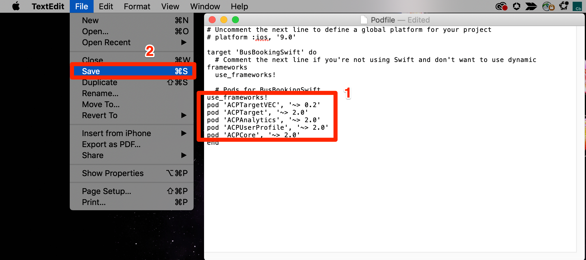
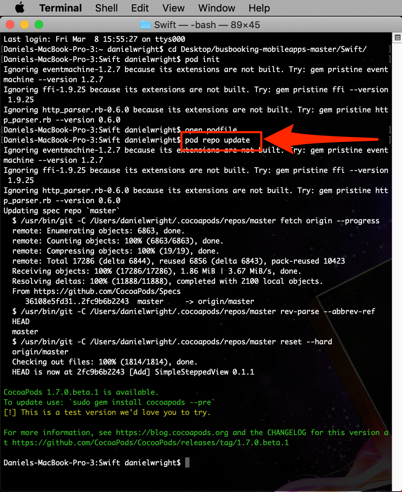
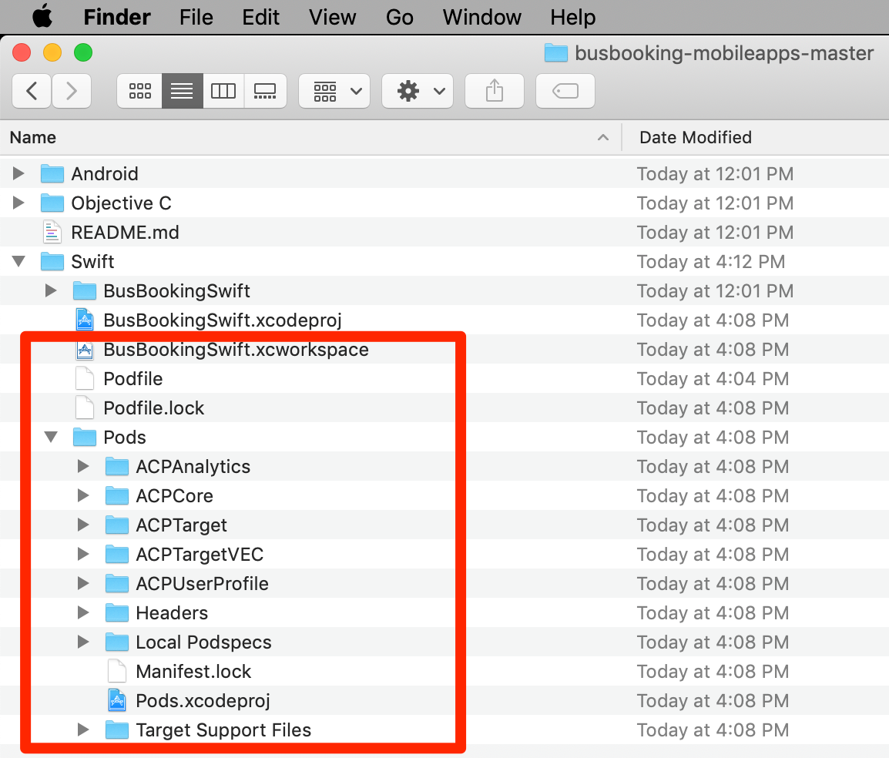
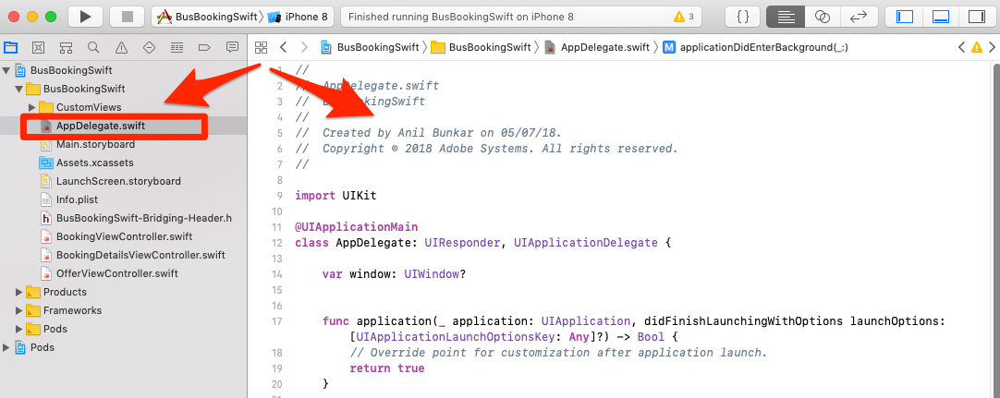
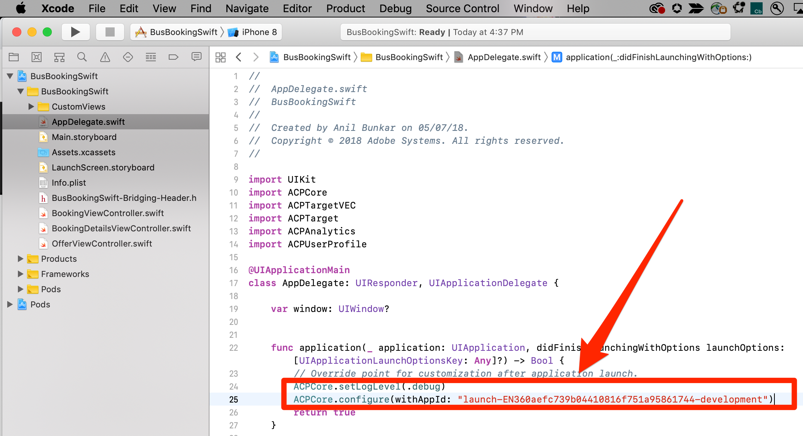

# Instalar el SDK de Mobile

En esta lección, implementará el SDK de Mobile con las extensiones y la configuración correspondientes al entorno de desarrollo de su propiedad Launch.

## Objetivos de aprendizaje

Al final de esta lección podrá:

* Obtenga las instrucciones de instalación de la propiedad de inicio móvil
* Comprender la diferencia entre los entornos Development, Staging y Production
* Crear y editar el archivo de pod
* Importación del SDK de Mobile en el archivo AppDelegate
* Verifique que el SDK se haya implementado correctamente

## Obtenga las instrucciones de instalación

Las Instrucciones de instalación para las propiedades de inicio móvil son una colección de fragmentos de código que se ejecutan en el terminal o que se agregan a ubicaciones específicas de la aplicación móvil.

Haga clic en la `Environments` ficha en la navegación superior para ir a la página de entornos. Tenga en cuenta que los entornos de desarrollo, ensayo y producción se han creado previamente para usted. Corresponden a los entornos típicos del proceso de desarrollo y lanzamiento del código. El código lo escribe primero un desarrollador en un entorno de desarrollo. Cuando han completado su trabajo, lo envían a un entorno de ensayo (Staging) para que el control de calidad y otros equipos lo revisen. Una vez satisfechos el control de calidad y otros equipos, el código se publica en el entorno de producción, que es el entorno público que experimentan los visitantes al descargar la aplicación.

Launch permite entornos de desarrollo adicionales, lo que resulta útil en organizaciones grandes en las que varios desarrolladores trabajan en diferentes proyectos al mismo tiempo.

Desarrollo, Ensayo y Producción son los únicos entornos que necesitamos para completar el tutorial.


En la fila **[!UICONTROL Desarrollo]** , haga clic en el icono Instalar  Instalar para abrir el modo de código incrustado.


Veamos las instrucciones paso a paso.

## Crear el archivo pod e instalar los pods

Si ya ha utilizado Launch en sitios web, una de las primeras cosas que notará es que hay mucha más información en este modal que en las propiedades web.

El SDK de Adobe Mobile para iOS utiliza CocoaPods para administrar las dependencias entre sus distintos componentes. Si todavía no tiene [CocoaPods](https://cocoapods.org/) instalados en su entorno de desarrollo, siga las instrucciones de instalación de su sitio web. Además, si aún no ha descargado la aplicación [](https://github.com/Adobe-Marketing-Cloud/busbooking-mobileapps)Bus Booking, guárdela en su equipo local y extraiga el archivo zip en su escritorio.

**Para crear el archivo de pod**

1. Abra la `Terminal` Aplicación en su Mac®

1. Vaya a la carpeta del proyecto en la que guardó la aplicación Swift de reservación de autobuses (p. ej. `cd Desktop/busbooking-mobileapps-master/Swift/`)

   

1. En la interfaz de Launch, cambie el sistema operativo a `iOS`

1. Copie la primera instrucción de iOS `pod init`, haciendo clic en el icono 

   

1. En la aplicación de Terminal, ejecute el `pod init` comando y espere a que se complete

   

1. En la aplicación de Terminal, abra el archivo podfile con el `open podfile` comando

   

1. Su equipo puede abrir un cuadro de diálogo preguntando con qué aplicación desea abrir el archivo de archivos. Elija cualquier editor de texto, como `TextEdit`

1. En la interfaz de Launch, copie la lista de dependencias haciendo clic en el icono  . Observe que hay una línea correspondiente a cada una de las extensiones agregadas en la lección anterior. Cada extensión tiene su propio conjunto de código que se basa en la extensión Mobile Core y solo se puede añadir o eliminar con una actualización de la aplicación:

   

1. En el editor de texto, pegue las dependencias del portapapeles justo después de la línea `# Pods for BusBookingSwift`

1. Guarde las actualizaciones en el pod en el editor de texto

   

1. Ahora puede cerrar el editor de texto

1. En la interfaz de Launch, copie la siguiente instrucción de iOS `pod repo update`haciendo clic en el icono 

   

1. En la aplicación de Terminal, ejecute el `pod repo update` comando y espere a que se complete (esto puede tardar unos minutos)

   

1. En la interfaz de Launch, copie la siguiente instrucción de iOS `pod install`haciendo clic en el icono 

   

1. En la aplicación de Terminal, ejecute el `pod install` comando y espere a que se complete

   

1. Ahora puede cerrar la ventana Terminal

1. Abra una ventana de Finder, vaya a la carpeta en la que guardó la aplicación de reservación de bus y confirme que se han creado el archivo BusBookingSwift.xcWorkspace, el archivo Podfile, el archivo Podfile.lock y la carpeta Pods

   

## Actualizar AppDelegate

Ahora es el momento de actualizar la aplicación para importar el SDK

1. Abrir el `BusBookingSwift.xcworkspace` archivo en Xcode
1. Abrir el `AppDelegate.swift` archivo

   

1. En la interfaz de Launch, desplácese hasta la sección **[!UICONTROL Agregar código]** de inicialización y elija **[!UICONTROL Swift]** como idioma de iOS que esté utilizando.
1. Copie las instrucciones de importación haciendo clic en el primer icono  de la sección **[!UICONTROL Agregar código]** de inicialización:

   

1. En Xcode, pegue estas instrucciones de importación en el `AppDelegate.swift` archivo después de la importación para la variable `UIKit`

   

1. En la interfaz de Launch, copie las dos líneas relacionadas con la extensión Core haciendo clic en el segundo icono  de la sección **[!UICONTROL Agregar código]** de inicialización. La primera línea activa las sentencias de registro de la consola (las opciones disponibles son "debug", "verbose", "warning" y "error"). La segunda línea apunta al identificador único del entorno de Launch. Esto es importante, ya que tendrá que actualizar este valor cuando estemos listos para implementar la aplicación en el entorno de producción.

   

1. En Xcode, pegue estas sentencias Core en el archivo AppDelegate en la parte superior del `application(_:didFinishLaunchingWithOptions:)` método:

   

1. En la interfaz de Launch, copie las sentencias de extensión haciendo clic en el tercer icono  de la sección [!UICONTROL Agregar código] de inicialización:

   

1. En Xcode, pegue estas sentencias de extensión en el archivo AppDelegate justo antes de la línea del `return true` método `application(_:didFinishLaunchingWithOptions:)` :

   

>[!NOTE] Las instrucciones de instalación móvil que se proporcionan en la interfaz Launch incluyen las instrucciones de importación y registro para las extensiones Identidad, Ciclo de vida y Señal, así como la inicialización de las métricas de ciclo de vida. Estas extensiones se consideran parte de la extensión Mobile Core. Si no desea utilizar estas extensiones en la aplicación, no es necesario importar, registrar ni implementar otro código asociado con estas extensiones.
>
> Además, hay opciones de implementación adicionales que deben tenerse en cuenta al usar estas extensiones (por ejemplo, puede poner en pausa o reiniciar la colección Lifecycle cuando el usuario esté en segundo plano o en primer plano de la aplicación). Puede obtener más información sobre esto en [la documentación de la extensión Mobile Core](https://aep-sdks.gitbook.io/docs/using-mobile-extensions/mobile-core)

## Verificar la implementación

1. Guardar el proyecto Xcode
1. Ejecute la aplicación e iníciela en el simulador. Si no tiene ningún dispositivo simulador configurado, configure uno ahora, asegurándose de configurar un dispositivo que ejecute iOS 10+. Nos gusta utilizar un simulador de iPhone 8 porque es fácil hacer clic en el `Home` botón con un ratón.

   

1. Espere a que se inicie el simulador y abra completamente la aplicación en la pantalla de reservación (esto puede tardar unos minutos)

   

1. Confirme que se están realizando llamadas a los servidores de Adobe en la consola Xcode

   

A continuación se muestran algunos ejemplos de llamadas específicas que puede buscar:

1. **Llamadas para recuperar la configuración** de Launch (filtre la consola a `adobedtm.com`). Tenga en cuenta las configuraciones de extensión introducidas en la lección anterior. Aunque la adición de la extensión requiere una actualización de la aplicación, esta configuración se puede administrar externamente en Launch y cambiar en cualquier momento:

   ```swift
   2019-01-15 12:11:44.518220-0500 BusDemoSwift[52399:5056293] [AMSDK DEBUG <RulesDownloader>]: Successfully downloaded Rules from 'https://assets.adobedtm.com/launch-EN360aefc739b04410816f751a95861744-development-rules.zip'
   
   {"target.propertyToken":"","target.timeout":5,"global.privacy":"optedin","analytics.backdatePreviousSessionInfo":true,"analytics.offlineEnabled":true,"build.environment":"dev","rules.url":"https://assets.adobedtm.com/launch-EN360aefc739b04410816f751a95861744-development-rules.zip","target.clientCode":"techmarketingdemos","experienceCloud.org":"7ABB3E6A5A7491460A495D61@AdobeOrg","target.autoFetch":true,"target.fetchBackground":true,"lifecycle.sessionTimeout":300,"target.environmentId":"busbookingapp","analytics.server":"tmd.sc.omtrdc.net","analytics.rsids":"tmd-mobile-dev1","analytics.batchLimit":0,"property.id":"PRb4881271498b4f2cbaf67d38a8f3891a","global.ssl":true,"analytics.aamForwardingEnabled":true}
   ```

1. **Solicitud al servicio** de identidad (filtre la consola a `demdex.net`) En este ejemplo, el ID (`d_mid`)ya se ha establecido y se vuelve a registrar)

   ```swift
   2019-01-15 12:11:45.164590-0500 BusDemoSwift[52399:5056322] [AMSDK DEBUG <com.adobe.module.identity>]:
   
   Sending request (https://dpm.demdex.net/id?d_rtbd=json&d_ver=2&d_orgid=7ABB3E6A5A7491460A495D61@AdobeOrg&d_mid=17179986463578698626041670574784107777&d_blob=j8Odv6LonN4r3an7LhD3WZrU1bUpAkFkkiY1ncBR96t2PTI&dcs_region=9)
   ```

1. **Respuesta del servicio** de identidad (filtre la consola a `ID Service`). Observe cómo el `mid` valor coincide con el `d_mid` de la solicitud anterior:

   ```swift
   2019-01-15 12:11:45.681821-0500 BusDemoSwift[52399:5056322] [AMSDK DEBUG <com.adobe.module.identity>]:
   
   ID Service - Got ID Response (mid: 17179986463578698626041670574784107777, blob: j8Odv6LonN4r3an7LhD3WZrU1bUpAkFkkiY1ncBR96t2PTI, hint: 9, ttl: "604800000 ms")
   ```

1. **Solicitud** de Analytics (filtre la consola a `Analytics request`)

   ```swift
   2019-01-15 12:11:45.828465-0500 BusDemoSwift[52399:5056336] [AMSDK DEBUG <AnalyticsHitDatabase>]: Analytics request was sent with body
   
   (ndh=1&c.&a.&AppID=BusDemoSwift%201%20%281.0%29&CarrierName=%28null%29&DayOfWeek=3&DaysSinceFirstUse=0&DaysSinceLastUse=0&DeviceName=x86_64&HourOfDay=12&LaunchEvent=LaunchEvent&Launches=3&OSVersion=iOS%2012.1&Resolution=828x1792&RunMode=Application&TimeSinceLaunch=0&ignoredSessionLength=-1547572244&internalaction=Lifecycle&locale=en-US&.a&.c&aamb=j8Odv6LonN4r3an7LhD3WZrU1bUpAkFkkiY1ncBR96t2PTI&aamlh=9&ce=UTF-8&cp=foreground&mid=17179986463578698626041670574784107777&pageName=BusDemoSwift%201%20%281.0%29&pe=lnk_o&pev2=ADBINTERNAL%3ALifecycle&t=00%2F00%2F0000%2000%3A00%3A00%200%20300&ts=1547572305)
   ```

¡Felicitaciones, ha agregado el SDK a una aplicación móvil!

[Siguiente "Add the Adobe Experience Platform Identity Service" &gt;](id-service.md)