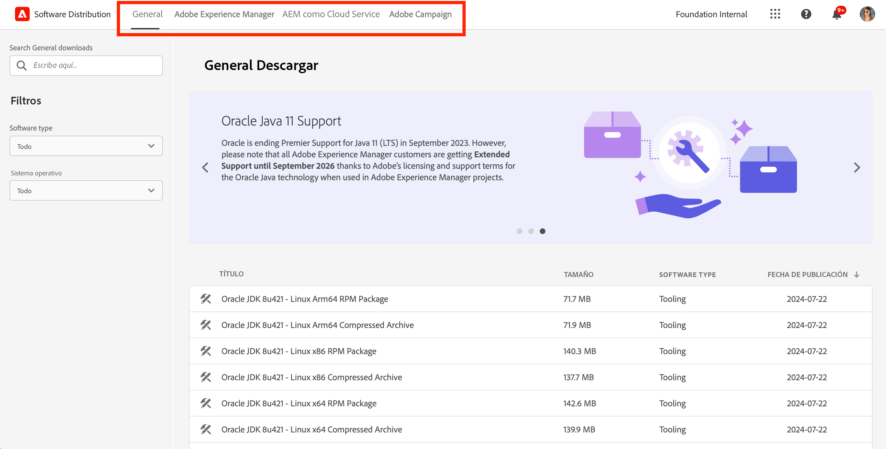
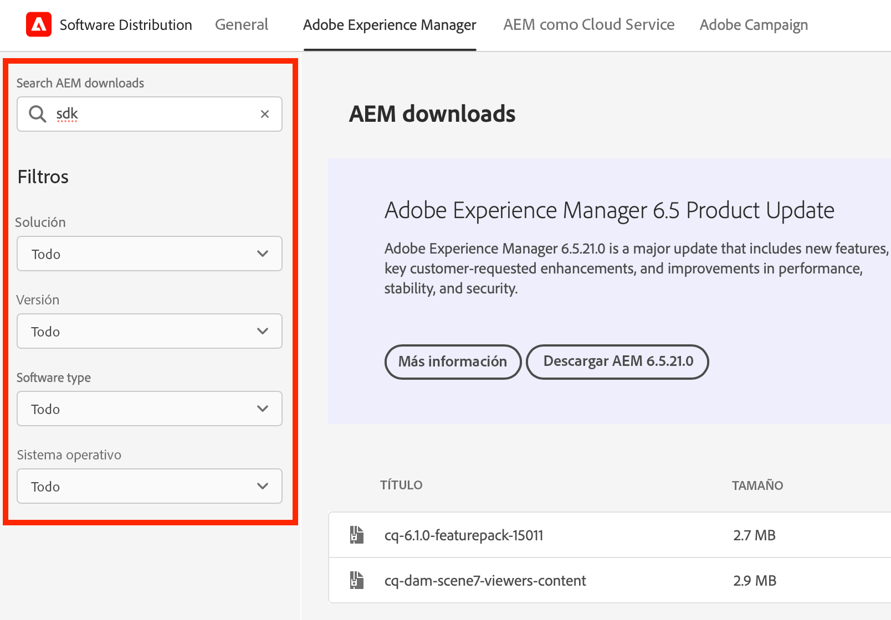
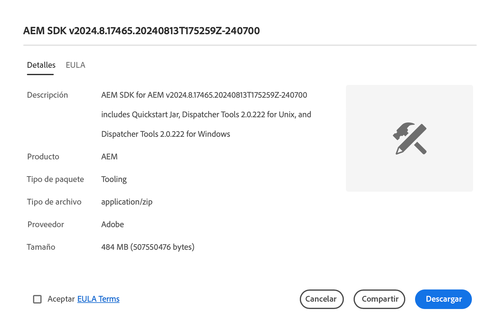

# Distribución de software

Aprenda a utilizar Distribución de software para descargar el software de Adobe Experience Cloud.

## Introducción

Distribución de software proporciona una experiencia eficiente para encontrar y descargar el software de Adobe Experience Cloud. Los paquetes de software aprobados del Adobe y los paquetes de compañías asociadas están disponibles para los siguientes productos:

1. **Adobe Experience Manager AEM** - Todo lo relacionado con el servicio y el mantenimiento, la seguridad, las herramientas y mucho más - para todas las versiones compatibles de la
1. **Adobe Experience Manager as a [!UICONTROL Cloud Service AEM AEM]** - [!UICONTROL SDK de nube de], herramientas de migración de [!UICONTROL nube de] y más
1. **Adobe Campaign** - Todas las versiones actuales del instalador [!DNL Campaign] y las herramientas relacionadas
1. **General**: herramientas de uso general que incluyen [!DNL Oracle] JDK para clientes de Adobe

El uso de la distribución de software es tan sencillo como:

1. [Acceso a distribución de software](#accessing)
1. [Selección del producto](#selecting)
1. [Encontrar la descarga](#finding)
1. [Descarga del software](#downloading)

## Acceso a la distribución de software {#accessing}

Para acceder a la distribución de software, ve a [`https://experience.adobe.com/downloads`](https://experience.adobe.com/downloads) e inicia sesión en [!UICONTROL Distribución de software] con tu Adobe ID.

## Selección del producto {#selecting}

La interfaz de usuario de distribución de software está organizada por producto, como se muestra en el menú.

Llega a la ficha **General**, donde puede encontrar descargas de software de uso general.

Toque o haga clic en el producto en el menú para el que desea descargar el software. Solo pueden descargarse los productos con licencia de su organización.

## Encontrar su descarga {#finding}

Una vez que haya seleccionado la pestaña de producto deseada, verá todas las descargas relacionadas. Utilice los filtros de búsqueda del panel izquierdo para encontrar rápidamente la descarga. Las opciones de filtro varían según el producto.

## Descarga del software {#downloading}

Al tocar o hacer clic en una descarga mostrada, se abre un cuadro de diálogo que le proporciona más información sobre la descarga. Por ejemplo, puede ver una descripción, el nombre del proveedor y el EULA.

Debe aceptar el EULA seleccionando **Aceptar términos del EULA** para habilitar el botón **Descargar**.

También puedes compartir un enlace a esa descarga en particular tocando o haciendo clic en **Compartir** para copiar la URL.

## Package Share {#package-share}

AEM En junio de 2020, [!UICONTROL Distribución de software] reemplazó a [!UICONTROL Uso compartido de paquetes] para la y a [!DNL Neolane] para [!DNL Campaign]. Una interfaz de usuario intuitiva, una búsqueda simplificada y una velocidad de descarga notablemente mejorada hacen que la descarga de paquetes de software para productos de Experience Cloud sea una mejor experiencia al utilizar la distribución de software.

>[!IMPORTANT]
>
>Las credenciales de inicio de sesión de [!UICONTROL Package Share] o [!DNL Neolane] no funcionarán para [!UICONTROL Distribución de software], que proporciona funciones para iniciar sesión con estándares de seguridad para todo el Adobe. Si no conoce su Adobe ID, póngase en contacto con un administrador de asistencia técnica de su organización.

>[!NOTE]
>
>La [!UICONTROL distribución de software] solo admite descargas de exploradores. Al utilizar AEM [!UICONTROL Package Manager] para nuevas instalaciones, se recomienda descargar el paquete en una carpeta local e instalarlo desde allí.
