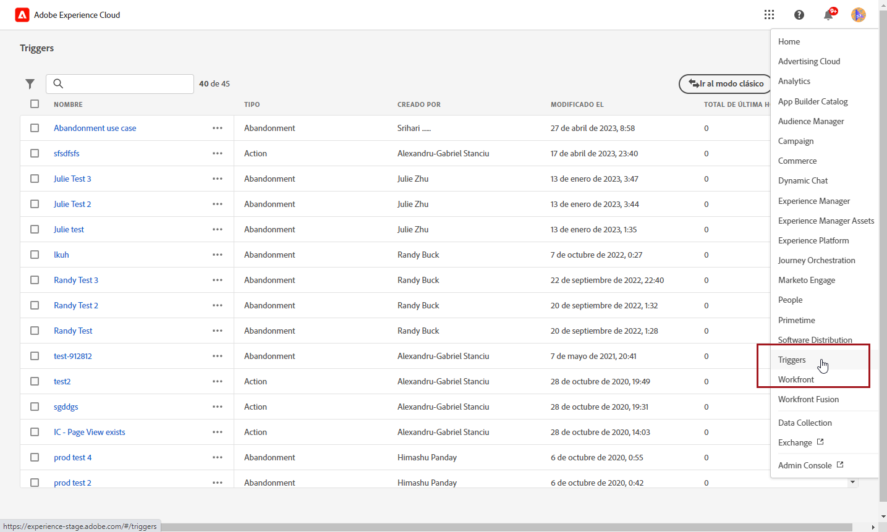
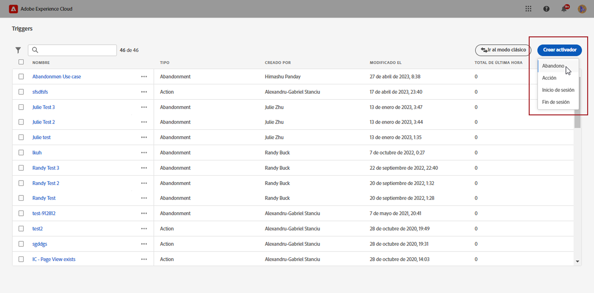
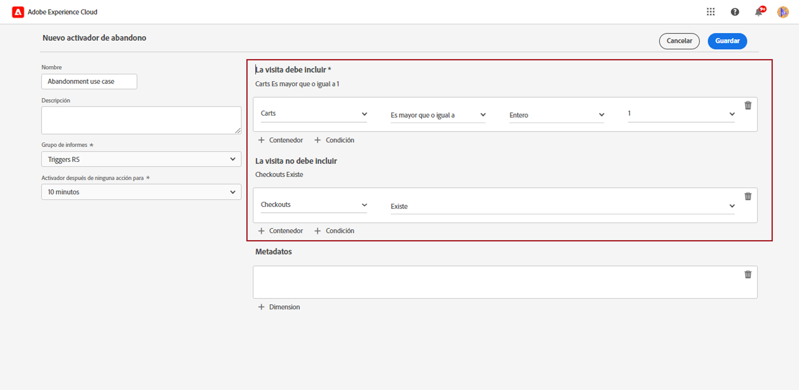
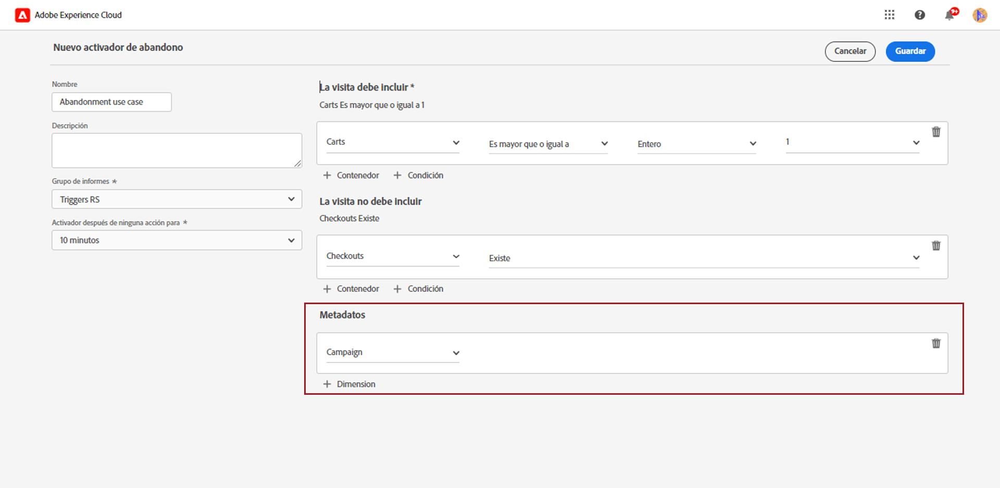
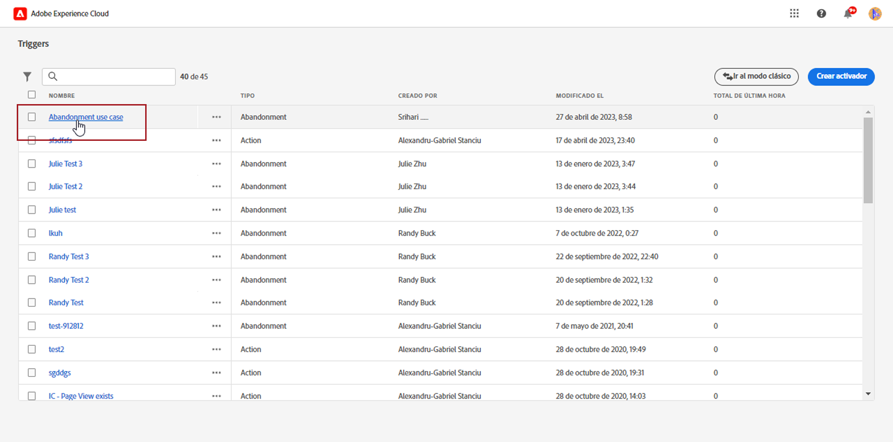
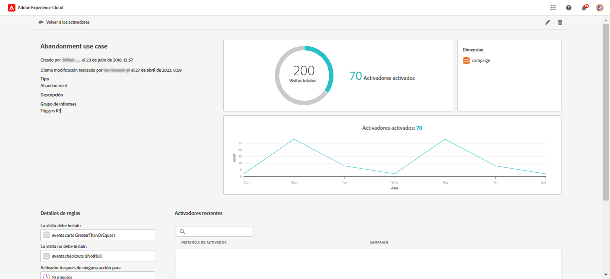

# Crear un activador de Experience Cloud {#create-triggers}

>[!NOTE]
>
> La nueva interfaz de usuario para activadores de Experience Cloud ofrece una experiencia intuitiva para administrar los comportamientos de los consumidores y personalizar las experiencias de los usuarios. Para volver a la interfaz anterior, haga clic en el botón **[!UICONTROL Ir al modo clásico]**.

Cree un activador y configure sus condiciones. Por ejemplo, puede especificar los criterios de las reglas de un Trigger durante una visita, por ejemplo, métricas como Abandonos del carro de compras, o dimensiones como el nombre del producto. Cuando se cumplen las reglas, se ejecuta el Trigger.

1. En Experience Cloud, seleccione el menú avanzado y, a continuación, Activadores.

   

1. En la página de inicio de su Activador, haga clic en **[!UICONTROL Crear activador]** y, a continuación, especifique el tipo de activador.

   Hay tres tipos de activadores disponibles:

   * **[!UICONTROL Abandono:]** puede crear un activador que se desencadene cuando un visitante vea un producto, pero no agregue nada al carro de compra.

   * **[!UICONTROL Acción:]** puede crear activadores, por ejemplo, para que se desencadenen después de que los usuarios se suscriban a una newsletter, una suscripción por correo electrónico o a aplicaciones para tarjetas de crédito (confirmaciones). Si tiene un comercio minorista, puede crear un Trigger para visitantes que se suscriben a un programa de fidelidad. Si se dedica al sector de los medios de comunicación y el entretenimiento, cree Triggers para visitantes que vean un determinado programa y que podrían estar interesados en responder a una encuesta.

   * **[!UICONTROL Inicio y fin de sesión]**: cree un activador para los eventos de inicio y fin de sesión.

   

1. Agregue un **[!UICONTROL Nombre]** y una **[!UICONTROL Descripción]** a su activador.

1. Seleccione el **[!UICONTROL Grupo de informes]** de Analytics utilizado para este activador. Esta configuración identifica los datos de sistema de informes que se van a utilizar.

   [Más información sobre el grupo de informes](https://experienceleague.adobe.com/docs/analytics/admin/admin-tools/manage-report-suites/c-new-report-suite/t-create-a-report-suite.html?lang=es).

1. Elija el **[!UICONTROL Activador después de que no haya acción para]** el periodo de validez.

1. En las categorías **[!UICONTROL Visita debe incluir]** y **[!UICONTROL Visita no debe incluir]**, puede definir criterios o comportamientos del visitante que desee o no desea que se produzcan. Puede especificar la lógica **Y** u **O** en o entre condiciones, según los criterios que determine.

   Por ejemplo, las reglas de un activador sencillo de abandono del carro de compras podrían ser:

   * **[!UICONTROL La visita debe incluir]**: `Carts (metric) Is greater or equal to 1` para dirigirse a visitantes que tengan al menos un artículo en el carro de compras.
   * **[!UICONTROL La visita no debe incluir]**: `Checkout (metric) Exists.` para quitar a los visitantes que han comprado los artículos en sus carros de compras.

   

1. Haga clic en **[!UICONTROL Contenedor]** para crear y guardar reglas, condiciones o filtros que definan un activador. Para que los eventos se produzcan al mismo tiempo, debe colocarlos en el mismo contenedor.

   Cada contenedor procesa de forma independiente en el nivel de visita, lo que significa que si dos contenedores se unen con la variable **[!UICONTROL Y]**, las reglas solo se cumplirán cuando dos visitas cumplan los requisitos.

1. En el campo **[!UICONTROL Metadatos]**, haga clic en **[!UICONTROL + Dimensión]** para elegir una dimensión de Campaign determinada o variables que sean relevantes para el comportamiento de un visitante.

   

1. Haga clic en **[!UICONTROL Guardar]**.

1. Seleccione el **[!UICONTROL Activador]** de la lista para acceder al informe detallado de su activador.

   

1. Desde la vista detallada de su activador, puede acceder a los informes sobre la cantidad de activadores activados. Si es necesario, puede editar el activador con el icono de lápiz.

   
