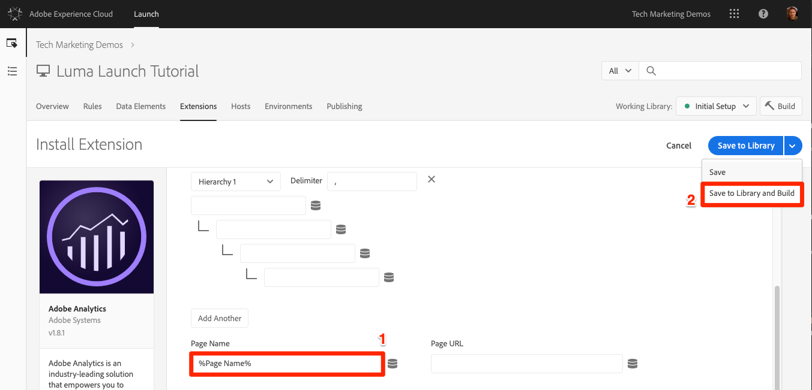
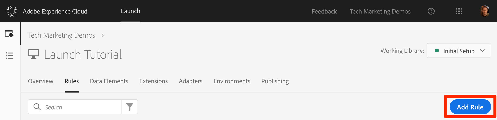
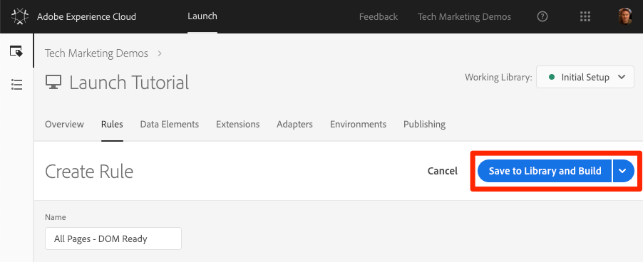
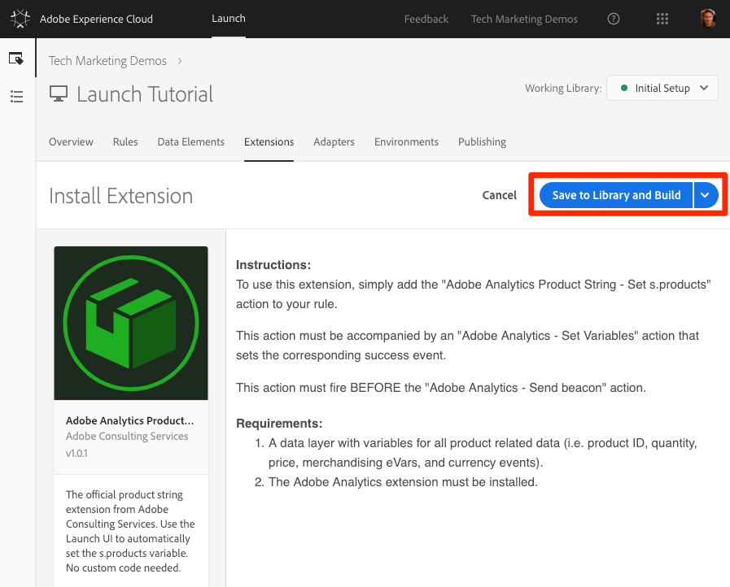
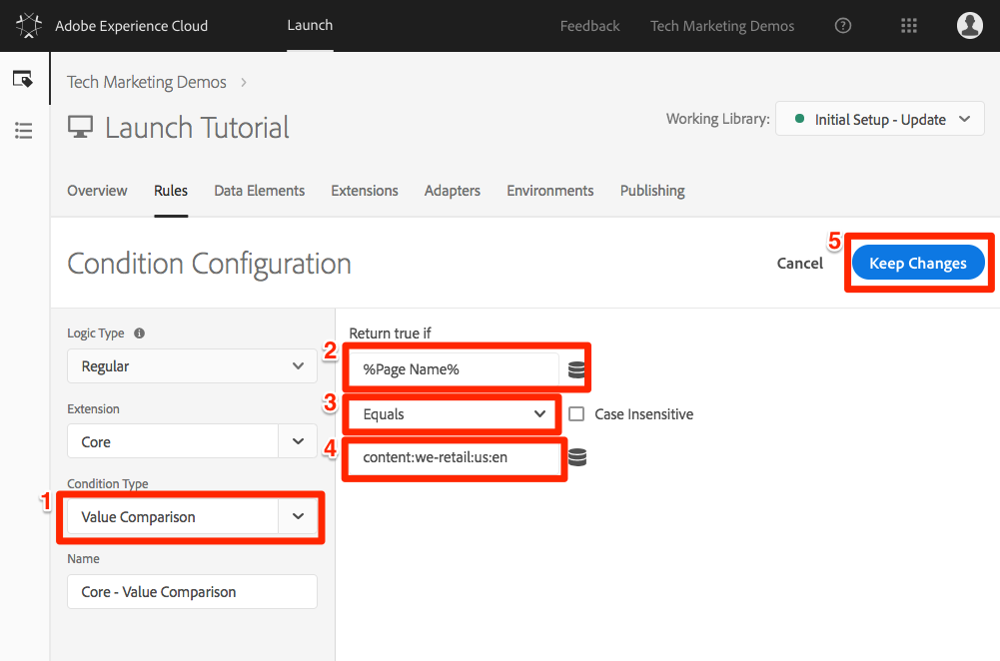

# Añadir Adobe Analytics

En esta lección, implementará la extensión [de](https://docs.adobe.com/content/help/en/launch/using/extensions-ref/adobe-extension/analytics-extension/overview.html) Adobe Analytics y creará reglas para enviar datos a Adobe Analytics.

[Adobe Analytics](https://docs.adobe.com/content/help/en/analytics/landing/home.html) es una solución líder del sector que le permite comprender a sus clientes como personas y dirigir su negocio con inteligencia de clientes.

## Objetivos de aprendizaje

Al final de esta lección podrá:

1. Agregar la extensión Adobe Analytics
1. Configurar variables globales mediante la extensión
1. Añadir la señalización de vistas de página
1. Añadir variables adicionales mediante reglas
1. Añadir seguimiento de clics y otras señalizaciones basadas en eventos
1. Agregar complementos de Analytics

Hay muchas cosas que se podrían implementar para Analytics en Launch. Esta lección no es exhaustiva, pero debería proporcionarle una visión general sólida de las principales técnicas que necesitará para implementar en su propio sitio.

## Requisitos previos

You should have already completed the lessons in [Configure Launch](launch.md) and [Add the Identity Service](id-service.md).

Además, necesitará al menos una ID de grupo de informes y su servidor de seguimiento. Si no tiene un grupo de informes de prueba/desarrollo que pueda utilizar para este tutorial, cree uno. Si no está seguro de cómo hacerlo, consulte [la documentación](https://docs.adobe.com/content/help/en/analytics/admin/manage-report-suites/new-report-suite/new-report-suite.html). Puede recuperar el servidor de seguimiento de su implementación actual, del consultor de Adobe o del representante del servicio de atención al cliente.

## Añadir la extensión de Analytics

La extensión de Analytics consta de dos partes principales:

1. La configuración de la extensión, que administra la configuración de biblioteca principal de AppMeasurement.js y puede configurar variables globales
1. Acciones de reglas para hacer lo siguiente:
   1. Configurar variables
   1. Borrar variables
   1. Envío de la señalización de Analytics

**Para agregar la extensión de Analytics**

1. Vaya a **[!UICONTROL Extensiones &gt; Catálogo]**
1. Localización de la extensión Adobe Analytics
1. Haga clic en **[!UICONTROL Instalar]**

   

1. En Administración [!UICONTROL de biblioteca &gt; Grupos]de informes, introduzca las ID de grupo de informes que desee utilizar con cada entorno de lanzamiento. Tenga en cuenta que cuando empiece a escribir en el cuadro, verá una lista previamente rellenada de todos los grupos de informes. (Está bien utilizar un grupo de informes para todos los entornos en este tutorial, pero en la vida real desea utilizar grupos de informes independientes, como se muestra en la imagen siguiente)

   

   >[!TIP] Recomendamos usar la opción  Administrar la biblioteca para mí como la configuración de Administración [!UICONTROL de] biblioteca, ya que facilita la tarea de mantener la `AppMeasurement.js` biblioteca actualizada.

1. En [!UICONTROL General &gt; Servidor]de seguimiento, introduzca su servidor de seguimiento, por ejemplo: "`tmd.sc.omtrdc.net`." Introduzca el servidor de seguimiento SSL si su sitio es compatible con `https://`

   

1. En la sección [!UICONTROL Variables]globales, configure la variable Nombre [!UICONTROL de] página usando el elemento `Page Name` de datos. Haga clic en el icono  datos para abrir el modal y elegir el elemento de datos de la página `Page Name` )

1. Haga clic en **[!UICONTROL Guardar en biblioteca y crear]**

   

>[!NOTE] Las variables globales se pueden configurar en la configuración de la extensión o en las acciones de reglas. Be aware that when setting variables in the extension configuration, the data layer must be defined *before* the Launch embed codes.

## Enviar la señalización de vista de página

Ahora creará una regla para activar la señalización de Analytics, que enviará la variable Nombre [!UICONTROL de] página establecida en la configuración de la extensión.

You have already created an "All Pages - Library Loaded" rule in the [Add a Data Element, a Rule and a Library](launch-data-elements-rules.md) lesson of this tutorial, which is triggered on every page when the Launch library loads. También *puede* usar esta regla para Analytics; sin embargo, esta configuración requiere que todos los atributos de capa de datos utilizados en la señalización de Analytics se definan antes que los códigos de incrustación de Launch. Para permitir una mayor flexibilidad con la recopilación de datos, creará una nueva regla "todas las páginas" activada en DOM Ready para activar la señalización de Analytics.

**Envío de la señalización de vista de página**

1. Vaya a la sección **[!UICONTROL Reglas]** de la navegación superior y, a continuación, haga clic en **[!UICONTROL Agregar regla]**

   

1. Asigne un nombre a la regla `All Pages - DOM Ready`
1. Click **[!UICONTROL Events &gt; Add]** to open the `Event Configuration` screen

   

1. Seleccione Tipo **[!UICONTROL de evento &gt; DOM Ready]** (tenga en cuenta que el orden de la regla es "50")
1. Click **[!UICONTROL Keep Changes]**
   

1. Under Actions, click the  to add a new action

   

1. Seleccione **[!UICONTROL Extensión &gt; Adobe Analytics]**

1. Seleccione Tipo **[!UICONTROL de acción &gt; Enviar señalización]**

1. Deje Tracking configurado como `s.t()`. Note that if you wanted to make an `s.tl()` call in a click-event rule you could do that using the Send Beacon action, as well.

1. Haga clic en el botón **[!UICONTROL Mantener cambios]** .

   

1. Haga clic en **[!UICONTROL Guardar en biblioteca y crear]**

   

### Validar la señalización de vista de página

Ahora que ha creado una regla para enviar una señalización de Analytics, debería poder ver la solicitud en Experience Cloud Debugger.

1. Open the [Luma site](https://luma.enablementadobe.com/content/luma/us/en.html) in your Chrome browser
1. Haga clic en el icono Depurador  de Experience Cloud para abrir el depurador de **[!UICONTROL Adobe Experience Cloud]**
1. Make sure the Debugger is mapping the Launch property to *your* Development environment, as described in the [earlier lesson](launch-switch-environments.md)

   

1. Haga clic para abrir la ficha Análisis
1. Expanda el nombre del grupo de informes para mostrar todas las solicitudes realizadas en él
1. Confirme que la solicitud se ha activado con la variable y el valor del nombre de la página

   

>[!NOTE] Si el nombre de la página (Page Name) no se muestra, vuelva a los pasos de esta página para asegurarse de que no ha pasado por alto nada.

## Añadir variables con reglas

When you configured the Analytics Extension, you populated the `pageName` variable in the extension configuration. Esta ubicación es perfecta para rellenar otras variables globales, como eVars y props, siempre y cuando el valor esté disponible en la página antes de que se cargue el código incrustado de Launch.

En las reglas que utilizan la acción hay una ubicación más flexible para establecer variables (así como eventos). `Set Variables` Las reglas le permiten establecer diferentes variables y eventos de Analytics en diferentes condiciones. For example, you could set the `prodView` only on product detail pages and the `purchase` event only on order confirmation pages. Esta sección le enseñará a configurar variables mediante reglas.

### Caso de uso

Las páginas de detalles del producto (PDP) son puntos importantes para la recopilación de datos en sitios de minoristas. Normalmente, Analytics desea registrar que se ha producido una vista del producto y qué producto se ha visualizado. Esto resulta útil para saber qué productos son más populares entre sus clientes. En un sitio de medios, las páginas de artículos o videos podrían utilizar técnicas de seguimiento similares a las que utilizará en esta sección.  When you load a Product Detail Page, you might want to put that value into a "Page Type" `eVar`, as well as set some events and the product id. Esto nos permitirá ver lo siguiente en nuestro análisis:

1. Cuántas veces se cargan las páginas de detalles del producto
1. Qué productos específicos se ven y cuántas veces
1. Otros factores (campañas, búsquedas, etc.) afectan a la cantidad de personas que cargan el PDP

### Creación de elementos de datos para el tipo de página

Primero debe identificar qué páginas son las páginas de detalles del producto. Lo hará con un elemento de datos.

**Creación del elemento de datos para el tipo de página**

1. Haga clic en Elementos **** de datos en la navegación superior
1. Haga clic en **[!UICONTROL Agregar elemento de datos]**

   

1. Asigne un nombre al elemento de datos `Page Type`
1. Seleccione Tipo **[!UICONTROL de elemento de datos &gt; Variable JavaScript]**
1. Use `digitalData.page.category.type` as the `JavaScript variable name`
1. Check the `Clean text` and `Force Lower Case` options
1. Haga clic en **[!UICONTROL Guardar en biblioteca y crear]**

   

### Crear elemento de datos para ID de producto

A continuación, recopilará la identificación del producto de la página de detalles del producto actual con un elemento de datos

**Para crear el elemento de datos para el ID de producto**

1. Haga clic en Elementos **** de datos en la navegación superior
1. Haga clic en **[!UICONTROL Agregar elemento de datos]**

   

1. Asigne un nombre al elemento de datos `Product Id`
1. Seleccione Tipo **[!UICONTROL de elemento de datos &gt; Variable JavaScript]**
1. Use `digitalData.product.0.productInfo.sku` as the `JavaScript variable name`
1. Check the `Force lowercase value` option
1. Check the `Clean text` option
1. Haga clic en **[!UICONTROL Guardar en biblioteca y crear]**

   

### Añadir la extensión Adobe Analytics Product String

If you are already familiar with Adobe Analytics implementations, you are probably familiar with the [products variable](https://docs.adobe.com/content/help/en/analytics/components/variables/dimensions-reports/reports-products.html). La variable products tiene una sintaxis muy específica y se utiliza de maneras ligeramente diferentes según el contexto. Para ayudar a que la población de los productos sea más fácil en Launch, ya se han creado tres extensiones adicionales en Launch extension Marketplace. En esta sección, agregará una extensión creada por Adobe Consulting para utilizarla en la página Product Detail.

**Para agregar la extensión, agregue la`Adobe Analytics Product String`**

1. Vaya a la página [!UICONTROL Extensiones &gt; Catálogo]
1. Busque la `Adobe Analytics Product String` extensión mediante los servicios de consultoría de Adobe y haga clic en **[!UICONTROL Instalar]**
   
1. Dedique un momento a leer las instrucciones
1. Haga clic en **[!UICONTROL Guardar en biblioteca y crear]**

   

### Creación de la regla para las páginas de detalles del producto

Ahora, utilizará los nuevos elementos de datos y la extensión para crear la regla de página Detalles del producto. Para esta funcionalidad, creará otra regla de carga de página, desencadenada por DOM Ready. However, you will use a condition so that it only fires on the Product Detail pages and the order setting so that it fires _before_ the rule that sends the beacon.

**Para generar la regla de la página Detalles del producto**

1. Vaya a la sección **[!UICONTROL Reglas]** de la navegación superior y, a continuación, haga clic en **[!UICONTROL Agregar regla]**

   

1. Asigne un nombre a la regla `Product Details - DOM Ready - 40`
1. Click **[!UICONTROL Events &gt; Add]** to open the `Event Configuration` screen

   

1. Seleccione Tipo **[!UICONTROL de evento &gt; Preparado para DOM]**
1. Set the **[!UICONTROL Order]** to 40, so that the rule will run *before* the rule containing the Analytics &gt; Send Beacon action
1. Click **[!UICONTROL Keep Changes]**
   

1. En **[!UICONTROL Condiciones]**, haga clic en el icono  Haga clic en el signo más para abrir la pantalla `Condition Configuration`
   

   1. Seleccione Tipo **[!UICONTROL de condición &gt; Comparación de valores]**
   1. Use the data element picker, choose `Page Type` in the first field
   1. Seleccione **[!UICONTROL Contiene]** en la lista desplegable de operadores de comparación
   1. En el siguiente tipo de campo `product-page` (es la parte única del valor de tipo de página extraído de la capa de datos en PDP)
   1. Click **[!UICONTROL Keep Changes]**

      

1. Under Actions, click the  to add a new action

   

1. Seleccione **[!UICONTROL Extensión &gt; Adobe Analytics]**
1. Seleccione Tipo **[!UICONTROL de acción &gt; Definir variables]**
1. Seleccione **[!UICONTROL eVar1 &gt; Establecer como]** e introduzca `product detail page`
1. Set **[!UICONTROL event1]**, leaving the optional values blank
1. En Eventos, haga clic en el botón **[!UICONTROL Agregar otro]** .
1. Set the **[!UICONTROL prodView]** event, leaving the optional values blank
1. Click **[!UICONTROL Keep Changes]**

   

1. Under Actions, click the  to add a new action

   

1. Seleccione **[!UICONTROL Extensión &gt; Cadena de producto de Adobe Analytics]**
1. Seleccione Tipo **[!UICONTROL de acción &gt; Definir s.products]**

1. En la sección Evento **[!UICONTROL de comercio electrónico de]** Analytics, seleccione **[!UICONTROL prodView]**

1. En la sección Variables **[!UICONTROL de capa de datos para datos]** de producto, utilice el selector de elementos de datos para elegir el elemento `Product Id` de datos

1. Click **[!UICONTROL Keep Changes]**

   

1. Haga clic en **[!UICONTROL Guardar en biblioteca y crear]**

   

### Validación de los datos de página de detalles del producto

Acaba de crear una regla que establece variables antes de que se envíe la señalización. Ahora debería poder ver los nuevos datos en la visita en Experience Cloud Debugger.

**Para validar los datos de la página Detalles del producto**

1. Open the [Luma site](https://luma.enablementadobe.com/content/luma/us/en.html) in your Chrome browser
1. Vaya a cualquier página de detalles del producto
1. Haga clic en el icono Depurador  de Experience Cloud para abrir el depurador de **[!UICONTROL Adobe Experience Cloud]**
1. Haga clic en la ficha Análisis
1. Expandir el grupo de informes
1. Notice the Product Detail Variables that are now in the debugger, namely that `eVar1` has been set to "product detail page", that the `Events` variable has been set to "event1" and "prodView", that the products variable is set with the product id of the product you are viewing, and that your Page Name is still set by the Analytics extension

   

## Envío de una señalización de vínculo de seguimiento

Cuando se carga una página, normalmente activa una señalización de carga de página activada por la función `s.t()`. This automatically increments a `page view` metric for the page listed in the `pageName` variable.

Sin embargo, a veces no se desea incrementar las vistas de página en el sitio, ya que la acción que se está realizando es "más pequeña" (o tal vez diferente) que una vista de página. In this case, you will use the `s.tl()` function, which is commonly referred to as a "track link" request. Aunque se denomina solicitud de enlace de seguimiento, no es necesario activarla al hacer clic en un enlace. It can be triggered by *any* of the events that are available to you in the Launch rule builder, including your own custom JavaScript.

En este tutorial, se activará una `s.tl()` llamada mediante uno de los eventos JavaScript más interesantes, un `Enters Viewport` evento.

### El ejemplo de uso

En este caso de uso, desea saber si las personas se desplazan hacia abajo en nuestra página de inicio de Luma lo suficientemente lejos como para ver la sección *New Arrivals (Llegadas* nuevas) de nuestra página. Hay cierta discordia interna en nuestra empresa sobre si las personas están viendo esa sección o no, por lo que quiere usar Analytics para determinar la verdad.

### Crear la regla en el inicio

1. Vaya a la sección **[!UICONTROL Reglas]** de la navegación superior y, a continuación, haga clic en **[!UICONTROL Agregar regla]**
   
1. Asigne un nombre a la regla `Homepage - New Arrivals enters Viewport`
1. Click **[!UICONTROL Events &gt; Add]** to open the `Event Configuration` screen

   

1. Seleccione Tipo **[!UICONTROL de evento &gt; Ingresa a la ventanilla]**. Esto mostrará un campo en el que debe introducir el selector de CSS que identificará el elemento de la página que debería activar la regla cuando entre a la vista en el explorador.
1. Vuelva a la página principal de Luma y desplácese hacia abajo hasta la sección Nuevos visitantes.
1. Haga clic con el botón derecho en el espacio entre el título “NOVEDADES” y los elementos de esta sección y seleccione `Inspect` en el menú contextual. Esto te acercará a lo que quieres.
1. Justo por ahí, posiblemente justo debajo de la sección seleccionada, está buscando un div con `class="we-productgrid aem-GridColumn aem-GridColumn--default--12"`. Busque este elemento.
1. Haga clic con el botón derecho en este elemento y seleccione **[!UICONTROL Copiar &gt; Selector de copia]**

   

1. Vuelva a Launch y pegue este valor del portapapeles en el campo rotulado `Elements matching the CSS selector`.
   1. En una nota al margen, le corresponde decidir cómo identificar los selectores CSS. Este método es un poco frágil, ya que ciertos cambios en la página podrían romper este selector. Tenga en cuenta esto cuando utilice selectores CSS en Launch.
1. Click **[!UICONTROL Keep Changes]**
   

1. En Condiciones, haga clic en el  Más para agregar una nueva condición
1. Seleccione Tipo **[!UICONTROL de condición &gt; Comparación de valores]**
1. Use the data element picker, choose `Page Name` in the first field
1. Seleccione **[!UICONTROL Igual]** en la lista desplegable de operadores de comparación
1. En el siguiente tipo de campo `content:we-retail:us:en` (es el nombre de la página de inicio tal como se extrae de la capa de datos; solo queremos que esta regla se ejecute en la página de inicio)
1. Click **[!UICONTROL Keep Changes]**

   

1. Under Actions, click the  to add a new action
1. Seleccione **[!UICONTROL Extensión &gt; Adobe Analytics]**
1. Seleccione Tipo **[!UICONTROL de acción &gt; Definir variables]**
1. Set `eVar3` to `Home Page - New Arrivals`
1. Set `prop3` to `Home Page - New Arrivals`
1. Set the `Events` variable to `event3`
1. Click **[!UICONTROL Keep Changes]**

   

1. Under Actions, click the  to add another new action

   

1. Seleccione **[!UICONTROL Extensión &gt; Adobe Analytics]**
1. Seleccione Tipo **[!UICONTROL de acción &gt; Enviar señalización]**
1. Choose the **[!UICONTROL s.tl()]** tracking option
1. En el campo Nombre **[!UICONTROL del]** vínculo, introduzca `Scrolled down to New Arrivals`. Este valor se colocará en el informe Vínculos personalizados de Analytics.
1. Click **[!UICONTROL Keep Changes]**

   

1. Haga clic en **[!UICONTROL Guardar en biblioteca y crear]**

   

### Validar la señalización de vínculo de seguimiento

Ahora debe asegurarse de que esta visita entra cuando se desplaza hacia abajo hasta la sección Nuevos visitantes de la página principal de nuestro sitio. Cuando carga la página principal por primera vez, la solicitud no debe realizarse, pero a medida que se desplaza hacia abajo y se visualiza la sección, la visita debería activarse con nuestros nuevos valores.

1. Abra el sitio [](https://luma.enablementadobe.com/content/luma/us/en.html) Luma en el navegador Chrome y asegúrese de que se encuentra en la parte superior de la página principal.
1. Haga clic en el icono **[!UICONTROL del]** depurador  de Experience Cloud para abrir [!UICONTROL Adobe Experience Cloud Debugger]
1. Haga clic en la ficha Análisis
1. Expandir la visita del grupo de informes
1. Observe la visita individual de vista de página normal para la página principal con el nombre de la página, etc. (pero nada en eVar3 o prop3).

   

1. Si deja el depurador abierto, desplácese hacia abajo en el sitio hasta que vea la sección Nuevos visitantes
1. Vuelva a ver el depurador y debería haber aparecido otra visita de Analytics. Esta visita debe tener los parámetros asociados con la visita s.tl() que configure, a saber:
   1. `LinkType = "link_o"` (esto significa que la visita es una visita con vínculo personalizado, no una visita con vista de página)
   1. `LinkName = "Scrolled down to New Arrivals"`
   1. `prop3 = "Home Page - New Arrivals"`
   1. `eVar3 = "Home Page - New Arrivals"`
   1. `Events = "event3"`

      

## Agregar un complemento

Un complemento es un fragmento de código JavaScript que puede agregar a la implementación para realizar una función específica que no está integrada en el producto. Los complementos pueden crearlos usted, otros clientes/socios de Adobe o Adobe Consulting.

Para implementar complementos, hay básicamente tres pasos:

1. Incluya la función doPlugins, donde se hará referencia al complemento
1. Añada el código de función principal del complemento
1. Incluya el código que llama a la función y configura variables, etc.

### Hacer que el objeto de Analytics sea accesible globalmente

Si va a agregar la función doPlugins (a continuación) y va a utilizar complementos, debe marcar una casilla para que el objeto "s" de Analytics esté disponible globalmente en la implementación de Analytics.

1. Vaya a **[!UICONTROL Extensiones &gt; Instalado]**

1. En la extensión Adobe Analytics, haga clic en **[!UICONTROL Configurar]**

   

1. En Administración **[!UICONTROL de biblioteca]**, seleccione la casilla rotulada `Make tracker globally accessible`. Como puede ver en la burbuja de ayuda, esto hará que el rastreador se cree en el ámbito global en window.s, lo cual será importante a medida que se refiera a él en el JavaScript de su cliente.

### Inclusión de la función doPlugins

Para agregar complementos, debe agregar una función llamada doPlugins. Esta función no se agrega de forma predeterminada, pero una vez agregada, la administra la biblioteca AppMeasurement y se llama al último cuando se envía una visita a Adobe Analytics. Por lo tanto, puede utilizar esta función para ejecutar JavaScript para configurar variables que sean más fáciles de definir de este modo.

1. While still in the Analytics extension, scroll down and expand the section titled `Configure Tracker Using Custom Code.`
1. Click **[!UICONTROL Open Editor]**
1. Pegue el siguiente código en el editor de código:

   ```javascript
   /* Plugin Config */
   s.usePlugins=true
   s.doPlugins=function(s) {
   /* Add calls to plugins here */
   }
   ```

1. Mantenga esta ventana abierta para el paso siguiente

### Añadir código de función para el complemento

En realidad va a llamar a dos complementos en este código, pero uno de ellos está integrado en la biblioteca de AppMeasurement, por lo que para ese complemento no necesita agregar la función a la que llamar. Sin embargo, para el segundo, también debe agregar el código de función. Esta función se denomina getValOnce().

### El complemento getValOnce()

El propósito de este complemento es evitar que los valores se dupliquen falsamente en el código cuando un visitante actualiza una página o utiliza el botón Atrás del explorador para regresar a una página donde se configuró un valor. En esta lección, la usará para evitar que el `clickthrough` evento se duplique.

El código de este complemento está disponible en la [documentación de Analytics](https://docs.adobe.com/content/help/en/analytics/implementation/javascript-implementation/plugins/getvalonce.html), pero se incluye aquí para facilitar el proceso de copiar y pegar.

1. Copie el siguiente código

   ```javascript
   /*
   * Plugin: getValOnce_v1.11
   */
   s.getValOnce=new Function("v","c","e","t",""
   +"var s=this,a=new Date,v=v?v:'',c=c?c:'s_gvo',e=e?e:0,i=t=='m'?6000"
   +"0:86400000,k=s.c_r(c);if(v){a.setTime(a.getTime()+e*i);s.c_w(c,v,e"
   +"==0?0:a);}return v==k?'':v");
   ```

1. Pégalo en la ventana de código de la extensión de Analytics (si aún no lo tiene abierto, vuelva a abrirlo según el paso anterior), **completamente por debajo** de la función doPlugins (no dentro de ella).

   

Ahora puede llamar a este complemento desde doPlugins.

### Llamadas a complementos desde doPlugins

Ahora que el código está ahí y se puede hacer referencia a él, puede realizar llamadas a complementos dentro de la función doPlugins.

Primero llamará a un complemento que se ha incorporado a la biblioteca de AppMeasurement y, por lo tanto, se lo conoce como "utilidad". It is referred to as `s.Util.getQueryParam`, because it is part of the s object, is a built-in utility, and will grab values (based on a parameter) from the query string in the URL.

1. Copie el siguiente código:

   ```javascript
   s.campaign = s.Util.getQueryParam("cid");
   ```

1. Póngalo en la función doPlugins. This will look for a parameter called `cid` in the current page URL and place it into the s.campaign variable.
1. Ahora llame a la función getValOnce copiando el siguiente código y pegándolo justo debajo de la llamada a getQueryParam:

   ```javascript
   s.campaign=s.getValOnce(s.campaign,'s_cmp',30);
   ```

   Este código se asegurará de que no se envíe el mismo valor en más de una vez consecutiva durante 30 días (consulte la documentación para ver formas de personalizar este código según sus necesidades).

   

1. Guardar la ventana de código
1. Haga clic en **[!UICONTROL Guardar en biblioteca y crear]**

   

### Validar los complementos

Ahora puede asegurarse de que los complementos están funcionando.

**Validación de los complementos**

1. Open the [Luma site](https://luma.enablementadobe.com/content/luma/us/en.html) in your Chrome browser
1. Haga clic en el icono Depurador  de Experience Cloud para abrir el depurador de **[!UICONTROL Adobe Experience Cloud]**
1. Haga clic en la ficha Análisis
1. Expandir el grupo de informes
1. Observe que la visita de Analytics no tiene una variable de campaña
1. Leaving the Debugger open, go back to the Luma site and add  `?cid=1234` to the URL and hit Enter to refresh the page with that query string included

   

1. Check the Debugger and confirm that there is a second Analytics request with a Campaign variable set to `1234`

   

1. Vuelva atrás y actualice la página Luma de nuevo, con la cadena de consulta aún en la dirección URL
1. Compruebe la siguiente visita en el depurador y la variable de campaña **no debería** estar presente, ya que el complemento getValOnce se ha asegurado de que no se duplique y parece que otra persona entró desde el código de seguimiento de la campaña.

   

1. BONUS: You can test this over and over by changing the value of the `cid` parameter in the query string. The Campaign variable should only be there if it is the **first** time you run the page with the value. If you are not seeing the Campaign value in the debugger, simply change the value of the `cid` in the query string of the URL, hit enter, and you should see it again in the debugger.

   >[!NOTE] En realidad, existen varias formas diferentes de extraer un parámetro de la cadena de consulta de la URL, incluida la configuración de la extensión de Analytics. Sin embargo, en estas otras opciones que no son de complementos, no proporcionan la capacidad de detener la duplicación innecesaria, como ha hecho aquí con el complemento getValOnce. Este es el método favorito del autor, pero debe determinar qué método funciona mejor para usted y sus necesidades.

¡Buen trabajo! Ha completado la lección de Analytics. Por supuesto, hay muchas otras cosas que puede hacer para mejorar nuestra implementación de Analytics, pero es de esperar que esto le haya dado algunas de las habilidades básicas que necesitará para abordar el resto de sus necesidades.

[Siguiente "Agregar Adobe Audience Manager" &gt;](audience-manager.md)
