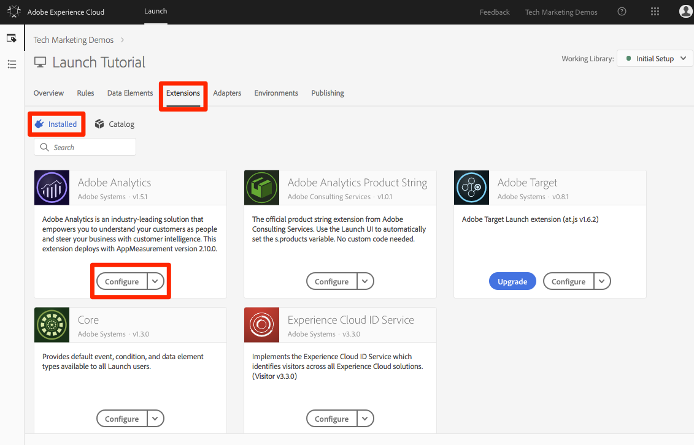

# Agregar Adobe Audience Manager

Esta lección le guiará a través de los pasos para habilitar Adobe Audience Manager mediante el reenvío del lado del servidor.

[Adobe Audience Manager](https://docs.adobe.com/content/help/en/audience-manager/user-guide/aam-home.html) (AAM) proporciona servicios líderes en el sector para la administración de datos de audiencia en línea, lo que proporciona a los anunciantes y editores digitales las herramientas que necesitan para controlar y aprovechar sus recursos de datos a fin de contribuir al éxito de las ventas.

## Objetivos de aprendizaje

Al final de esta lección podrá:

1. Describa las dos formas principales de implementar Audience Manager en un sitio web
1. Adición de Audience Manager mediante el reenvío de servidor de la señalización de Analytics
1. Validar la implementación de Audience Manager

## Requisitos previos

Para completar esta lección, necesitará:

1. Para completar las lecciones de [Configurar lanzamiento](launch.md), [agregue Adobe Analytics](analytics.md)y [agregue el servicio](id-service.md)de identidad.

1. Acceso del administrador a Adobe Analytics para que pueda habilitar el reenvío del lado del servidor para el grupo de informes que está utilizando para este tutorial. También puede pedir a un administrador existente de su organización que lo haga siguiendo las instrucciones que se indican a continuación.

1. Su "Subdominio de Audience Manager" (también conocido como "Nombre del socio", "ID del socio" o "Subdominio del socio"). Si ya ha implementado Audience Manager en su sitio web real, la forma más sencilla de obtenerlo es ir al sitio web real y abrir el depurador. El subdominio está disponible en la ficha Resumen, en la sección Administrador de audiencia:

   

Si aún no ha implementado Audience Manager, siga estas instrucciones para [obtener el subdominio](https://docs.adobe.com/content/help/en/audience-manager-learn/tutorials/web-implementation/how-to-identify-your-partner-id-or-subdomain.html)de Audience Manager.

## Opciones de implementación

Existen dos formas de implementar Audience Manager en un sitio web:

* **Reenvío del lado del servidor (SSF)**: para los clientes con Adobe Analytics, esta es la forma más sencilla y recomendada de implementar. Adobe Analytics reenvía datos a AAM en el servidor de Adobe, lo que permite una solicitud menos en la página. Esto también permite funciones de integración clave y se ajusta a las optimizaciones para la implementación y la implementación del código de Audience Manager.

* **DIL** del lado del cliente: este método es para clientes que no tienen Adobe Analytics. El código DIL (Código de biblioteca de integración de datos, código de configuración JavaScript de AAM) envía datos directamente desde la página web a Audience Manager.

Como ya ha implementado Adobe Analytics en este tutorial, implementará Audience Manager mediante el reenvío del lado del servidor. For a complete description and requirements list for Server-Side forwarding, please review the [documentation](https://docs.adobe.com/content/help/en/analytics/admin/admin-tools/server-side-forwarding/ssf.html), so that you are familiar with how it works, what is required, and how to validate.

## Activación del reenvío del lado del servidor

Existen dos pasos principales para realizar una implementación de SSF:

1. Activar un "conmutador" en la Consola de administración de Analytics para reenviar datos de Analytics a Audience Manager *por grupo* de informes.
1. Colocación del código, que se realiza mediante Launch. Para que esto funcione correctamente, deberá tener instalada la extensión del servicio de identidad de Adobe Experience Platform, así como la extensión de Analytics (de hecho, *no necesitará* la extensión AAM, que se explica a continuación).

### Habilitar el reenvío del lado del servidor en la Admin Console de Analytics

Se requiere una configuración en la Consola de administración de Adobe Analytics para empezar a reenviar datos de Adobe Analytics a Adobe Audience Manager. Dado que puede tardar hasta cuatro horas en empezar a reenviar los datos, debe realizar este paso primero.

#### Para activar SSF en la Consola de administración de Analytics

1. Inicie sesión en Analytics mediante la interfaz de usuario de Experience Cloud. Si no tiene acceso de administrador a Analytics, deberá hablar con el administrador de Experience Cloud o Analytics para asignarle acceso o completar estos pasos.

   

1. En el panel de navegación superior de Analytics, elija **[!UICONTROL Administración &gt; Grupos]** de informes y, en la lista, seleccione (selección múltiple) los grupos de informes que desee reenviar a Audience Manager.

   

1. En la pantalla Grupos de informes y con los grupos de informes seleccionados, elija **[!UICONTROL Editar configuración &gt; General &gt; Reenvío]** del lado del servidor.

   

   >[!WARNING] Como se ha indicado anteriormente, debe tener privilegios de administrador para ver este elemento de menú.

1. Una vez en la página Reenvío del lado del servidor, lea la información y marque la casilla de verificación **[!UICONTROL Habilitar reenvío]** del lado del servidor para los grupos de informes.

1. Haga clic en **[!UICONTROL Guardar]**

   

>[!NOTE] Dado que el SSF debe habilitarse por grupo de informes, no olvide repetir este paso para los grupos de informes reales cuando implemente el SSF en el grupo de informes real del sitio.
>
>Además, si la opción SSF está atenuada, deberá "asignar los grupos de informes a su organización de Experience Cloud para habilitar la opción. Esto se explica en [la documentación](https://docs.adobe.com/content/help/en/core-services/interface/about-core-services/report-suite-mapping.html).

Una vez completado este paso, y si tiene habilitado el servicio de identidad de Adobe Experience Platform, los datos se reenviarán de Analytics a AAM. Sin embargo, para completar el proceso de modo que la respuesta vuelva correctamente de AAM a la página (y también a Analytics mediante la función Audience Analytics), debe completar también el siguiente paso en Launch. No te preocupes, es super fácil.

### Activación del reenvío del lado del servidor en Launch

Este es el segundo de dos pasos para habilitar el SSF. Ya ha volteado el conmutador en la Consola de administración de Analytics y ahora solo necesita agregar el código, lo que Launch hará por usted si simplemente marca la casilla de verificación correcta.

>[!NOTE] Para implementar el reenvío de datos de Analytics por parte del servidor en AAM, en realidad editaremos/configuraremos la extensión de Analytics en Launch, **no** la extensión de AAM. La extensión AAM se utiliza exclusivamente para implementaciones DIL del lado del cliente, para aquellos que no tienen Adobe Analytics. Por lo tanto, los siguientes pasos son correctos cuando le envían a la extensión de Analytics para configurarla.

#### Para habilitar SSF en Launch

1. Vaya a **[!UICONTROL Extensiones &gt; Instalado]** y haga clic para configurar la extensión de Analytics.

   

1. Expandir la `Adobe Audience Manager` sección

1. Marque la casilla para compartir **[!UICONTROL automáticamente datos de Analytics con Audience Manager]**. Esto agregará el "módulo" (código) de Audience Manager a la implementación de Analytics `AppMeasurement.js` .

1. Agregue el "Subdominio de Audience Manager" (también conocido como "Nombre del socio", "ID del socio" o "Subdominio del socio"). Siga estas instrucciones para [obtener el subdominio](https://docs.adobe.com/content/help/en/audience-manager-learn/tutorials/web-implementation/how-to-identify-your-partner-id-or-subdomain.html)de Audience Manager.

1. Haga clic en **[!UICONTROL Guardar en biblioteca y crear]**

   

Ya se ha implementado el código de reenvío del lado del servidor.

### Validación del reenvío del lado del servidor

La forma principal de validar que el reenvío del lado del servidor esté activo y en ejecución es mirando la respuesta a cualquiera de las visitas de Adobe Analytics. Llegaremos a eso en un minuto. Mientras tanto, revisemos un par de otras cosas que nos pueden ayudar a asegurarnos de que está funcionando como queremos.

#### Verifique que el código se esté cargando correctamente

El código que Adobe Launch instala para controlar el reenvío, y especialmente la respuesta de AAM a la página, se denomina "Módulo" de Audience Manager. Podemos usar Experience Cloud Debugger para garantizar que se haya cargado.

1. Abrir el sitio Luma
1. Haga clic en el icono del depurador en el navegador para abrir el depurador de Experience Cloud
1. En la ficha Resumen, desplácese hacia abajo hasta la sección Análisis
1. Verify that **AudienceManagement** is listed under the Modules section

   

#### Compruebe el ID de socio en Debugger

A continuación, también podemos verificar que el depurador está recopilando el "ID del socio" correcto (subdominio del socio AKA, etc.) del código.

1. Mientras sigue en el depurador y en la ficha Resumen, desplácese hacia abajo hasta la sección Administrador de audiencia
1. Verifique su ID de socio/subdominio en "Partner"

   

>[!WARNING] Es posible que observe que la sección Audience Manager del depurador hace referencia a "DIL", que es la "Biblioteca de integración de datos", y que generalmente hace referencia a una implementación del lado del cliente, a diferencia del enfoque del lado del servidor que hemos implementado aquí. La verdad es que el "módulo" de AAM (utilizado en este enfoque de SSF) utiliza mucho del mismo código que la biblioteca DIL del lado del cliente, por lo que este depurador lo está informando como tal. Si ha seguido los pasos de este tutorial y el resto de los elementos de esta sección de validación son correctos, puede estar seguro de que el reenvío del lado del servidor está funcionando.

#### Verificación de la solicitud y la respuesta de Analytics

Bien, este es el gran. Si no realiza el reenvío de datos de Analytics a Audience Manager por parte del servidor, no hay ninguna respuesta a la señalización de Analytics (además de un píxel de 2 x 2). Sin embargo, si está realizando SSF, hay elementos que puede comprobar en la solicitud y respuesta de Analytics que le harán saber que funciona correctamente.
Lamentablemente, en este momento, el depurador de Experience Cloud no admite mostrar la respuesta a las señalizaciones. Por lo tanto, debe utilizar otro depurador/husmeador de paquetes, como Charles Proxy o las herramientas para desarrolladores del explorador.

1. Abra las herramientas de desarrollador en el navegador y vaya a la ficha Red
1. En el campo de filtro, escriba `b/ss` que limitará lo que ve a las solicitudes de Adobe Analytics
1. Actualice la página para ver la solicitud de Analytics

   

1. En la señalización de Analytics (solicitud), busque un parámetro "callback". Se establecerá en algo como esto: `s_c_il[1].doPostbacks`

   

1. Tendrá una respuesta a la señalización de Analytics. Contendrá referencias a doPostbacks, como se llama en la solicitud, y lo más importante, debe tener un objeto "material". Aquí es donde los ID de segmento de AAM se enviarán de vuelta al explorador. Si tienes el objeto "material", ¡SSF está funcionando!

   

>[!WARNING] Cuidado con el falso "éxito" - Si hay una respuesta, y todo parece estar funcionando, asegúrate de **que** tienes ese objeto "material". Si no lo hace, puede que vea un mensaje en la respuesta que diga "estado":"ÉXITO". Por más loco que parezca, esto es prueba de que **NO** está funcionando correctamente. Si lo ve, significa que ha completado este segundo paso (el código en Launch), pero que el reenvío en la Consola de administración de Analytics (primer paso de esta sección) aún no se ha completado. En este caso, debe comprobar que ha activado SSF en la Consola de administración de Analytics. Si lo has hecho, y no han pasado 4 horas todavía, ten paciencia.

[Próximas "Integraciones de Experience Cloud" &gt;](integrations.md)