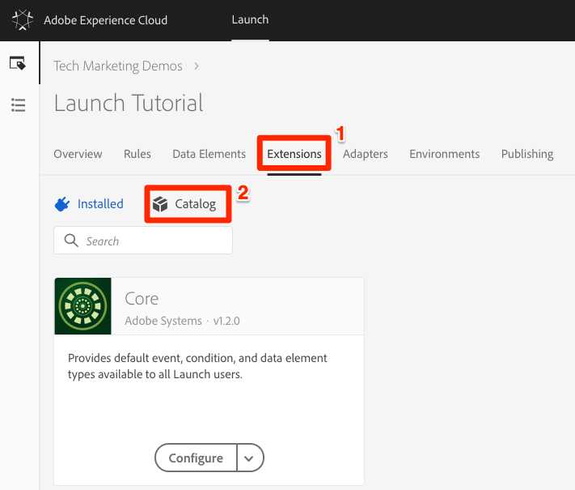
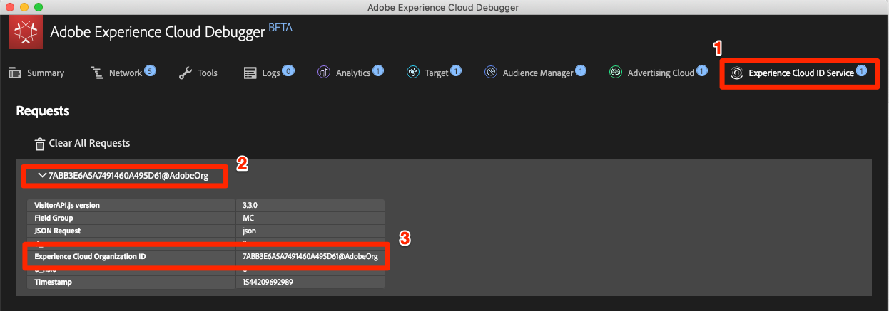
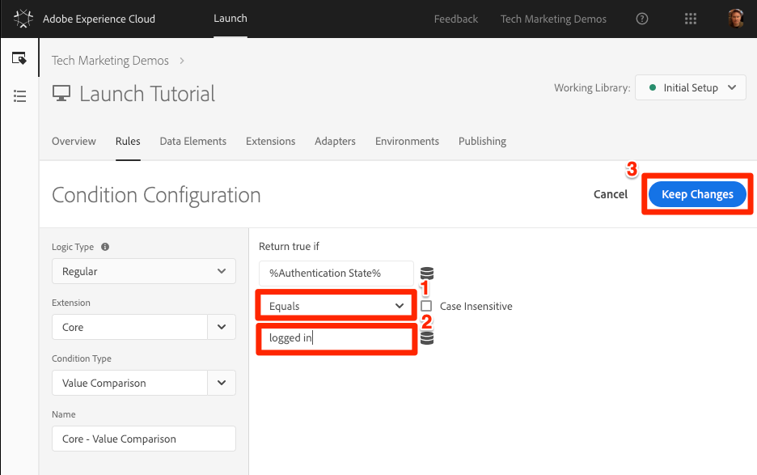
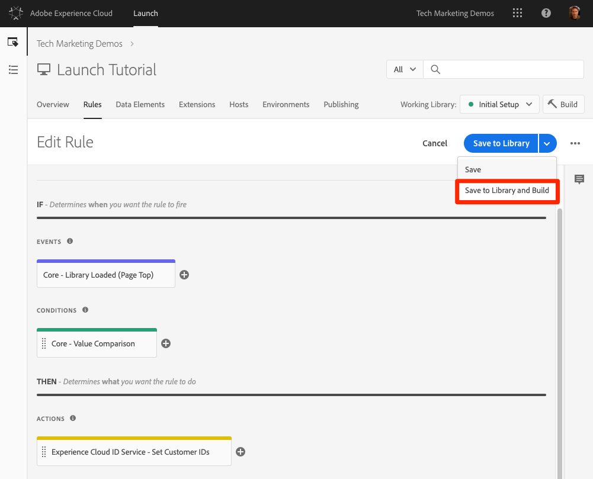

# Agregar el servicio de identidad de Adobe Experience Platform

Esta lección le guiará por los pasos necesarios para implementar la extensión [del servicio de identidad de](https://docs.adobe.com/content/help/en/launch/using/extensions-ref/adobe-extension/id-service-extension/overview.html) Adobe Experience Platform y enviar los ID de cliente.

El servicio [de identidad de](https://docs.adobe.com/content/help/en/id-service/using/home.html) Adobe Experience Platform establece un ID de visitante común en todas las soluciones de Adobe para potenciar las funciones de Experience Cloud, como el uso compartido de público entre soluciones.  También puede enviar sus propios ID de cliente al Servicio para habilitar la segmentación entre dispositivos y las integraciones con su sistema de administración de la relación con los clientes (CRM).

## Objetivos de aprendizaje

Al final de esta lección podrá:

* Agregar la extensión de servicio de identidad
* Crear un elemento de datos para recopilar las identificaciones de los clientes
* Cree una regla que utilice la acción "Definir ID de cliente" para enviar los ID de cliente a Adobe
* Utilice la función de orden de reglas para secuenciar las reglas que se activan con el mismo evento

## Requisitos previos

You should have already completed the lessons in the [Configure Launch](launch.md) section.

## Agregar Identity Service Extension

Dado que esta es la primera extensión que está agregando, a continuación se ofrece una descripción general rápida de las extensiones. Las extensiones son una de las características principales de Launch. Una extensión es una integración creada por Adobe, un socio de Adobe o cualquier cliente de Adobe que agrega opciones nuevas e interminables para las etiquetas que puede implementar en su sitio web. Si piensa en Launch como un sistema operativo, las extensiones son las aplicaciones que instala, por lo que Launch puede hacer lo que necesita para hacerlo.

**Para agregar Identity Service Extension**

1. In the top navigation, click **[!UICONTROL Extensions]**

1. Haga clic en **[!UICONTROL Catálogo]** para ir a la página Catálogo de extensiones

   

1. Tenga en cuenta la variedad de extensiones disponibles en el catálogo

1. En el filtro de la parte superior, escriba "id" para filtrar el catálogo

1. En la tarjeta del servicio de identidad de Adobe Experience Platform, haga clic en **[!UICONTROL Instalar]**

   

1. Tenga en cuenta que el ID de organización de Experience Cloud se ha detectado automáticamente.

1. Deje todos los ajustes predeterminados y haga clic en **[!UICONTROL Guardar en biblioteca y crear]**

   

>[!NOTE] Cada versión de la extensión de servicio de identidad incluye una versión específica de VisitorAPI.js que se indica en la descripción de la extensión. Para actualizar la versión VisitorAPI.js, actualice la extensión del servicio de identidad.

### Validar la extensión

La extensión del servicio de identidad es una de las pocas extensiones de Launch que realiza una solicitud sin tener que utilizar una acción de regla. La extensión realizará automáticamente una solicitud al servicio de identidad en la primera carga de página de la primera visita a un sitio web. Una vez solicitado el ID, se almacenará en una cookie de origen que comenzará con "AMCV_".

**Validación de la extensión Identity Service**

1. Open the [Luma site](https://luma.enablementadobe.com/content/luma/us/en.html)

1. Make sure the Debugger is mapping the Launch property to *your* Development environment, as described in the [earlier lesson](launch-switch-environments.md).

1. En la ficha Resumen del depurador, la sección Inicio debe indicar que se ha implementado la extensión del servicio de identidad de la plataforma de experiencia de Adobe.

1. Además, en la ficha Resumen, la sección Servicio de identidad debe rellenarse con el mismo identificador de organización que estaba en la pantalla de configuración de la extensión de la interfaz de Launch:

   

1. La solicitud inicial para recuperar el ID de visitante puede aparecer en la ficha Servicio de identidad del depurador. Puede que ya se haya solicitado, por lo que no debe preocuparse si no la ve:
   

1. Después de la solicitud inicial para recuperar el ID de visitante, el ID se almacena en una cookie cuyo nombre comienza con `AMCV_`. Puede confirmar que la cookie se ha configurado haciendo lo siguiente:
   1. Abra las herramientas para desarrolladores del explorador
   1. Go to the `Application` tab
   1. Expand `Cookies` on the left side
   1. Click on the domain `https://luma.enablementadobe.com`
   1. Busque la cookie AMCV_ en el lado derecho. Es posible que haya visto varios desde que cargaron el sitio de Luma usando tanto su propiedad Launch codificada como también asignada a la suya propia.
      

¡Ya está! ¡Has añadido tu primera extensión! Para obtener más información sobre las opciones de configuración del servicio de identidad, consulte [la documentación](https://docs.adobe.com/content/help/en/id-service/using/id-service-api/configurations/function-vars.html).

## Enviar ID de cliente

A continuación, enviará un ID [de cliente](https://docs.adobe.com/content/help/en/id-service/using/reference/authenticated-state.html) al servicio de identidad. This will allow you to [integrate your CRM](https://docs.adobe.com/content/help/en/core-services/interface/customer-attributes/attributes.html) with the Experience Cloud as well as track visitors across devices.

In the earlier lesson, [Add Data Elements, Rules, and Libraries](launch-data-elements-rules.md) you created a data element and used it in a rule. Ahora, utilizará las mismas técnicas para enviar un ID de cliente cuando el visitante esté autenticado.

### Creación de elementos de datos para el ID de cliente

Comience creando dos elementos de datos:

1. `Authentication State`—para capturar si el visitante ha iniciado sesión o no
1. `Email (Hashed)`: para capturar la versión con hash de la dirección de correo electrónico (utilizada como ID del cliente) de la capa de datos

**Para crear el elemento de datos para el estado de autenticación**

1. Haga clic en Elementos **** de datos en la navegación superior
1. Haga clic en el botón **[!UICONTROL Agregar elemento]** de datos

   

1. Asigne un nombre al elemento de datos `Authentication State`
1. Para el tipo **[!UICONTROL de elemento]** de datos, seleccione Código **[!UICONTROL personalizado]**
1. Haga clic en el botón **[!UICONTROL Abrir editor]**

   

1. En la ventana [!UICONTROL Editar código] , utilice el siguiente código para devolver valores de "sesión iniciada" o "sesión iniciada" según un atributo de la capa de datos del sitio de Luma:

   ```javascript
   if (digitalData.user[0].profile[0].attributes.loggedIn)
       return "logged in"
   else
       return "logged out"
   ```

1. Click **[!UICONTROL Save]** to save the custom code

   

1. Mantenga el resto de configuraciones en sus valores predeterminados
1. Haga clic en **[!UICONTROL Guardar en biblioteca y crear]** para guardar el elemento de datos y volver a la página de elementos de datos

   

Al conocer el estado de autenticación del usuario, sabe cuándo debe existir un ID de cliente en la página para enviarlo al servicio de identidad. El siguiente paso es crear un elemento de datos para la identificación del cliente. En el sitio de demostración de Luma, utilizará la versión con hash de la dirección de correo electrónico del visitante.

**Adición del elemento de datos para el correo electrónico con hash**

1. Haga clic en el botón **[!UICONTROL Agregar elemento]** de datos

   

1. Asigne un nombre al elemento de datos `Email (Hashed)`
1. Para el tipo **[!UICONTROL de elemento]** de datos, seleccione Variable **[!UICONTROL JavaScript]**
1. Como nombre **[!UICONTROL de la variable]** JavaScript, utilice el siguiente puntero a una variable en la capa de datos del sitio Luma: `digitalData.user.0.profile.0.attributes.username`
1. Mantenga el resto de configuraciones en sus valores predeterminados
1. Haga clic en **[!UICONTROL Guardar en biblioteca y crear]** para guardar el elemento de datos

   

### Añadir una regla para enviar los ID de cliente

El servicio de identidad de Adobe Experience Platform pasa los ID de cliente en reglas mediante una acción denominada "Establecer ID de cliente".  Ahora creará una regla para activar esta acción cuando el visitante esté autenticado.

**Creación de una regla para enviar los ID de cliente**

1. In the top navigation, click **[!UICONTROL Rules]**
1. Haga clic en **[!UICONTROL Agregar regla]** para abrir el Generador de reglas

   

1. Asigne un nombre a la regla `All Pages - Library Loaded - Authenticated - 10`

   >[!TIP] Esta convención de nombres indica que está activando esta regla en la parte superior de todas las páginas cuando el usuario se autentica y tendrá un orden de "10". El uso de una convención de nombres como ésta (en lugar de asignarle un nombre para las soluciones activadas en las acciones) le permitirá minimizar el número total de reglas que necesita la implementación.

1. Under **[!UICONTROL Events]** click **[!UICONTROL Add]**

   

   1. For the **[!UICONTROL Event Type]** select **[!UICONTROL Library Loaded (Page Top)]**
   1. For the  **[!UICONTROL Order]** enter `10`. El orden controla la secuencia de reglas activadas por el mismo evento. Las reglas con un orden inferior se activarán antes que las reglas con un orden superior. In this case, you want to set the customer ID before you fire the Target request, which you will do in the next lesson with a rule with an order of `50` .
   1. Haga clic en el botón **[!UICONTROL Mantener cambios]** para volver al Generador de reglas
   

1. En **[!UICONTROL Condiciones]** , haga clic en **[!UICONTROL Agregar]**

   

   1. Para el tipo **[!UICONTROL de]** condición, seleccione Comparación **[!UICONTROL de valores]**
   1. Click the  icon to open the Data Element modal

      

   1. En el Modelo de elementos de datos, haga clic en Estado **[!UICONTROL de]** autenticación y, a continuación, haga clic en **[!UICONTROL Seleccionar]**

      

1. Make sure `Equals` is the operator
1. Escriba "logged in" en el campo de texto, lo que provoca que la regla se active siempre que el elemento de datos "Authentication State" tenga el valor "logged in"

1. Click **[!UICONTROL Keep Changes]**

   

1. En **[!UICONTROL Acciones]** , haga clic en **[!UICONTROL Agregar]**

   

   1. Para **[!UICONTROL Extension]** , seleccione Servicio de identidad de la plataforma de **[!UICONTROL Adobe Experience]**
   1. Para el tipo **[!UICONTROL de]** acción, seleccione **[!UICONTROL Definir ID de cliente]**
   1. Para el código **[!UICONTROL de]** integración, introduzca `crm_id`
   1. Para el **[!UICONTROL valor]** , abra el modal del selector de elementos de datos y seleccione la variable `Email (Hashed)`
   1. Para el estado **[!UICONTROL de]** autenticación, seleccione **[!UICONTROL Autenticado]**
   1. Click the **[!UICONTROL Keep Changes]** button to save the action and return to the Rule Builder

      

1. Haga clic en el botón **[!UICONTROL Guardar en biblioteca y crear]** para guardar la regla

   

Ha creado una regla que enviará el ID de cliente como variable `crm_id` cuando el visitante esté autenticado. Desde que especificó el pedido, `10` esta regla se activará antes de que la `All Pages - Library Loaded` regla se cree en la lección [Agregar elementos de datos, reglas y bibliotecas](launch-data-elements-rules.md) , que utiliza el valor de pedido predeterminado de `50`.

### Validar los ID de cliente

Para validar su trabajo, iniciará sesión en el sitio de Luma para confirmar el comportamiento de la nueva regla.

**Para iniciar sesión en el sitio Luma**

1. Open the [Luma site](https://luma.enablementadobe.com/content/luma/us/en.html)

1. Make sure the Debugger is mapping the Launch property to *your* Development environment, as described in the [earlier lesson](launch-switch-environments.md)

   

1. Haga clic en el vínculo **[!UICONTROL LOGIN]** en la esquina superior derecha del sitio de Luma

   

1. Escriba `test@adobe.com` como nombre de usuario
1. Escriba `test` como contraseña
1. Haga clic en el botón **[!UICONTROL LOGIN]**

   

1. Vuelva a la página de inicio

Ahora, confirme que el ID de cliente se envía al servicio mediante la extensión Debugger.

**Para validar que Identity Service está pasando la identificación del cliente**

1. Asegúrese de que la ficha con el sitio Luma esté enfocada
1. En el depurador, vaya a la ficha Servicio de identidad de Adobe Experience Platform
1. Expandir su ID de organización
1. Click on the cell with the `Customer ID - crm_id` value
1. In the modal, note the customer id value and that the `AUTHENTICATED` state is reflected:

   

1. Tenga en cuenta que puede confirmar el valor de correo electrónico con hash si ve el código fuente de la página Luma y consulta la propiedad username. Debe coincidir con el valor que ve en el depurador:

   

### Sugerencias de validación adicionales

Launch también tiene funciones de registro de consola enriquecidas. Para activarlos, vaya a la ficha **[!UICONTROL Herramientas]** del depurador y active la opción **[!UICONTROL Iniciar registro]** de consola.


Esto activará el registro de la consola tanto en la consola del explorador como en la ficha Registros del depurador. ¡Debería ver el registro de todas las reglas que ha creado hasta ahora! Tenga en cuenta que las nuevas entradas de registro se agregan a la parte superior de la lista, por lo que la regla "Todas las páginas - Biblioteca cargada - Autenticada - 10" debe activarse antes de la regla "Todas las páginas - Biblioteca cargada" y aparecer debajo de ella en el Registro de la consola del depurador:


[Siguiente "Agregar Adobe Target" &gt;](target.md)
