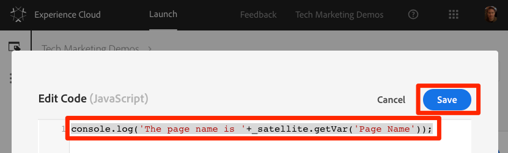

# Agregar un elemento de datos, una regla y una biblioteca

En esta lección, creará su primer elemento de datos, regla y biblioteca.

Los elementos de datos y las reglas son los componentes básicos de Launch. Los elementos de datos almacenan los atributos que desea enviar a sus soluciones de marketing y publicidad, mientras que las reglas activan las solicitudes a dichas soluciones en las condiciones correctas.  Las bibliotecas son los archivos JavaScript que se cargan en la página para realizar todo el trabajo. En esta lección, usará los tres para hacer que nuestra página de muestra haga algo.

## Objetivos de aprendizaje

Al final de esta lección podrá:

* Crear un elemento de datos
* Creación de reglas
* Crear una biblioteca
* Agregar cambios a una biblioteca
* Validar que la biblioteca se esté cargando en el explorador web
* Utilice la función "Biblioteca de trabajo" para trabajar de forma más eficaz

## Crear un elemento de datos para el nombre de la página

Los elementos de datos son la versión de una capa de datos de Launch. Pueden almacenar valores de su propio objeto de capa de datos, cookies, objetos de almacenamiento local, parámetros de cadena de consulta, elementos de página, etiquetas meta, etc. En este ejercicio, creará un elemento de datos para Nombre de página, que utilizará más adelante en las implementaciones de Target y Analytics.

**Para crear un elemento de datos**

1. En la navegación superior, haga clic en Elementos **[!UICONTROL de datos]**

1. Dado que aún no ha creado ningún elemento de datos en esta propiedad, aparece un breve vídeo con información adicional sobre este tema. Si lo desea, mire este vídeo.

1. Click the **[!UICONTROL Create New Data Element]** button:

   

1. Name the data element, e.g. `Page Name`

1. Use the [!UICONTROL JavaScript Variable] Data Element type to point to a value in your sample page's data layer: `digitalData.page.pageInfo.pageName`

1. Use "`not available`" as the [!UICONTROL Default Value]. The [!UICONTROL Default Value] tells Launch what value to use for the data element if your JavaScript Variable specified above is not found.

1. Marque las casillas de **[!UICONTROL Forzar valor en minúsculas]** y **[!UICONTROL Limpiar texto]** para estandarizar el caso y eliminar espacios superfluos

1. Deje **[!UICONTROL Ninguno]** como la configuración de duración **** del almacenamiento, ya que este valor generalmente será diferente en cada página

1. Haga clic en el botón **[!UICONTROL Guardar]** para guardar el elemento de datos

   de datos Nombre de página.

>[!NOTE]**** Migradores de DTM: Se han agregado nuevos tipos de elementos de datos a Launch, que no existían en la DTM. Algunos de los nuevos tipos de elementos de datos incluyen Local Storage, Session Storage, Page Info y Random Number
<!-- -->
>[!NOTE]Las capacidades de elementos de datos se _pueden ampliar con Extensiones_. Por ejemplo, la extensión ContextHub permite agregar elementos de datos mediante funciones de la extensión.

## Creación de reglas

A continuación, utilizará este elemento de datos en una regla sencilla. Las reglas son una de las funciones más potentes de Launch y le permiten especificar lo que debe suceder a medida que el visitante interactúa con el sitio web. Cuando se cumplen los criterios descritos en las reglas, la regla desencadena la acción especificada.

Va a crear una regla que envía el valor del elemento de datos Nombre de página a la consola del explorador.

**Para crear una regla**

1. In the top navigation, click **[!UICONTROL Rules]**

1. Dado que aún no ha creado ninguna regla en esta propiedad, aparece un breve vídeo con información adicional sobre el tema. Si lo desea, mire este vídeo.

1. Click the **[!UICONTROL Create New Rule]** button:

   

1. Name the Rule `All Pages - Library Loaded`. Esta convención de nombres indica dónde y cuándo se activará la regla, lo que facilita la identificación y reutilización a medida que la propiedad Launch madura.

1. En Eventos, haga clic en **[!UICONTROL Añadir]**. El evento indica a Launch cuándo se debe activar la regla y puede ser muchas cosas, como una carga de página, un clic, un evento personalizado de JavaScript, etc.

   

   1. Como Tipo de evento, seleccione **[!UICONTROL Biblioteca cargada (Principio de página)]**. Tenga en cuenta que cuando selecciona el tipo de evento, Launch rellena previamente un nombre para el evento utilizando su selección. Tenga en cuenta también que el orden predeterminado para el evento es 50. El pedido es una función potente de Launch que le proporciona un control preciso sobre la secuencia de acciones cuando tiene varias reglas activadas por el mismo evento. Esta función se utilizará más adelante en el tutorial.

   1. Haga clic en el botón **[!UICONTROL Mantener cambios]** .
   

1. Dado que esta regla debe activarse en todas las páginas, deje **[!UICONTROL Condiciones]** en blanco. Si abre el modal Conditions, verá que las condiciones pueden agregar restricciones y exclusiones en función de una gran variedad de opciones, incluidas direcciones URL, valores de elementos de datos, intervalos de fechas, etc.

1. Under Actions, click **[!UICONTROL Add]**

1. Seleccione Tipo **[!UICONTROL de acción &gt; Código]** personalizado, que en este momento es la única opción. Más adelante en el tutorial, al añadir extensiones, habrá más opciones disponibles.

1. Seleccione **[!UICONTROL &lt;/&gt; Abrir editor]** para abrir el editor de código

   

1. Agregue lo siguiente al editor de código. Este código mostrará el valor del elemento de datos Nombre de página en la consola del explorador para que pueda confirmar que funciona:

   ```javascript
   console.log('The page name is '+_satellite.getVar('Page Name'));
   ```

1. Guardar el editor de código

   

1. On the Action configuration screen click **[!UICONTROL Keep Changes]**

1. Click **[!UICONTROL Save]** to save the rule

>[!NOTE]**** Migradores de DTM: En Launch, se requieren reglas para activar la mayoría de los píxeles de marketing. Por ejemplo, para activar la señalización de Adobe Analytics, debe utilizar una regla para indicar a Launch que lo haga.
>
> El Generador de reglas se ha rediseñado y rediseñado considerablemente en Launch.
> Algunos de los cambios principales son:
>
> * Solo hay un Generador de reglas. Los tipos de reglas de la DTM como "Final de página", "Clic" y "Llamada directa" son solo tipos de eventos en el Generador de reglas. Esto hace que sea mucho más fácil actualizar una regla si necesita cambiar el activador desde, por ejemplo, un evento DOM a un evento personalizado.
> * Hay un nuevo tipo de evento "Código personalizado"
> * Las extensiones pueden agregar nuevos tipos de eventos al Generador de reglas. Por ejemplo, en el futuro, la extensión de Target podría admitir [eventos at.js personalizados](https://docs.adobe.com/content/help/en/target/using/implement-target/client-side/functions-overview/atjs-custom-events.html), por lo que no se necesitaría código personalizado para utilizar esta función.
> * Las extensiones pueden agregar nuevas acciones al Generador de reglas, lo que reduce los problemas al dejar de depender del código personalizado. En este tutorial se usarán muchas de estas acciones de extensión.
> * Las reglas se requieren para activar solicitudes asociadas con la mayoría de las herramientas de marketing. Esto requerirá un ajuste de mentalidad, especialmente en el caso de la configuración de ID de cliente, la activación de señalizaciones de Analytics y la activación de solicitudes de Target.


## Guardar los cambios en una biblioteca

Después de configurar una colección de extensiones, elementos de datos y reglas en la interfaz de Launch, debe empaquetar estas capacidades y lógica en un conjunto de códigos JavaScript que puede implementar en el sitio web para que las etiquetas de marketing se activen cuando los visitantes lleguen al sitio. Una biblioteca es el conjunto de código JavaScript que lo hará.

En lecciones anteriores, hemos implementado el código incrustado del entorno de desarrollo en la página de muestra. Cuando cargó la página de ejemplo, se devolvió un error 404 para la URL de código incrustado porque aún no se había creado una biblioteca de Launch y se había asignado al entorno. Ahora pondrá el nuevo elemento de datos y la regla en una biblioteca para que la página de muestra pueda hacer algo.

**Para agregar y crear una biblioteca**

1. Go to the [!UICONTROL Publishing] tab

1. Click **[!UICONTROL Add New Library]**

   

1. Asigne a la biblioteca el nombre "Ajustes iniciales"

1. Seleccionar **[!UICONTROL entorno &gt; Desarrollo]**

1. Haga clic en **[!UICONTROL Agregar todos los recursos modificados]**

   

1. Tenga en cuenta que después de hacer clic en **[!UICONTROL Agregar todos los recursos]** modificados, se resumen los cambios que acaba de realizar.

1. Haga clic en **[!UICONTROL Guardar y crear para desarrollo]**

   

Después de unos momentos, el punto de estado cambiará a verde indicando que la biblioteca se ha creado correctamente.


## Validar su trabajo

Ahora valide que la regla funcione según lo esperado.

Vuelva a cargar la página de muestra. Si consulta la ficha Herramientas para desarrolladores -&gt; Red, debería ver una respuesta de 200 para su biblioteca de lanzamiento.


Si consulta la consola Herramientas para desarrolladores -&gt; , debería ver el texto "El nombre de la página es inicio"


Enhorabuena, ha creado su primer elemento de datos y regla y su primera biblioteca de lanzamiento.

## Uso de la función Biblioteca de trabajo

Cuando esté realizando muchos cambios en Launch, no es conveniente tener que ir a la ficha Publicación, agregar cambios y crear la biblioteca cada vez que desee ver el resultado.  Ahora que ha creado la biblioteca "Ajustes iniciales", puede utilizar una función denominada "Biblioteca de trabajo" para guardar rápidamente los cambios y volver a crear la biblioteca en un solo paso.

Realice un pequeño cambio en la regla "Todas las páginas - Biblioteca cargada". In the top navigation, click **[!UICONTROL Rules]** and then click on the `All Pages - Library Loaded` rule to open it up.


En la `Edit Rule` página, haga clic en el menú desplegable Biblioteca ***[!UICONTROL de]*** trabajo y seleccione la `Initial Setup` biblioteca.


Una vez seleccionada la biblioteca, debe ver que el botón **[!UICONTROL Guardar]** ahora tiene el valor predeterminado **[!UICONTROL Guardar en biblioteca y crear]**. Cuando realice un cambio en Iniciar, puede utilizar esta opción para agregar automáticamente el cambio directamente a la biblioteca de trabajo y reconstruirlo.

Pruébelo. Abra la acción Código personalizado y agregue dos puntos después del texto "El nombre de la página es" para que todo el bloque de código diga:

```javascript
console.log('The page name is: '+_satellite.getVar('Page Name'));
```

Guarde el código, mantenga los cambios en la acción y, a continuación, haga clic en el botón **[!UICONTROL Guardar en biblioteca y crear]** .


Espere un momento hasta que el punto verde vuelva a aparecer junto al menú desplegable Biblioteca [!UICONTROL de] trabajo. Ahora, vuelva a cargar la página de muestra y debería ver el cambio reflejado en el mensaje de la consola (puede que tenga que borrar la caché del explorador y volver a cargar, para ver el cambio en la página):


Esta es una forma mucho más rápida de trabajar y utilizará este método para el resto del tutorial.

[Siguiente "Entornos de conmutación con el depurador de Experience Cloud" &gt;](launch-switch-environments.md)
