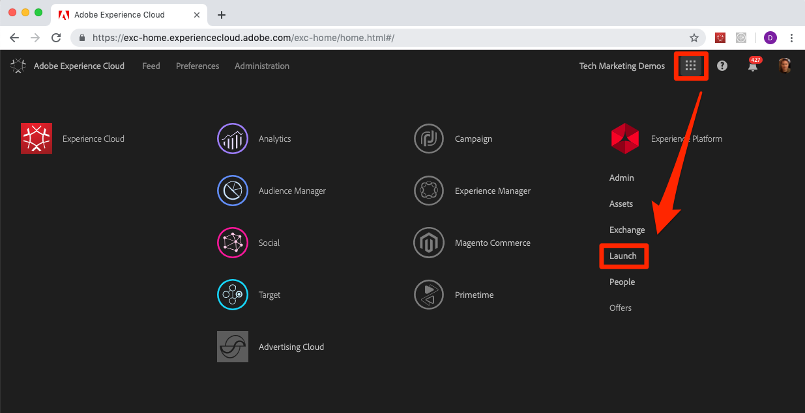
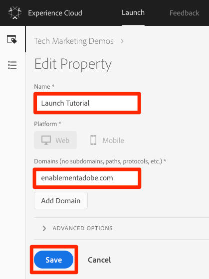

# Crear una propiedad de inicio

En esta lección, creará su primera propiedad Launch.

Una propiedad es básicamente un contenedor que se rellena con extensiones, reglas, elementos de datos y bibliotecas al implementar etiquetas en el sitio.

## Requisitos previos

Para completar las siguientes lecciones, debe tener permiso para desarrollar, aprobar, publicar, administrar extensiones y administrar entornos en Launch. Si no puede completar ninguno de estos pasos porque las opciones de la interfaz de usuario no están disponibles para usted, póngase en contacto con el administrador de Experience Cloud para solicitar acceso. For more information on Launch permissions, see [the documentation](https://docs.adobe.com/content/help/en/launch/using/reference/admin/user-permissions.html).

## Objetivos de aprendizaje

Al final de esta lección podrá:

* Inicie sesión en la interfaz de usuario de Launch
* Crear una nueva propiedad Launch
* Configurar una propiedad Launch

## Vaya a Launch

**Para llegar al lanzamiento**

1. Inicie sesión en [Adobe Experience Cloud](https://experiencecloud.adobe.com)

1. Haga clic en el icono del  para abrir el conmutador de soluciones

1. Seleccione **[!UICONTROL Iniciar]** en el menú 

1. En Inicio **[!UICONTROL de]** Adobe Experience Cloud, haga clic en el botón **[!UICONTROL Ir a inicio]**

   

You should now see the `Properties` screen (if no properties have ever been created in the account, this screen might be empty):

Si utiliza Launch con frecuencia, también puede marcar la siguiente URL e iniciar sesión directamente [https://launch.adobe.com](https://launch.adobe.com)

## Crear una propiedad

Una propiedad es básicamente un contenedor que se rellena con extensiones, reglas, elementos de datos y bibliotecas al implementar etiquetas en el sitio. Una propiedad puede ser cualquier conjunto de uno o varios dominios y subdominios. Puede administrar y rastrear estos recursos de manera similar. Por ejemplo, supongamos que tiene varios sitios web basados en una plantilla y quiere rastrear los mismos recursos en todos. Puede aplicar una propiedad a varios dominios. Para obtener más información sobre la creación de propiedades, consulte ["Empresas y propiedades"](https://docs.adobe.com/content/help/en/launch/using/reference/admin/companies-and-properties.html) en la documentación del producto.

**Creación de una propiedad**

1. Haga clic en el botón **[!UICONTROL Nueva propiedad]** :

   

1. Asigne un nombre a la propiedad (por ejemplo `Launch Tutorial` o `Daniel's Launch Tutorial`)
1. Como dominio, introduzca `enablementadobe.com` porque es el dominio en el que se aloja el sitio de demostración de Luma. Aunque el campo "Dominio" es obligatorio, la propiedad Launch funcionará en cualquier dominio en el que esté implementado. El principal propósito de este campo es rellenar previamente las opciones de menú en el Generador de reglas.
1. Haga clic en el botón **[!UICONTROL Guardar]** .

   

La nueva propiedad debe mostrarse en la página Propiedades. Note that if you check the box next to the property name, options to **[!UICONTROL Configure]** or **[!UICONTROL Delete]** the property appear above the property list. Haga clic en el nombre de su propiedad (p. ej. `Launch Tutorial`) para abrir la `Overview` pantalla.

[Siguiente "Agregar el código incrustado de lanzamiento" &gt;](launch-add-embed.md)
