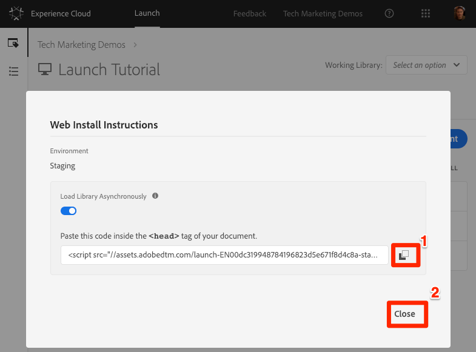

# Publicar la propiedad Launch

Ahora que ha implementado algunas soluciones clave de Adobe Experience Cloud en su entorno de desarrollo, es hora de aprender el flujo de trabajo de publicación.

## Objetivos de aprendizaje

Al final de esta lección podrá:

1. Publicar una biblioteca de desarrollo en el entorno de ensayo
1. Asigne una biblioteca de ensayo al sitio web de producción mediante el depurador
1. Publicar una biblioteca de ensayo en el entorno de producción

## Publicar en el entorno de ensayo

Ahora que ha creado y validado la biblioteca en el entorno de desarrollo, es hora de publicarla en Ensayo.

1. Go to the **[!UICONTROL Publishing]** page

1. Abra el menú desplegable situado junto a la biblioteca y seleccione **[!UICONTROL Enviar para aprobación]**

   

1. Haga clic en el botón **[!UICONTROL Enviar]** del cuadro de diálogo:

   

1. La biblioteca ahora aparecerá en la columna [!UICONTROL Enviado] en un estado sin compilar:

1. Abra el menú desplegable y seleccione **[!UICONTROL Generar para ensayo]**:

   

1. Una vez que aparece el icono del punto verde, la biblioteca se puede previsualizar en el entorno de ensayo.

En un escenario en tiempo real, el siguiente paso del proceso sería que el equipo de control de calidad validara los cambios en la biblioteca de ensayo. Pueden hacerlo mediante el depurador.

**Validación de los cambios en la biblioteca de ensayo**

1. En la propiedad Launch, abra la página [!UICONTROL Entornos]

1. En la fila [!UICONTROL Ensayo] , haga clic en el icono Instalar  Instalar para abrir el modal

   

1. Haga clic en el icono Copiar  Copiar para copiar el código incrustado en el portapapeles

1. Click **[!UICONTROL Close]** to close the modal

   

1. Open the [Luma demo site](https://luma.enablementadobe.com/content/luma/us/en.html) in your Chrome browser

1. Abra la extensión [de](https://chrome.google.com/webstore/detail/adobe-experience-cloud-de/ocdmogmohccmeicdhlhhgepeaijenapj) Experience Cloud Debugger haciendo clic en el icono 

   

1. Vaya a la ficha Herramientas

1. Haga clic en **[!UICONTROL Adobe Launch &gt; Insertar dinámicamente lanzamiento &gt; botón Código]** incrustado para abrir el campo de entrada de texto (actualmente puede tener la dirección URL del código incrustado de desarrollo):

   

1. Pegar el código incrustado de ensayo que se encuentra en el portapapeles

1. Haga clic en el icono de disco para guardar

   

1. Vuelva a cargar y marque la ficha Resumen del depurador. En la sección Inicio, debería ver que la propiedad de ensayo está implementada, mostrando el nombre de la propiedad (p. ej. "Iniciar tutorial" o el nombre que haya asignado a su propiedad).

   

En la vida real, una vez que el equipo de control de calidad haya firmado revisando los cambios en el entorno de ensayo, es hora de publicar en producción.

## Publicación en producción

1. Go to the [!UICONTROL Publishing] page

1. En el menú desplegable, haga clic en **[!UICONTROL Aprobar para publicación]**:

   

1. Haga clic en el botón **[!UICONTROL Aprobar]** del cuadro de diálogo:

   

1. La biblioteca aparecerá ahora en la columna [!UICONTROL Aprobado] en el estado sin compilar (punto amarillo):

1. Abra el menú desplegable y seleccione **[!UICONTROL **Generar y publicar en producción]**:

   

1. Haga clic en **[!UICONTROL Publicar]** en el cuadro de diálogo:

   

1. La biblioteca ahora aparecerá en la columna [!UICONTROL Publicado] :

   

¡Eso es todo! Ha completado el tutorial y publicado su primera propiedad en Launch.