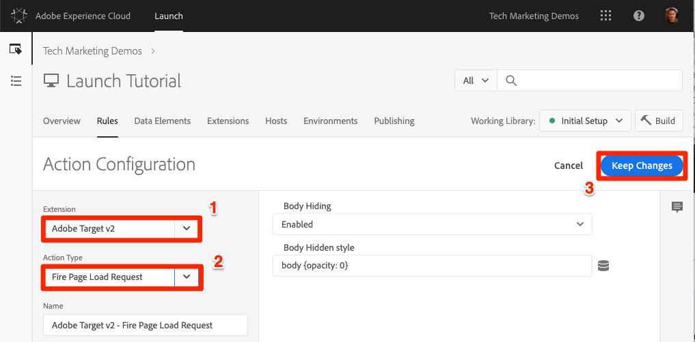
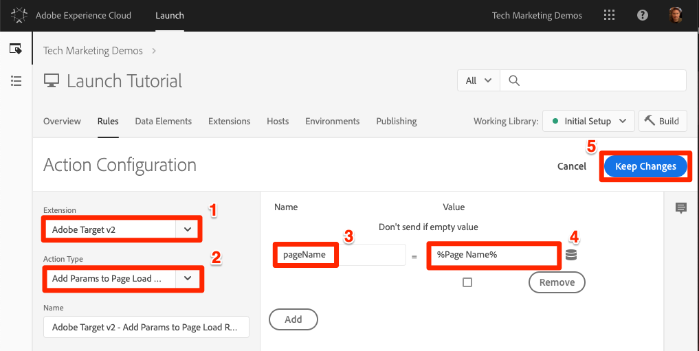
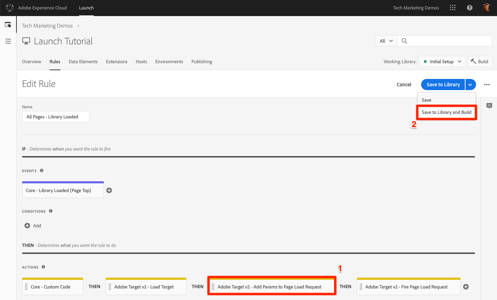
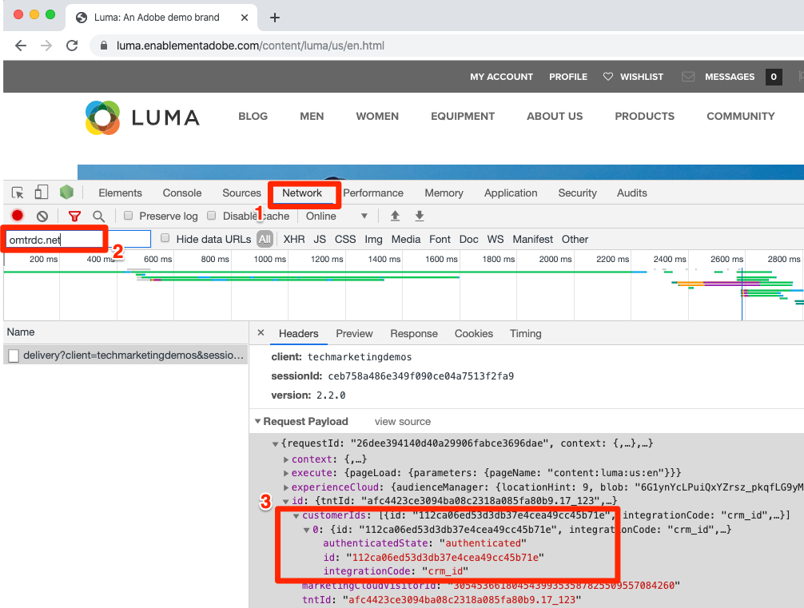
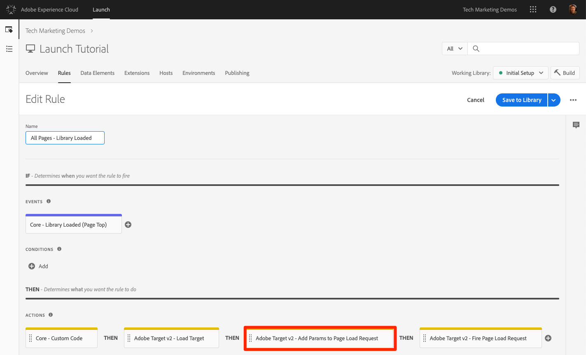
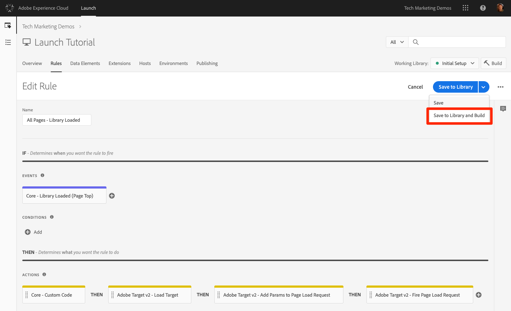

# Añadir Adobe Target

En esta lección, implementaremos la extensión [de](https://docs.adobe.com/content/help/en/launch/using/extensions-ref/adobe-extension/target-extension/overview.html) Adobe Target con una solicitud de carga de página y parámetros personalizados.

[Adobe Target](https://docs.adobe.com/content/help/en/target/using/target-home.html) es la solución de Adobe Marketing Cloud que le proporciona todo lo necesario para adaptar y personalizar la experiencia de sus clientes, de modo que pueda maximizar los ingresos de sus sitios web y móviles, aplicaciones, medios sociales y otros canales digitales.

## Objetivos de aprendizaje

Al final de esta lección podrá:

* Agregue el fragmento de ocultación previa utilizado para administrar el parpadeo al usar Target con códigos incrustados de inicio asincrónico
* Agregar la extensión Target v2
* Active la solicitud de carga de página (anteriormente denominada "mbox global")
* Agregar parámetros a la solicitud de carga de página
* Explicar cómo se pueden agregar parámetros de perfil y entidad a la solicitud de carga de página
* Activación de la solicitud de confirmación de pedido con los parámetros requeridos
* Explique cómo añadir configuraciones avanzadas como código de Library Header y Library Footer
* Validar una implementación de Target

## Requisitos previos

To complete the lessons in this section, you must first complete the lessons in [Configure Launch](launch.md) and [Add the Identity Service](id-service.md).

## Agregar el fragmento de objetivo de ocultación previa

Antes de empezar, debemos actualizar ligeramente los códigos de incrustación de Launch. Cuando los códigos incrustados de Launch se cargan de forma asíncrona, la página puede terminar de procesarse antes de que la biblioteca de Target esté completamente cargada y haya realizado el intercambio de contenido. Esto puede llevar a lo que se conoce como "parpadeo", donde el contenido predeterminado se muestra brevemente antes de ser reemplazado por el contenido personalizado especificado por Target. Si desea evitar este parpadeo, le recomendamos encarecidamente codificar un fragmento de ocultación previa especial inmediatamente antes de los códigos incrustados asincrónicos de Launch.

Esto ya se ha hecho en el sitio de Luma, pero sigamos adelante y hagámoslo en la página de muestra para que entienda la implementación. Copie las siguientes líneas de código:

```html
<script>
    //prehiding snippet for Adobe Target with asynchronous Launch deployment
    (function(g,b,d,f){(function(a,c,d){if(a){var e=b.createElement("style");e.id=c;e.innerHTML=d;a.appendChild(e)}})(b.getElementsByTagName("head")[0],"at-body-style",d);setTimeout(function(){var a=b.getElementsByTagName("head")[0];if(a){var c=b.getElementById("at-body-style");c&&a.removeChild(c)}},f)})(window,document,"body {opacity: 0 !important}",3E3);
</script>
```

Abra la página de muestra y péguela justo antes del código incrustado de Launch, como se muestra a continuación (no se preocupe si los números de línea son diferentes):
Pase el

Vuelva a cargar la página de muestra. Notará que la página estará oculta durante tres segundos antes de que se muestre. Este comportamiento es temporal y desaparecerá después de haber implementado Target. Este comportamiento de ocultación previa está controlado por dos configuraciones al final del fragmento, que se pueden personalizar pero que normalmente se dejan en la configuración predeterminada:

* `body {opacity: 0 !important}` especifica la definición css que se usará para la ocultación previa hasta que Target se cargue. De forma predeterminada, todo el cuerpo estará oculto. Si tiene una estructura DOM coherente con un elemento contenedor fácilmente identificable que ajuste todo el contenido debajo de la navegación, por ejemplo, y nunca desea probar o personalizar la navegación, puede utilizar esta configuración para limitar la ocultación previa a ese elemento contenedor.
* `3E3` que especifica la configuración de tiempo de espera para la ocultación previa. De forma predeterminada, si Target no se ha cargado en tres segundos, se mostrará la página. Esto debe ser muy improbable.

For more details and to obtain the un-minified pre-hiding snippet, please see [the Adobe Target extension with an asynchronous deployment&#x200B;](https://docs.adobe.com/content/help/en/launch/using/extensions-ref/adobe-extension/target-extension/overview.html#adobe-target-extension-with-an-asynchronous-deployment).

## Agregar la extensión de Target

La extensión Adobe Target admite implementaciones de cliente mediante el SDK de JavaScript de Target para la web moderna, at.js. Customers still using Target's older library, mbox.js, [should upgrade to at.js 2.x](https://docs.adobe.com/content/help/en/target/using/implement-target/client-side/mbox-implement/migrate-mbox/target-atjs-implementation.html) in order to use Launch.

La extensión de Target v2 consta de dos partes principales:

1. La configuración de la extensión, que administra la configuración de la biblioteca central
1. Acciones de reglas para hacer lo siguiente:
   1. Cargar destino (at.js 2.x)
   1. Agregar parámetros a solicitudes de carga de página
   1. Agregar parámetros a todas las solicitudes
   1. Activar solicitud de carga de página

En este primer ejercicio agregaremos la extensión y veremos las configuraciones. En ejercicios posteriores usaremos las acciones.

**Para agregar la extensión**

1. Vaya a **[!UICONTROL Extensiones &gt; Catálogo]**
1. Escriba `target` el filtro para localizar rápidamente las extensiones de Adobe Target. Existen dos extensiones: Adobe Target y Adobe Target v2. Este tutorial utilizará la versión v2 de la extensión que utiliza la última versión de at.js (actualmente 2.x), ideal tanto para sitios web tradicionales como para aplicaciones de una sola página (SPA).
1. Haga clic en **[!UICONTROL Instalar]**

   

1. Cuando agregue la extensión, importará muchas, pero no todas las configuraciones de at.js, de la interfaz de Target, como se muestra a continuación. Una configuración que no se importará es el tiempo de espera, que siempre será de 3000 ms después de agregar la extensión. Para el tutorial, mantenga la configuración predeterminada. Tenga en cuenta que en el lado izquierdo se mostrará la versión de at.js que se incluye con la versión actual de la extensión.

1. Haga clic en **[!UICONTROL Guardar en biblioteca y crear]**

   

En este momento, Target no está haciendo nada, por lo que no hay nada que validar.

>[!NOTE] Cada versión de la extensión de Target incluye una versión específica de at.js, que se muestra en la descripción de la extensión. Para actualizar la versión de at.js, actualice la extensión de Target.

## Cargar Target y activar la solicitud de carga de página

Los especialistas en marketing utilizan Target para controlar la experiencia del visitante en la página al probar y dirigir el contenido. Debido a esta importante función en la visualización de la página, debe cargar Target lo antes posible para minimizar el impacto en la visibilidad de la página. En esta sección, se cargará la biblioteca JavaScript de Target, at.js, y se activará la solicitud de carga de página (denominada "mbox global" en versiones anteriores de at.js).

Puede utilizar la `All Pages - Library Loaded` regla que ha creado en la lección "[Agregar elementos de datos, reglas y bibliotecas](launch-data-elements-rules.md)" para implementar Target porque ya se ha activado lo antes posible en las cargas de página.

**Para cargar Target**

1. Vaya a **[!UICONTROL Rules]** en la barra de navegación superior y luego haga clic en `All Pages - Library Loaded` para abrir el editor de reglas

   

1. Under Actions, click the  to add a new action

   

1. Seleccione **[!UICONTROL Extensión &gt; Adobe Target v2]**

1. Seleccione Tipo **[!UICONTROL de acción &gt; Cargar objetivo]**

1. Click **[!UICONTROL Keep Changes]**

   

With the `Load Target` action added, at.js will load on the page. Sin embargo, ninguna solicitud de Target se activará hasta que se agregue la `Fire Page Load Request` acción.

**Para activar la solicitud de carga de página**

1. En Acciones, haga clic de nuevo en el icono  Haga clic en el signo más para agregar otra acción

   

1. Seleccione **[!UICONTROL Extensión &gt; Adobe Target v2]**

1. Seleccione Tipo **[!UICONTROL de acción &gt; Solicitud de carga de página de lanzamiento]**

1. Hay algunas configuraciones disponibles para la solicitud de carga de página relacionadas con si se debe o no ocultar la página y el selector de CSS que se utilizará para la ocultación previa. Esta configuración funciona junto con el fragmento de ocultamiento previo codificado en la página. Conserve la configuración predeterminada.

1. Click **[!UICONTROL Keep Changes]**

   

1. La nueva acción se agrega en secuencia después de la acción y las acciones se ejecutarán en este orden `Load Target` . Puede arrastrar y soltar las acciones para reorganizar el orden, pero en este escenario `Load Target` debe estar antes `Fire Page Load Request`.

1. Haga clic en **[!UICONTROL Guardar en biblioteca y crear]**

   

### Validar la solicitud de carga de página

Ahora que ha agregado la extensión Target v2 y ha activado las acciones `Load Target` y `Fire Page Load Request` , debe haber una solicitud de carga de página en todas las páginas donde se utilice la propiedad Launch.

**Validación de las acciones Cargar destino y Cargar página de inicio**

1. Vuelva a cargar la página de muestra. Ya no debería ver un retraso de tres segundos antes de que la página sea visible. If you are loading the sample page using the `file://` protocol, you should do this step in Firefox or Safari browsers since Chrome will not fire a Target request when using the `file://` protocol.

1. Open the [Luma site](https://luma.enablementadobe.com/content/luma/us/en.html)

1. Make sure the Debugger is mapping the Launch property to *your* Development environment, as described in the [earlier lesson](launch-switch-environments.md)

   

1. Vaya a la ficha Resumen del depurador

1. In the `Launch` section, confirm that `Target` appears under the `Extensions` heading

1. En la `Target` sección , confirme que aparece la versión de la biblioteca at.js

   

1. Finalmente, vaya a la `Target` ficha, expanda el código de cliente y confirme que aparece la solicitud de carga de página:

   

¡Felicitaciones! ¡Ha implementado Target!

## Agregar parámetros

Al pasar parámetros en la solicitud de Target, se agregan potentes capacidades a las actividades de segmentación, prueba y personalización. La extensión Launch proporciona dos acciones para pasar parámetros:

1. `Add Params to Page Load Request`, que agrega parámetros a las solicitudes de carga de página (equivalente al método [targetPageParams()](https://docs.adobe.com/content/help/en/target/using/implement-target/client-side/functions-overview/cmp-atjs-functions.html) )

1. `Add Params to All Requests`, que agrega parámetros en todas las solicitudes de Target, por ejemplo: la solicitud de carga de página más las solicitudes adicionales realizadas a partir de acciones de código personalizado o codificadas en el sitio (equivalente al método [targetPageParamsAll()](https://docs.adobe.com/content/help/en/target/using/implement-target/client-side/functions-overview/cmp-atjs-functions.html) )

These actions can be used *before* the `Load Target` action and can set different parameters on different pages based on your rule configurations. Utilice la función de ordenación de reglas que utilizó al configurar los ID de cliente con el servicio de identidad para establecer parámetros adicionales en el `Library Loaded` evento antes de que la regla active la solicitud de carga de página.
>[!TIP] Dado que la mayoría de las implementaciones utilizan la solicitud de carga de página para la entrega de actividades, normalmente es suficiente para usar la `Add Params to Page Load Requests` acción.

### Parámetros de solicitud (mbox)

Los parámetros se utilizan para pasar datos personalizados a Target, lo que enriquece las capacidades de personalización. Son ideales para atributos que cambian con frecuencia durante una sesión de navegación, como el nombre de la página, la plantilla, etc. y no persistirán.

Añadamos el elemento de datos que hemos creado anteriormente en la lección `Page Name` Agregar elementos de datos, reglas y bibliotecas [](launch-data-elements-rules.md) como parámetro de solicitud.

**Para agregar el parámetro de solicitud**

1. Vaya a **[!UICONTROL Rules]** en la barra de navegación superior y luego haga clic en `All Pages - Library Loaded` para abrir el editor de reglas.

   

1. Under Actions, click the  to add a new action

   

1. Seleccione **[!UICONTROL Extensión &gt; Adobe Target v2]**

1. Seleccione Tipo de **[!UICONTROL acción &gt; Agregar parámetros a la solicitud de carga de página]**

1. Escriba `pageName` como **[!UICONTROL nombre]**

1. Click the  to open the data element modal

1. Haga clic en el elemento de `Page Name` datos

1. Haga clic en el botón **[!UICONTROL Seleccionar]**

   

1. Click **[!UICONTROL Keep Changes]**

   

1. Haga clic y arrastre en el borde izquierdo de la acción para reorganizar las acciones que tiene antes de la `Add Params to Page Load Request` acción `Fire Page Load Request` (puede ser antes o después `Load Target`)

1. Haga clic en **[!UICONTROL Guardar en biblioteca y crear]**

   

#### Validar parámetros de solicitud

Por el momento, los parámetros personalizados que se pasan con solicitudes at.js 2.x no son fácilmente visibles en el depurador, por lo que utilizaremos las herramientas de desarrollador del explorador.

**Para validar el parámetro de solicitud pageName**

1. Volver a cargar el sitio de luminancia, asegurándose de que esté asignado a su propia propiedad Launch
1. Abra las herramientas para desarrolladores del explorador
1. Haga clic en la ficha Red
1. Filtrar las solicitudes a `tt.omtrdc` (o su dominio CNAME para solicitudes de Target)
1. Expanda la sección `Headers` &gt; `Request Payload` &gt; `execute.pageLoad.parameters` para validar el `pageName` parámetro y el valor
   

<!--Now go to the **[!UICONTROL Target]** tab in the Debugger. Expand your client code and look at the requests. You should see the new `pageName` parameter passed in the request:

-->

### Parámetros de perfil

De forma similar a los parámetros de solicitud, los parámetros de perfil también se pasan a través de la solicitud de Target. However, profile parameters get stored in Target's visitor profile database and will persist for the [duration of the visitor's profile](https://docs.adobe.com/content/help/en/target/using/audiences/visitor-profiles/visitor-profile-lifetime.html). Puede configurarlas en una página del sitio y utilizarlas en actividades de Target en otra página. Este es un ejemplo de un sitio web de automóviles. Cuando un visitante va a una página de vehículo, puede pasar un parámetro de perfil "profile.lastViewed=sportscar" para registrar su interés en ese vehículo en particular. Cuando el visitante navega a otras páginas que no son de vehículos, puede dirigirse al contenido en función de su último vehículo visualizado.  Los parámetros de perfil son ideales para atributos que cambian con poca frecuencia o que solo están disponibles en determinadas páginas

You won't pass any profile parameters in this tutorial, but the workflow is almost identical to what you just did when passing the `pageName` parameter. La diferencia es que debe dar a los parámetros de perfil un prefijo `profile.`. This is what a profile parameter called "userType" would look like in the `Add Params to Page Load Request` action:


### Parámetros de entidad

Los parámetros de entidad son parámetros especiales que se utilizan en las [implementaciones de Recommendations](https://docs.adobe.com/content/help/en/target/using/recommendations/plan-implement.html) por tres motivos principales:

1. Como clave para activar recomendaciones de productos. Por ejemplo, al utilizar un algoritmo de recomendaciones como “Otras personas que vieron el producto X también vieron Y”, “X” es la “clave” de la recomendación. Normalmente es el SKU del producto (`entity.id`) o la categoría (`entity.categoryId`) que el visitante está viendo actualmente.
1. Para recopilar el comportamiento del visitante y activar algoritmos de recomendaciones, como "Productos vistos recientemente" o "Productos más vistos"
1. Para rellenar el catálogo de Recommendations. Recomendaciones contiene una base de datos de todos los productos o artículos del sitio web, para que se puedan proporcionar en la oferta de recomendaciones. Por ejemplo, al recomendar productos, normalmente desea mostrar atributos como el nombre del producto (`entity.name`) o su imagen (`entity.thumbnailUrl`). Algunos clientes rellenan el catálogo con fuentes de servidor, pero también se pueden rellenar con parámetros de entidad en solicitudes de Target.

No es necesario pasar ningún parámetro de perfil en este tutorial, pero el flujo de trabajo es idéntico al que se ha hecho anteriormente al pasar el parámetro de `pageName` solicitud, solo tiene que indicar al parámetro un nombre con el prefijo "entity". y asignarlo al elemento de datos pertinente. Tenga en cuenta que algunas entidades comunes tienen nombres reservados que se deben usar (por ejemplo, entity.id para el SKU del producto). This is what it would look like to set entity parameters in the `Add Params to Page Load Request` action:


### Añadir parámetros de ID de cliente

La recopilación de ID de cliente con el servicio de identidad de la plataforma Adobe Experience Cloud facilita la importación de datos CRM en Target mediante la función Atributos [del](https://docs.adobe.com/content/help/en/target/using/audiences/visitor-profiles/working-with-customer-attributes.html) cliente de Adobe Experience Cloud. It also enables [cross-device visitor stitching](https://docs.adobe.com/content/help/en/target/using/integrate/experience-cloud-device-co-op.html), allowing you to maintain a consistent user experience as your customers switch between their laptops and their mobile devices.

Es imperativo configurar el ID de cliente en la acción de Identity Service antes de activar la solicitud de carga de página `Set Customer IDs` . Para ello, asegúrese de disponer de las siguientes capacidades en su sitio:

* El ID de cliente debe estar disponible en la página antes de iniciar código incrustado
* Se debe instalar la extensión del servicio de identidad de Adobe Experience Platform
* You must use the `Set Customer IDs` action in a rule that fires at the "Library Loaded (Page Top)" event
* Use the `Fire Page Load Request` action in a rule that fires *after* the "Set Customer IDs" action

En la lección anterior, [agregue el servicio](id-service.md)de identidad de Adobe Experience Platform, ha creado la `All Pages - Library Loaded - Authenticated - 10` regla para activar la acción "Definir ID de cliente". Debido a que esta regla tiene una `Order` configuración de `10`, los ID de cliente se establecen antes de que nuestra solicitud de carga de página se active desde la `All Pages - Library Loaded` regla con su `Order` configuración de `50`. Por lo tanto, ya ha implementado la recopilación de ID de cliente para Target.

#### Validar el ID de cliente

Por el momento, los parámetros personalizados que se pasan con solicitudes at.js 2.x no son fácilmente visibles en el depurador, por lo que utilizaremos las herramientas de desarrollador del explorador.

**Para validar el ID de cliente**

1. Open the [Luma site](https://luma.enablementadobe.com/content/luma/us/en.html)

1. Make sure the Debugger is mapping the Launch property to *your* Development environment, as described in the [earlier lesson](launch-switch-environments.md)

   

1. Inicie sesión en el sitio de Luma con las credenciales `test@adobe.com`/`test`
1. Return to the [Luma homepage](https://luma.enablementadobe.com/content/luma/us/en.html)

1. Abra las herramientas para desarrolladores del explorador
1. Haga clic en la ficha Red
1. Filtrar las solicitudes a `tt.omtrdc` (o su dominio CNAME para solicitudes de Target)
1. Expanda la sección `Headers` &gt; `Request Payload` &gt; `id.customerIds.0` para validar la configuración y el valor del ID de cliente:
   
<!--
1. Open the Debugger
1. Go to the Target tab
1. Expand your client code
1. You should see parameters in the latest Target request for `vst.crm_id.id` and `vst.crm_id.authState`. `vst.crm_id.id` should have a value of the hashed email address and `vst.crm_id.authState` should have a value of `1` to represent `authenticated`. Note that `crm_id` is the `Integration Code` you specified in the Identity Service configuration and must align with the key you use in your [Customer Attributes data file](https://docs.adobe.com/content/help/en/core-services/interface/customer-attributes/t-crs-usecase.html):

-->

>[!WARNING] El servicio de identidad de la plataforma de experiencia de Adobe le permitirá enviar varios identificadores al servicio. Sin embargo, solo el primero se enviará a Target.

### Agregar el parámetro de token de propiedad

>[!NOTE] Este es un ejercicio opcional para los clientes de Target Premium.

The property token is a reserved parameter used with the Target Premium [Enterprise User Permissions](https://docs.adobe.com/content/help/en/target/using/administer/manage-users/enterprise/property-channel.html) feature. Se utiliza para definir diferentes propiedades digitales de modo que se puedan asignar a diferentes miembros de una organización de Experience Cloud permisos diferentes en cada propiedad. Por ejemplo, es posible que desee que un grupo de usuarios pueda configurar actividades de Target en el sitio web, pero no en la aplicación móvil.

Las propiedades de Target son análogas a las propiedades de Launch y a los grupos de informes de Analytics. Una empresa con varias marcas, sitios web y equipos de marketing puede utilizar una propiedad de Target diferente, propiedad Launch y grupo de informes de Analytics para cada sitio web o aplicación móvil. Las propiedades de inicio se diferencian por sus códigos incrustados, los grupos de informes de Analytics se diferencian por su ID de grupo de informes y las propiedades de Target se diferencian por su parámetro de token de propiedad.

El token de propiedad se implementa como un parámetro de solicitud. Asigne un nombre al parámetro "at_property" y péguelo en el valor proporcionado en la interfaz de Target.  Si va a implementar varios sitios con una sola propiedad Launch, puede administrar el valor at_property a través de un elemento de datos.

Este es un ejercicio opcional si es cliente de Target Premium y desea implementar un token de propiedad en la propiedad Tutorial:

1. En una ficha independiente, abra la interfaz de usuario de Target

1. Vaya a **[!UICONTROL Ajustes &gt; Propiedades]**

1. Identifique la propiedad que desee utilizar y haga clic en la **[!UICONTROL &lt;/&gt;]** (o cree una nueva propiedad)

1. Copy the `at_property` value to your clipboard

   

1. In your Launch tab, go to the **[!UICONTROL Rules]** in the top navigation and then click on `All Pages - Library Loaded` to open the rule editor.

   

1. En Acciones, haga clic en la `Adobe Target - Add Params to Page Load Request` acción para abrir la `Action Configuration`

   

1. Bajo el `pageName` parámetro, haga clic en el botón **[!UICONTROL Agregar]** .

   

1. Name the parameter `at_property` and paste in the value you copied from the Target interface

1. Click **[!UICONTROL Keep Changes]**

   

1. Haga clic en **[!UICONTROL Guardar en biblioteca y crear]**
   

#### Validación del token de propiedad

Por el momento, los parámetros personalizados que se pasan con solicitudes at.js 2.x no son fácilmente visibles en el depurador, por lo que utilizaremos las herramientas de desarrollador del explorador.

**Validación del parámetro Token de propiedad**

1. Open the [Luma site](https://luma.enablementadobe.com/content/luma/us/en.html)
1. Make sure the Debugger is mapping the Launch property to *your* Development environment, as described in the [earlier lesson](launch-switch-environments.md)

   

1. Abra las herramientas para desarrolladores del explorador
1. Haga clic en la ficha Red
1. Filtrar las solicitudes a `tt.omtrdc` (o su dominio CNAME para solicitudes de Target)
1. Expanda la sección `Headers` &gt; `Request Payload` &gt; `property.token` para validar el valor
   

<!--
1. Go to the `Target` tab
1. Expand your client code
1. You should see the parameter for "at_property" in every page load request request as you browse the site:

-->

## Agregar solicitudes personalizadas

### Agregar una solicitud de confirmación de pedido

La solicitud de confirmación de pedido es un tipo especial de solicitud que se utiliza para enviar los detalles del pedido a Target. La inclusión de tres parámetros de solicitud específicos (orderId, orderTotal y productPurchasedId) es lo que convierte una solicitud de Target normal en una solicitud de pedido. Además de los ingresos de informes, la solicitud de pedido también realiza lo siguiente:

1. Anula la duplicación de reenvíos accidentales de pedidos
1. Filtra pedidos extremos (cualquier pedido cuyo total tenga más de tres desviaciones estándar de la media)
1. Utiliza un algoritmo diferente entre bastidores para calcular la confianza estadística
1. Crea un informe de auditoría especial descargable de detalles de pedidos individuales

Lo mejor es utilizar y solicitar confirmación de pedidos en todos los canales de pedidos, incluso en los sitios que no sean minoristas. Por ejemplo, los sitios de generación de posibles clientes suelen tener canales de posibles clientes con un “ID de posible cliente” único generado al final. Estos sitios deben implementar una solicitud de pedido mediante un valor estático (p. ej. "1") para orderTotal.

Los clientes que utilicen la integración de Analytics para Target (A4T) para la mayoría de sus informes también deben implementar la solicitud de pedido, ya que A4T aún no es compatible con tipos de actividades como Asignación automática, Personalización automatizada y Segmentación automática. Además, la solicitud de pedido es un elemento crítico en las implementaciones de Recomendaciones, que alimenta los algoritmos basados en el comportamiento de compra.

La solicitud de confirmación de pedido debe activarse desde una regla que solo se activa en la página o evento de confirmación de pedido. A menudo, se puede combinar con una regla que establezca el evento de compra de Adobe Analytics. Debe configurarse mediante la acción Código personalizado de la extensión Core, utilizando los elementos de datos adecuados para establecer los parámetros orderId, orderTotal y productPurchasedId.

Añadamos los elementos de datos y la regla que necesitamos para activar una solicitud de confirmación de pedido en el sitio de Luma. Dado que ya ha creado varios elementos de datos, estas instrucciones se abreviarán.

**Para crear el elemento de datos para el identificador de pedido**

1. Haga clic en Elementos **** de datos en la navegación superior
1. Haga clic en **[!UICONTROL Agregar elemento de datos]**
1. Asigne un nombre al elemento de datos `Order Id`
1. Seleccione Tipo **[!UICONTROL de elemento de datos &gt; Variable JavaScript]**
1. Use `digitalData.cart.orderId` as the `JavaScript variable name`
1. Check the `Clean text` option
1. Haga clic en **[!UICONTROL Guardar en biblioteca]**(no crearemos la biblioteca hasta que hayamos realizado todos los cambios para la solicitud de confirmación de pedido)

**Para crear el elemento de datos para la cantidad del carro de compras**

1. Haga clic en **[!UICONTROL Agregar elemento de datos]**
1. Asigne un nombre al elemento de datos `Cart Amount`
1. Seleccione Tipo **[!UICONTROL de elemento de datos &gt; Variable JavaScript]**
1. Use `digitalData.cart.cartAmount` as the `JavaScript variable name`
1. Check the `Clean text` option
1. Haga clic en **[!UICONTROL Guardar en biblioteca]**

**Para crear el elemento de datos para SKU de carro de compras (Target)**

1. Haga clic en **[!UICONTROL Agregar elemento de datos]**
1. Asigne un nombre al elemento de datos `Cart SKUs (Target)`
1. Seleccione Tipo **[!UICONTROL de elemento de datos &gt; Código personalizado]**
1. Para Target, los códigos de artículo deben aparecer en una lista separada por comas. Este código personalizado cambiará el formato de la matriz de capas de datos al formato adecuado. En el editor de código personalizado, pegue lo siguiente:

   ```javascript
   var targetProdSkus="";
   for (var i=0; i<digitalData.cart.cartEntries.length; i++) {
     if(i>0) {
       targetProdSkus = targetProdSkus + ",";
     }
     targetProdSkus = targetProdSkus + digitalData.cart.cartEntries[i].sku;
   }
   return targetProdSkus;
   ```

1. Check the `Force lowercase value` option
1. Check the `Clean text` option
1. Haga clic en **[!UICONTROL Guardar en biblioteca]**

Ahora necesitamos crear una regla para activar la solicitud de confirmación de pedido con estos elementos de datos como parámetros en la página de confirmación de pedido.

**Para crear la página de confirmación de pedido de la regla**

1. Click **[!UICONTROL Rules]** in the top navigation
1. Haga clic en **[!UICONTROL Agregar regla]**
1. Asigne un nombre a la regla `Order Confirmation Page - Library Loaded - 60`
1. Haga clic en **[!UICONTROL Eventos &gt; Agregar]**
   1. Seleccione Tipo **[!UICONTROL de evento &gt; Biblioteca cargada (Principio de página)]**
   1. Cambie el `Order` a para `60` que se active después de la `Load Target` acción (que está en nuestra `All Pages - Library Loaded` regla donde `Order` se establece en `50`)
   1. Click **[!UICONTROL Keep Changes]**
1. Haga clic en **[!UICONTROL Condiciones &gt; Agregar]**
   1. Seleccione Tipo **[!UICONTROL de condición &gt; Ruta sin cadena de consulta]**
   1. Para `Path equals` entrar `thank-you.html`
   1. Alternar en la opción Regex para cambiar la lógica de `equals` a `contains` (puede utilizar la `Test` función para confirmar que la prueba pasará con la dirección URL `https://luma.enablementadobe.com/content/luma/us/en/user/checkout/order/thank-you.html`

      

   1. Click **[!UICONTROL Keep Changes]**
1. Haga clic en **[!UICONTROL Acciones &gt; Agregar]**
   1. Seleccione Tipo **[!UICONTROL de acción &gt; Código personalizado]**
   1. Click **[!UICONTROL Open Editor]**
   1. Paste the following code into the `Edit Code` modal

      ```javascript
      adobe.target.getOffer({
        "mbox": "orderConfirmPage",
        "params":{
           "orderId": _satellite.getVar('Order Id'),
           "orderTotal": _satellite.getVar('Cart Amount'),
          "productPurchasedId": _satellite.getVar('Cart SKUs (Target)')
        },
        "success": function(offer) {
          adobe.target.applyOffer({
            "mbox": "orderConfirmPage",
            "offer": offer
          });
        },
        "error": function(status, error) {
          console.log('Error', status, error);
        }
      });
      ```

   1. Click **[!UICONTROL Save]** to save the custom code
   1. Haga clic en **[!UICONTROL Mantener cambios]** para mantener la acción
1. Haga clic en **[!UICONTROL Guardar en biblioteca y crear]**

#### Validar la solicitud de confirmación de pedido

Por el momento, los parámetros personalizados que se pasan con solicitudes at.js 2.x no son fácilmente visibles en el depurador, por lo que utilizaremos las herramientas de desarrollador del explorador.

1. Open the [Luma site](https://luma.enablementadobe.com/content/luma/us/en.html)

1. Make sure the Debugger is mapping the Launch property to *your* Development environment, as described in the [earlier lesson](launch-switch-environments.md)

   

1. Examine el sitio y añada varios productos al carro de compras
1. Continúe con el cierre de compra
1. During the checkout process the only required fields are `First Name` and `Last Name`

   

1. On the Review Order page, be sure to click the `Place Order` button
1. Abra las herramientas para desarrolladores del explorador
1. Haga clic en la ficha Red
1. Filtrar las solicitudes a `tt.omtrdc` (o su dominio CNAME para solicitudes de Target)
1. Haga clic en la segunda solicitud
1. Expanda la sección `Headers` &gt; `Request Payload` &gt; `execute.mboxes.0` para validar el nombre de la solicitud y los parámetros de pedido:
   
<!--
1. Look in the Debugger
1. Go to the Target tab
1. Expand your client code
1. You should see the `orderConfirmPage` request as the latest Target request with the orderId, orderTotal, and productPurchasedId parameters populated with the details of your order

   -->

### Solicitudes personalizadas

Hay casos excepcionales en los que es necesario realizar solicitudes de Target que no sean la carga de página y la solicitud de confirmación de pedido. Por ejemplo, a veces los datos importantes que desea utilizar para la personalización no están definidos en la página antes de los códigos de incrustación de Launch (Iniciar); puede que estén codificados en la parte inferior de la página o que se devuelvan desde una solicitud de API asincrónica. Estos datos aún se pueden enviar a Target mediante una solicitud adicional, aunque no será óptimo utilizar esta solicitud para la entrega de contenido, ya que la página ya estará visible. Se puede utilizar para enriquecer el perfil del visitante para utilizarlo posteriormente (mediante parámetros de perfil) o para rellenar el catálogo de Recomendaciones.

In these circumstances, use the Custom Code action in the Core extension to fire a request using the
[getOffer()](https://docs.adobe.com/content/help/en/target/using/implement-target/client-side/functions-overview/adobe-target-getoffer.html)/[applyOffer()](https://docs.adobe.com/content/help/en/target/using/implement-target/client-side/functions-overview/adobe-target-applyoffer.html) and [trackEvent()](https://docs.adobe.com/content/help/en/target/using/implement-target/client-side/functions-overview/adobe-target-trackevent.html)
methods. This is very similar to what you just did in the [Order
Confirmation request](#order-confirmation-request) exercise, but you will just use a different request name and will not use the special order parameters. Be sure to use the **[!UICONTROL Load Target]** action before making Target requests from custom code.

## Encabezado de biblioteca y pie de página de biblioteca

La pantalla Editar at.js de la interfaz de usuario de Target tiene ubicaciones en las que puede pegar JavaScript personalizado que se ejecutará inmediatamente antes o después del archivo at.js. The Library Header is sometimes used to override at.js settings via the
[targetGlobalSettings()](https://docs.adobe.com/content/help/en/target/using/implement-target/client-side/functions-overview/targetgobalsettings.html) function or pass data from third parties using the [Data Providers](https://docs.adobe.com/content/help/en/target-learn/tutorials/integrations/use-data-providers-to-integrate-third-party-data.html) feature. El pie de página de la biblioteca se utiliza a veces para agregar oyentes de eventos [personalizados de](https://docs.adobe.com/content/help/en/target/using/implement-target/client-side/functions-overview/atjs-custom-events.html) at.js.

Para replicar esta capacidad en Launch, utilice la acción Código personalizado en la extensión Core y secuencie la acción antes (Encabezado de biblioteca) o después (Pie de página de biblioteca) de la acción Cargar destino. This can be done in the same rule as the `Load Target` action (as pictured below) or in separate rules with events or order settings that will reliably fire before or after the rule containing `Load Target`:


Para obtener más información sobre los ejemplos de uso de los encabezados y pies de página personalizados, consulte los siguientes recursos:

* [Utilice dataProviders para integrar datos de terceros en Adobe Target](https://docs.adobe.com/content/help/en/target-learn/tutorials/integrations/use-data-providers-to-integrate-third-party-data.html)
* [Implemente dataProviders para integrar datos de terceros en Adobe Target](https://docs.adobe.com/content/help/en/target-learn/tutorials/integrations/implement-data-providers-to-integrate-third-party-data.html)
* [Use Tokens de respuesta y eventos personalizados de at.js con Adobe Target](https://docs.adobe.com/content/help/en/target-learn/tutorials/integrations/use-response-tokens-and-atjs-custom-events.html)

[Siguiente "Agregar Adobe Analytics" &gt;](analytics.md)
